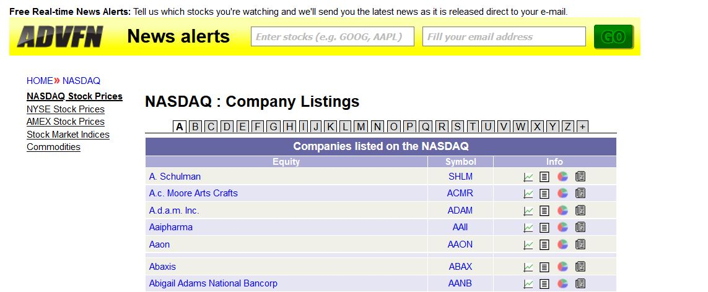
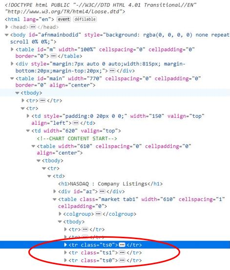
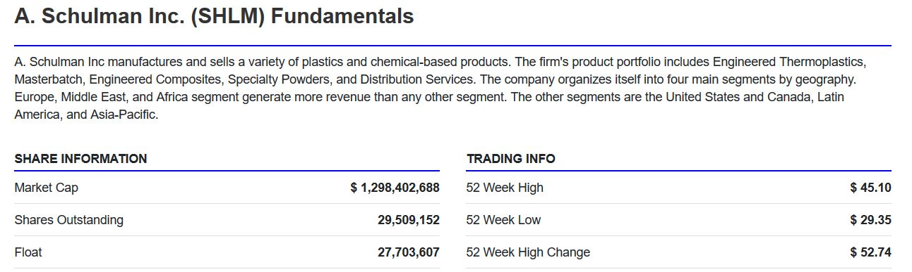
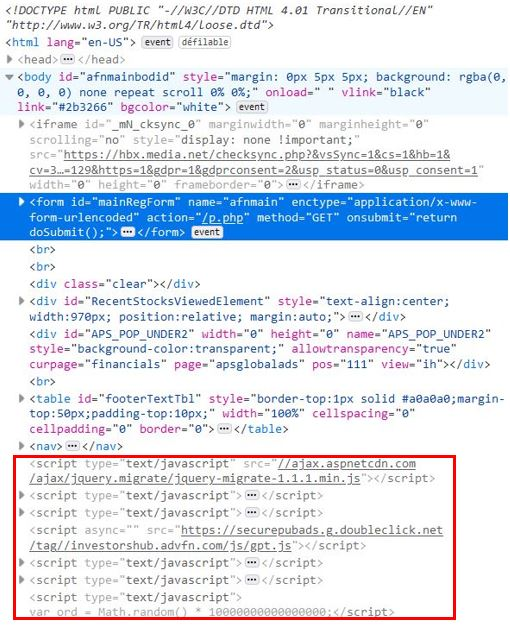
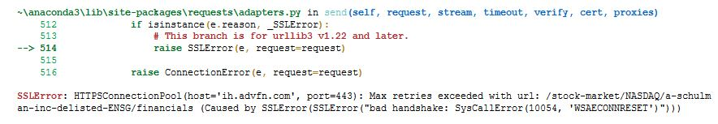
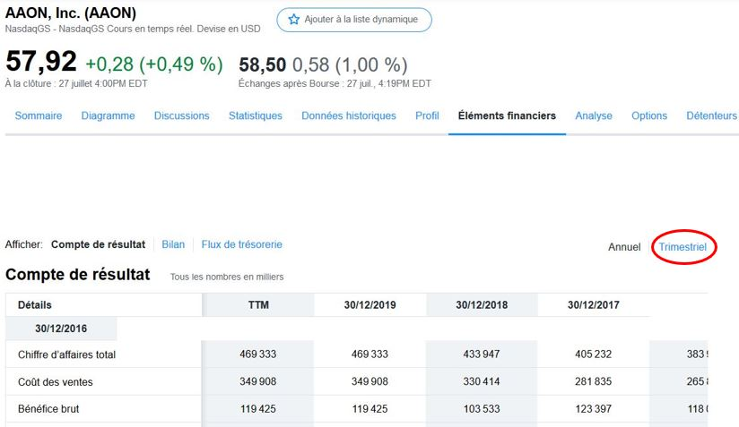

# Crysis impact on coporate profitability


<font size = 6>Welcome to this new project!</font>

Today we will study the **impact of the current crysis on given companies**. The profit variation will be the endog variable and will be explained with foundamentals observations.\
Share price variation won't be added because predicting model has to work on unlisted companies. In other words, the work will only use public quarterly reports, which is mandatory for US listed company but models must generalize well on every companies with a minimal size/capital.

To do that, financials data will be get by web-scraping.\
**Companies included in NASDAQ** index are more than 3000 and **will firstly be studied**. More companies may be added if necessary.

Quarterly reports are scraped in totally free **Yahoo finance** instead of payant EDGAR API from SEC.

This part is only about web-scraping, which is dense enough.\
Followed steps will be:\
**1) Get NASDAQ companies list with corresponding SYMBOL**\
**2) Get general information on each companies thanks to the SYMBOL(sector,size,adress...)**\
**3) Get quarterly report on each companies**

\
I'm really happy to share this work with you...let's see what we can get! I wish you a good reading!

First let's import necessary librairies:


```python
import pandas as pd
from bs4 import BeautifulSoup
import requests
import re
import numpy as np
import pandas as pd
import json
from time import time, sleep
from random import randint
from IPython.display import clear_output

from selenium import webdriver
from selenium.webdriver.support import expected_conditions as ec
from selenium.webdriver.common.by import By
from selenium.webdriver.support.ui import WebDriverWait

pd.set_option('display.max_columns',150)
```

# 1 - NASDAQ list

Get all companies listed in NASDAQ and corresponding SYMBOL is the first thing to do. Fortunately, theses informations are gathered in one website easy to scrap:\
[advfn website](https://www.advfn.com/nasdaq/nasdaq.asp?companies=A) is the perfect solution.




Every companies are listed in alphabetical order, so there are 26 pages to scrap, one for each letter. **BeautifulSoup is the only necessary librairy** beacause no JavaScript is exectued until to reach the desired data in the html page. The screenshot below show the code page, **no script tag can be see**. That's why this website seems easy to scrap.



The equity and its SYMBOL can be located with class name **"ts0"** or **"ts1"** corresponding to the row parity. 'ts0' is pair row and 'ts1' is unpair, it probably helps to apply different colors to get a better readable table. **We want to scrap both 'ts0' and 'ts1', no matter parity.** That is why a unique class name reseach will be made on all tag including 'ts'. Doing this is easy **using re.compile()** function (see below,line 23).

As always **temporization** is made between each requests to **avoid server issue**.

## 1.1 - Functions


```python
def NASDAQ_companies_name(pages):
    L_Name = []
    L_Symbol = []

    start_time = time()
    cpt = 0

    for page in pages:

        cpt+=1
        sleep(randint(3,6))


        url = 'https://www.advfn.com/nasdaq/nasdaq.asp?companies='+page
        response = requests.get(url)
        content = response.content
        print('Request {} >>> Status Code : {}'.format(cpt,response.status_code))

        parser = BeautifulSoup(content,'html.parser')
        selected = parser.find('table',class_='market tab1')

        class_type = 'ts'
        selectedts = selected.find_all('tr',class_=re.compile('ts'))
        nb_rows = len(selectedts)

        for row in np.arange(nb_rows):
            selected_row=selectedts[row]
            Informations = selected_row.find_all('a')
            if len(Informations)>1:
                Company_Name = Informations[0].text
                Company_Symbol = Informations[1].text
                L_Name.append(Company_Name)
                L_Symbol.append(Company_Symbol)

        eleapse_time = time() - start_time
        print('Request {} >>> Frequency: {} s/request'.format(cpt,round(eleapse_time/cpt,5)))
        clear_output(wait = True)

    df_NASDAQ = pd.DataFrame({'Name' : L_Name,'Symbol' : L_Symbol})
    return df_NASDAQ
```

## 1.2 - Extraction

Extraction is made with theses lines below, pages are called by letters in pages list. **Scraping theses pages is very quick, it takes between 2 and 5 minutes.**


```python
pages = ['A','B','C','D','E','F','G','H','I','J','K','L','M','N','O','P','Q','R','T','S','T','U','V','W','X','Y','Z','0']
df_NASDAQ_Name = NASDAQ_companies_name(pages)

df_NASDAQ_Name.head()
```


<div>
<style scoped>
    .dataframe tbody tr th:only-of-type {
        vertical-align: middle;
    }

    .dataframe tbody tr th {
        vertical-align: top;
    }

    .dataframe thead th {
        text-align: right;
    }
</style>
<table border="1" class="dataframe">
  <thead>
    <tr style="text-align: right;">
      <th></th>
      <th>Name</th>
      <th>Symbol</th>
    </tr>
  </thead>
  <tbody>
    <tr>
      <th>0</th>
      <td>A. Schulman</td>
      <td>SHLM</td>
    </tr>
    <tr>
      <th>1</th>
      <td>A.c. Moore Arts Crafts</td>
      <td>ACMR</td>
    </tr>
    <tr>
      <th>2</th>
      <td>A.d.a.m. Inc.</td>
      <td>ADAM</td>
    </tr>
    <tr>
      <th>3</th>
      <td>Aaipharma</td>
      <td>AAII</td>
    </tr>
    <tr>
      <th>4</th>
      <td>Aaon</td>
      <td>AAON</td>
    </tr>
  </tbody>
</table>
</div>


```python
df_NASDAQ_Name.to_csv('NASDAQ_Name.csv',index=None)
```

Well done, the first dataset is made. It doesn't included meaningful informations for now but SYMBOL will be used in the second part to get more specific stuffs.

# 2 - NASDAQ COMPANIES GENERAL INFOS

Get general information on each companies thanks to the SYMBOL(sector,size,adress...) is the new step we have to complete. The same website is used, but the code page has changed.\
[advfn website](https://ih.advfn.com/stock-market/NASDAQ/a-schulman-inc-delisted-SHLM/financials)




Javascript is used, **script tag are widely called** in the bottom of the screenshot (framed in red). But **data we want to get are displayed before** (underlined in blue), so BeautifulSoup can still do the job.



Get the needed outcome implies a little bit more complicated function. JSON format is used line 77.

## 2.1 - Functions


```python
def clear_numeric(value):
    number = str()
    try: #If NaN or emply list is given
        for t in value:
            if (t.isnumeric()) | (t=='.'):
                number =number+ t

        try: #If number can't be converted to float
            value_to_return = float(number)
        except :
            value_to_return = np.NaN
    except:
        value_to_return = np.NaN
        
    return value_to_return

def brut_value (value):
    if str(value) =='':
        return np.NaN
    else:
        return value


def NASDAQ_companies_info(symbols):
    MarketCap = []
    Stocks_nb = []
    Dividends_5Y_P = []
    Holder_Institutionnal_P = []
    Holder_Insider_P = []
    DAV10 = []
    DAV50 = []
    alpha = []
    beta = []
    std = []
    R2 = []
    PER = []
    Company_Value = []
    Employees = []
    Industry = []
    Sector = []
    CIK = []
    Adress = []
    
    Symbols_ok = []
    L_missing_info = []
    
    cpt = 0
    start_time = time()
    
    for symbol in symbols:
        ###################### Tempo before requesting ######################
        cpt+=1
        sleep(randint(3,6))
        
        ###################### Requesting #####################
        url = 'https://ih.advfn.com/stock-market/NASDAQ/a-schulman-inc-delisted-'+symbol+'/financials'
        response = requests.get(url)
        content = response.content
        print('Status Code : {}'.format(response.status_code))

        parser = BeautifulSoup(content,'html.parser')
        
        try:
            #Get All Gathered informations in one time
            selected = parser.find('div',class_='container px-0').find('fundamentals-organism') #tpye : bs4.element.Tag
        except:
            print('{} info missing'.format(symbol))
            L_missing_info.append(symbol)
            continue
        selected_Dict = selected.attrs #All information in dict

        Keys = list(selected_Dict.keys())
    
        ####################################### INFORMATION SCRAPING ########################################
        # ============================================================================== Fundamentals informations
        Fundamentals = selected_Dict[Keys[0]] #Get one of the 3 important Key out of 5
        Dict_Fundamentals = json.loads(Fundamentals)

        Keys_Fundamentals = list(Dict_Fundamentals.keys())
        Share_information = Dict_Fundamentals[Keys_Fundamentals[0]]
        Dividend = Dict_Fundamentals[Keys_Fundamentals[1]]
        Holders = Dict_Fundamentals[Keys_Fundamentals[2]]
        TradingInfo = Dict_Fundamentals[Keys_Fundamentals[3]]

        # ============================================================================== KeyRatios
        KeyRatios = selected_Dict[Keys[1]] #Get one of the 3 important Key out of 5
        Dict_KeyRatios = json.loads(KeyRatios)
        Keys_KeyRatios = list(Dict_KeyRatios.keys())
        EvaluationMeasures = Dict_KeyRatios[Keys_KeyRatios[3]]

        # ============================================================================== Profile
        Profil = selected_Dict[Keys[2]] #Get the profil section
        Dict_Profil = json.loads(Profil) #Dict Profil
        Keys_Profil = list(Dict_Profil.keys())
        ProfilInfo = Dict_Profil[Keys_Profil[1]] #Profil Info in Profil dict
        Keys_ProfilInfo = list(ProfilInfo.keys())

        ContactInfo = Dict_Profil[Keys_Profil[2]] #Profil Info in Profil dict
        Keys_ContactInfo = list(ContactInfo.keys())

        #################### Fundamentals informations #########################
        # Share Info
        MarketCap.append(clear_numeric(list(Share_information.values())[0]))
        Stocks_nb.append(clear_numeric(list(Share_information.values())[1]))
        # Dividends
        Dividends_5Y_P.append(clear_numeric(list(Dividend.values())[1]))
        # Holding
        Holder_Institutionnal_P.append(clear_numeric(list(Holders.values())[3]))
        Holder_Insider_P = clear_numeric(list(Holders.values())[7])
        # Trading Info
        DAV10.append(clear_numeric(list(TradingInfo.values())[9])) #10 Day Average Volume 
        DAV50.append(clear_numeric(list(TradingInfo.values())[12])) #50 Day Average Volume
        alpha.append(clear_numeric(list(TradingInfo.values())[13])) #Alpha
        beta.append(clear_numeric(list(TradingInfo.values())[14])) #Beta
        std.append(clear_numeric(list(TradingInfo.values())[15])) #Standard Deviation
        R2.append(clear_numeric(list(TradingInfo.values())[16])) # R2


        #################### KEY RATIOS #########################
        PER.append(clear_numeric(list(EvaluationMeasures.values())[0]))
        Company_Value.append(clear_numeric(list(EvaluationMeasures.values())[1]))


        #################### PROFILE #########################
        Employees.append(ProfilInfo[Keys_ProfilInfo[4]])
        Industry.append(ProfilInfo[Keys_ProfilInfo[7]])
        Sector.append(ProfilInfo[Keys_ProfilInfo[8]])
        tmp_CIK = ProfilInfo[Keys_ProfilInfo[6]]
        CIK.append(tmp_CIK.split('>')[1].split('<')[0])

        Adress.append(ContactInfo[Keys_ContactInfo[0]])
        
        Symbols_ok.append(symbol)
        
        eleapse_time = time() - start_time
        print('Request {} >>> Frequency: {} s/request'.format(cpt,round(eleapse_time/cpt,5)))
        clear_output(wait = True)
        
    df_scraped = pd.DataFrame({'Name':Symbols_ok,
                               'MarketCap':MarketCap,
                               'Stocks_nb':Stocks_nb,
                               'Dividends_5Y_P':Dividends_5Y_P,
                               'Holder_Institutionnal_P':Holder_Institutionnal_P,
                               'Holder_Insider_P':Holder_Insider_P,
                               'DAV10':DAV10,
                               'DAV50':DAV50,
                               'alpha':alpha,
                               'beta':beta,
                               'std':std,
                               'R2':R2,
                               'PER':PER,
                               'Company_Value':Company_Value,
                               'Employees':Employees,
                               'Industry':Industry,
                               'Sector':Sector,
                               'CIK':CIK,
                               'Adress':Adress
                              })
    return df_scraped,L_missing_info
```

## 2.2 - Extraction

This function run with a list of equity SYMBOL found in NASDAQ_companies_name.\
Calling all SYMBOLS **in one single list is a bad way to get needed data**. About 3000 web pages are going to be scraped, doing this in one time is highly risky because of communication with the server. **Sometimes and for no logical reasons, communication can be broke down.**\
This type of errors might occurs and generate the exception below:



SSLError appeared certainly because of TCP protocol error with the server. This phenomenon has **nothing to do with our created function**, it was caused by the internet connection or by the server itself.

Because of the high number of web page to scrap, the safest way to get all we want is to **batch the SYMBOL list**. Regarding to the bad current web connection quality, NASDAQ_companies_info will be run with 30 batch of 100 companies.

One request take between 6 and 9 seconds (partially due the web connection), 3000 requests must be made, so **5 to 8 hours are needed in this step**.


```python
threshold = 100
l_info_tmp = []
l_missing_tmp = []
for i in np.arange(df_NASDAQ_Name.shape[0]//threshold+1):
    NASDAQ_List_Symbol =  list(df_NASDAQ_Name['Symbol'])[i*threshold:(i+1)*threshold]
    df_NASDAQ_Info,L_missing_info = NASDAQ_companies_info(NASDAQ_List_Symbol)
    l_info_tmp.append(df_NASDAQ_Info)
    l_missing_tmp = l_missing_tmp + L_missing_info
```

    Status Code : 200
    Request 100 >>> Frequency: 6.0927 s/request
    


```python
df_Companies_info = pd.concat(l_info_tmp,axis='index')
df_Companies_info.reset_index(drop=True,inplace=True)
df_Companies_info.to_csv('Companies_infos.csv',index=None)
pd.Series(l_missing_tmp).to_csv('Companies_Missing_info.csv',index = None)

print('Companies Scraped : {}\n>>> Info obtained : {}\n>>> Info Missing  : {}'.format(df_NASDAQ_Name.shape[0],
                                                                                    df_Companies_info.shape[0],
                                                                                    len(l_missing_tmp)))
```

    Companies Scraped : 2996
    >>> Info obtained : 2410
    >>> Info Missing  : 586
    


```python
df_Companies_info.head()
```


<div>
<style scoped>
    .dataframe tbody tr th:only-of-type {
        vertical-align: middle;
    }

    .dataframe tbody tr th {
        vertical-align: top;
    }

    .dataframe thead th {
        text-align: right;
    }
</style>
<table border="1" class="dataframe">
  <thead>
    <tr style="text-align: right;">
      <th></th>
      <th>Name</th>
      <th>MarketCap</th>
      <th>Stocks_nb</th>
      <th>Dividends_5Y_P</th>
      <th>Holder_Institutionnal_P</th>
      <th>Holder_Insider_P</th>
      <th>DAV10</th>
      <th>DAV50</th>
      <th>alpha</th>
      <th>beta</th>
      <th>std</th>
      <th>R2</th>
      <th>PER</th>
      <th>Company_Value</th>
      <th>Employees</th>
      <th>Industry</th>
      <th>Sector</th>
      <th>CIK</th>
      <th>Adress</th>
    </tr>
  </thead>
  <tbody>
    <tr>
      <th>0</th>
      <td>SHLM</td>
      <td>1.298403e+09</td>
      <td>29509152.0</td>
      <td>1.02</td>
      <td>89.7</td>
      <td>0.0</td>
      <td>132571.0</td>
      <td>183891.0</td>
      <td>0.000928</td>
      <td>1.3699</td>
      <td>0.091445</td>
      <td>0.169341</td>
      <td>48.4</td>
      <td>2.164849e+09</td>
      <td>5300</td>
      <td>Chemicals</td>
      <td>Basic Materials</td>
      <td>0000087565</td>
      <td>3637 Ridgewood Road&lt;br/&gt;Fairlawn, OH 44333</td>
    </tr>
    <tr>
      <th>1</th>
      <td>ACMR</td>
      <td>1.545660e+09</td>
      <td>18179954.0</td>
      <td>0.00</td>
      <td>38.9</td>
      <td>0.0</td>
      <td>577559.0</td>
      <td>571524.0</td>
      <td>0.106547</td>
      <td>0.8027</td>
      <td>0.277029</td>
      <td>0.022698</td>
      <td>92.4</td>
      <td>1.550265e+09</td>
      <td>361</td>
      <td>Semiconductors</td>
      <td>Technology</td>
      <td>0001680062</td>
      <td>42307 Osgood Road&lt;br/&gt;Suite I&lt;br/&gt;Fremont, CA ...</td>
    </tr>
    <tr>
      <th>2</th>
      <td>AAON</td>
      <td>2.999098e+09</td>
      <td>52031532.0</td>
      <td>11.60</td>
      <td>142.6</td>
      <td>0.0</td>
      <td>200438.0</td>
      <td>215379.0</td>
      <td>0.013401</td>
      <td>0.7492</td>
      <td>0.074896</td>
      <td>0.182908</td>
      <td>47.9</td>
      <td>3.007647e+09</td>
      <td>2290</td>
      <td>Construction</td>
      <td>Industrials</td>
      <td>0000824142</td>
      <td>2425 South Yukon Avenue&lt;br/&gt;Tulsa, OK 74107</td>
    </tr>
    <tr>
      <th>3</th>
      <td>ABAX</td>
      <td>1.898290e+09</td>
      <td>22870967.0</td>
      <td>0.00</td>
      <td>91.7</td>
      <td>0.0</td>
      <td>154925.0</td>
      <td>258341.0</td>
      <td>0.003428</td>
      <td>1.4398</td>
      <td>0.096504</td>
      <td>0.174023</td>
      <td>70.9</td>
      <td>1.731684e+09</td>
      <td>656</td>
      <td>Medical Diagnostics &amp; Research</td>
      <td>Healthcare</td>
      <td>0000881890</td>
      <td>3240 Whipple Road&lt;br/&gt;Union City, CA 94587</td>
    </tr>
    <tr>
      <th>4</th>
      <td>AANB</td>
      <td>1.011362e+07</td>
      <td>3463569.0</td>
      <td>0.00</td>
      <td>7.0</td>
      <td>0.0</td>
      <td>461.0</td>
      <td>0.0</td>
      <td>0.020162</td>
      <td>0.5091</td>
      <td>0.110400</td>
      <td>0.044413</td>
      <td>0.0</td>
      <td>0.000000e+00</td>
      <td>102</td>
      <td>None</td>
      <td>None</td>
      <td>0000356809</td>
      <td>1130 Connecticut Ave. N.W.&lt;br/&gt;Washington, DC ...</td>
    </tr>
  </tbody>
</table>
</div>


# 3 - Annual Report NASDAQ

Get quarterly report on each companies is the last but not least step.\
Two ways are possible:
+ SEC EDGAR API (payant)
+ Yahoo Finance (free)

So [Yahoo Finance](https://fr.finance.yahoo.com/quote/AAON/financials?p=AAON) will be used and getting reports is way more complicated than previous part.



**Financials elements and quaterly buttons must be clicked on to get the needed data.**\
Beautiful Soup can't be used in this case because of JavaScript routine. **The URL adress is the same between annual and quaterly report**, by defaut annual data is displayed and that's exactly what we don't want.\
\
Simulate quaterly button click is needed, **Selenium package can do this**. Scroll down must be done to show the desired button in the web page and start JavaScript routine. That's why the command below is writen line 142:\
    browser.execute_script("window.scrollTo(0, 200)")
    
    
**If too much quarterly reports are missing, other equity all around the world will be find to complete our database.**

## 3.1 - Functions


```python
############################ USED FUNCTION ANNUAL REPORT ##########################
def one_digit(value):
    for val in value:
        if val.isdigit():
            key = True
            break
        key = False
    try : 
        return key
    except:
        return np.NaN

import unicodedata
def split_num(value):
    splited = value.split(' ')
    splited_list = []
    for val in splited:
        splited_list.append(unicodedata.normalize('NFKD',val))

    return splited_list

def report_cleaning(report):
    report_tmp = []
    cpt = 0
    len_num_raw = []
    alpha_index = []
    for line in report:
        try:#======================== NAN
            if one_digit(line): 
                line_tmp = split_num(line)
                report_tmp.append(line_tmp)
                len_num_raw.append(len(line_tmp))
            else:
                txt = unicodedata.normalize('NFD', line).encode('ascii', 'ignore').decode('ascii','ignore')
                txt = txt.replace(' ','_')
                report_tmp.append(txt)
                alpha_index.append(cpt)
        except:
            report_tmp.append(np.NaN)
        cpt+=1
    return report_tmp,len_num_raw,alpha_index

def index_correction(RAW_list,RAW_alphas):
    
    #Determine index to pop
    to_pop = []
    for i in np.arange(0,len(RAW_alphas)):
        ##Pop index of numerical value which has no corresponding alpha value
        if i!=0:
            if (RAW_alphas[i]-RAW_alphas[i-1]!=2):
                for k in np.arange(1,RAW_alphas[i]-RAW_alphas[i-1]-1):
                    to_pop.append(RAW_alphas[i-1]+k)
                    
        #Pop index of alpha value which has no corresponding numerical value
        if i!=len(RAW_alphas)-1:       
            if RAW_alphas[i+1]==RAW_alphas[i]+1:
                to_pop.append(RAW_alphas[i])
        to_pop.sort()
        
        
    #Determine final list
    General_list = RAW_list.copy()
    biais = 0
    for i in to_pop:
        _=General_list.pop(i-biais)
        biais=biais+1
    return General_list


def Structure_Report(POPED_Report,len_num,symbol):
    POPED = POPED_Report.copy()
    # Arrange POPED report to dict
    dict_POPED = dict()
    for i in np.arange(0,len(POPED),2):
        dict_POPED[POPED[i]] = POPED[i+1]

    # Columns of the future final dataframe
    L_Structured = ['Total_revenue',
                    'Cost_of_revenue',
                    'Gross_profit',
                    'Selling_general_and_admin',
                    'Research_development',
                    'Total_operating_expenses',
                    'Operating_income_or_loss',
                    'Interest_expense',
                    'Total_other_income',
                    'Income_before_tax',
                    'Income_tax_expense',
                    'Net_income'
                   ]

    # Filling final dataframe
    dict_structured = dict()
    for categ in L_Structured:
        assigned = False
        for key,value in dict_POPED.items():
            if bool(re.search(categ,key)):
                assigned = True
                for q in np.arange(len_num[0]-1):
                    dict_structured[categ+'QM'+str(q)]=value[q+1]
        if assigned == False:
            for q in np.arange(len_num[0]-1):
                    dict_structured[categ+'QM'+str(q)]=0


    df_tmp_report = pd.DataFrame([dict_structured])
    df_Name = pd.DataFrame([symbol],columns=['Name'])
    return pd.concat([df_Name,df_tmp_report],axis='columns')

############################ END USED FUNCTION ANNUAL REPORT ##########################


def Get_Companies_Reports(list_symbol,time_sleep=1):
    time_to_wait = time_sleep
    browser = webdriver.Firefox()  #Initialising Firefox to Scrap
    L_All_Reports = []
    L_missing_report = []
    
    global_cpt = 0
    start_time = time()
    
    for symbol in list_symbol:
        try:
            ###################### Tempo before requesting ######################
            global_cpt+=1
            sleep(randint(2,3))

            url = 'https://uk.finance.yahoo.com/quote/'+symbol+'/financials?p='+symbol
            browser.get(url)


            # ================= Cookies Consent Box ===================
            try :
                #browser.find_element_by_class_name('con-wizard') # make sure the consent box is present
                box= WebDriverWait(browser, time_to_wait).until(ec.visibility_of_element_located((By.CLASS_NAME, "con-wizard")))
                browser.find_element_by_name('agree').click()
            except:
                pass

            
            # ===================================================== Find the 'trimestriel' button
            browser.execute_script("window.scrollTo(0, 200)") #Scroll to activate JS and find 'Quarterly' button
            buttons = browser.find_elements_by_css_selector('button')

            # There are two 'Quarterly' buttons, we want to click on the first
            button_to_push = []
            for i in np.arange(len(buttons)):
                if buttons[i].text == 'Quarterly':
                    button_to_push.append(i)

            buttons[button_to_push[0]].click() #click on the desired 'trimestriel' button (index 4)

            #Find desired reports 
            data= WebDriverWait(browser, time_to_wait).until(ec.visibility_of_element_located((By.XPATH, "//div[contains(@class,'D(tbrg)')]")))
            annual_report = data.text


            RAW_Report = annual_report.split('\n') #1st retake 
            CLEANED_Report,len_num,alphas = report_cleaning(RAW_Report) #Clean string report

            POPED_Report = index_correction(CLEANED_Report,alphas)

            # Verify the same len for all numeric rows
            same_value = (np.array(len_num)==len_num[0]).all()

            if same_value:
                L_All_Reports.append(Structure_Report(POPED_Report,len_num,symbol))
            else:
                print('{} not taken because of unequals numeric rows length'.format(symbol))

            eleapse_time = time() - start_time
            print('Request {} >>> Frequency: {} s/request'.format(global_cpt,round(eleapse_time/global_cpt,5)))
            clear_output(wait = True)
        except:
            print('{} not taken, missing report'.format(symbol))
            L_missing_report.append(symbol)
            continue
    df_All_Reports = pd.concat(L_All_Reports,axis='index')
    browser.close()
    return df_All_Reports,L_missing_report
```

No need to deeply understand the function, it globally make steps described below:
+ Open a Firefox browser and go to the Yahoo finance desired page                   **(line 114 to 130)**
+ Click ok in the cookies consent box, scroll down and click on the quaterly button **(line 131 to 150)**
+ Scrap the report data                                                             **(line 153 to 154)**
+ Structure raw data and put it in DataFrame                               **(line 1 to 108 and line 155 to line 172)**
+ Repeat for all companies
+ Quit Browser                                                                      **(line 136)**

Raw data unique shape implies a dense structuring process.

## 3.2 - Extraction

Get_Companies_Reports works the same way as the previous function. It takes Symbol list but return corresponding quaterly reports. The 3000 needed requests will be made by 30 batch of 100 symbols.


```python
threshold = 100
l_report_tmp = []
l_missing_report = []
for i in np.arange(df_NASDAQ_Name.shape[0]//threshold+1):
    NASDAQ_List_Symbol =  list(df_NASDAQ_Name['Symbol'])[i*threshold:(i+1)*threshold]
    NASDAQ_Report,l_missing = Get_Companies_Reports(NASDAQ_List_Symbol,time_sleep=12)
    l_report_tmp.append(NASDAQ_Report)
    l_missing_report = l_missing_report + l_missing
```

    Request 96 >>> Frequency: 17.98683 s/request
    


```python
df_Companies_report = pd.concat(l_report_tmp,axis='index')
df_Companies_report.reset_index(drop=True,inplace=True)
df_Companies_report.to_csv('Companies_report.csv',index=None)
pd.Series(l_missing_report).to_csv('Companies_Missing_report.csv',index = None)

print('Companies Scraped : {}\n>>> Info obtained : {}\n>>> Info Missing  : {}'.format(df_NASDAQ_Name.shape[0],
                                                                                    df_Companies_report.shape[0],
                                                                                    len(l_missing_report)))
```

    Companies Scraped : 2996
    >>> Info obtained : 1318
    >>> Info Missing  : 1678
    


```python
df_Companies_report.head()
```


<div>
<style scoped>
    .dataframe tbody tr th:only-of-type {
        vertical-align: middle;
    }

    .dataframe tbody tr th {
        vertical-align: top;
    }

    .dataframe thead th {
        text-align: right;
    }
</style>
<table border="1" class="dataframe">
  <thead>
    <tr style="text-align: right;">
      <th></th>
      <th>Name</th>
      <th>Total_revenueQM0</th>
      <th>Total_revenueQM1</th>
      <th>Total_revenueQM2</th>
      <th>Total_revenueQM3</th>
      <th>Cost_of_revenueQM0</th>
      <th>Cost_of_revenueQM1</th>
      <th>Cost_of_revenueQM2</th>
      <th>Cost_of_revenueQM3</th>
      <th>Gross_profitQM0</th>
      <th>Gross_profitQM1</th>
      <th>Gross_profitQM2</th>
      <th>Gross_profitQM3</th>
      <th>Selling_general_and_adminQM0</th>
      <th>Selling_general_and_adminQM1</th>
      <th>Selling_general_and_adminQM2</th>
      <th>Selling_general_and_adminQM3</th>
      <th>Research_developmentQM0</th>
      <th>Research_developmentQM1</th>
      <th>Research_developmentQM2</th>
      <th>Research_developmentQM3</th>
      <th>Total_operating_expensesQM0</th>
      <th>Total_operating_expensesQM1</th>
      <th>Total_operating_expensesQM2</th>
      <th>Total_operating_expensesQM3</th>
      <th>Operating_income_or_lossQM0</th>
      <th>Operating_income_or_lossQM1</th>
      <th>Operating_income_or_lossQM2</th>
      <th>Operating_income_or_lossQM3</th>
      <th>Interest_expenseQM0</th>
      <th>Interest_expenseQM1</th>
      <th>Interest_expenseQM2</th>
      <th>Interest_expenseQM3</th>
      <th>Total_other_incomeQM0</th>
      <th>Total_other_incomeQM1</th>
      <th>Total_other_incomeQM2</th>
      <th>Total_other_incomeQM3</th>
      <th>Income_before_taxQM0</th>
      <th>Income_before_taxQM1</th>
      <th>Income_before_taxQM2</th>
      <th>Income_before_taxQM3</th>
      <th>Income_tax_expenseQM0</th>
      <th>Income_tax_expenseQM1</th>
      <th>Income_tax_expenseQM2</th>
      <th>Income_tax_expenseQM3</th>
      <th>Net_incomeQM0</th>
      <th>Net_incomeQM1</th>
      <th>Net_incomeQM2</th>
      <th>Net_incomeQM3</th>
      <th>Total_revenueQM4</th>
      <th>Cost_of_revenueQM4</th>
      <th>Gross_profitQM4</th>
      <th>Selling_general_and_adminQM4</th>
      <th>Research_developmentQM4</th>
      <th>Total_operating_expensesQM4</th>
      <th>Operating_income_or_lossQM4</th>
      <th>Interest_expenseQM4</th>
      <th>Total_other_incomeQM4</th>
      <th>Income_before_taxQM4</th>
      <th>Income_tax_expenseQM4</th>
      <th>Net_incomeQM4</th>
      <th>Total_revenueQM5</th>
      <th>Cost_of_revenueQM5</th>
      <th>Gross_profitQM5</th>
      <th>Selling_general_and_adminQM5</th>
      <th>Research_developmentQM5</th>
      <th>Total_operating_expensesQM5</th>
      <th>Operating_income_or_lossQM5</th>
      <th>Interest_expenseQM5</th>
      <th>Total_other_incomeQM5</th>
      <th>Income_before_taxQM5</th>
      <th>Income_tax_expenseQM5</th>
      <th>Net_incomeQM5</th>
    </tr>
  </thead>
  <tbody>
    <tr>
      <th>0</th>
      <td>ACMR</td>
      <td>24,348</td>
      <td>24,608</td>
      <td>33,427</td>
      <td>29,010</td>
      <td>14,120</td>
      <td>12,165</td>
      <td>17,173</td>
      <td>15,879</td>
      <td>10,228</td>
      <td>12,443</td>
      <td>16,254</td>
      <td>13,131</td>
      <td>5,333</td>
      <td>5,292</td>
      <td>5,732</td>
      <td>5,129</td>
      <td>3,677</td>
      <td>3,302</td>
      <td>3,492</td>
      <td>3,341</td>
      <td>9,010</td>
      <td>8,594</td>
      <td>9,224</td>
      <td>8,470</td>
      <td>1,218</td>
      <td>3,849</td>
      <td>7,030</td>
      <td>4,661</td>
      <td>111</td>
      <td>207</td>
      <td>205</td>
      <td>194</td>
      <td>825</td>
      <td>-831</td>
      <td>1,841</td>
      <td>696</td>
      <td>2,267</td>
      <td>3,016</td>
      <td>8,761</td>
      <td>5,187</td>
      <td>304</td>
      <td>-1,185</td>
      <td>-328</td>
      <td>876</td>
      <td>1,705</td>
      <td>3,944</td>
      <td>8,782</td>
      <td>4,311</td>
      <td>NaN</td>
      <td>NaN</td>
      <td>NaN</td>
      <td>NaN</td>
      <td>NaN</td>
      <td>NaN</td>
      <td>NaN</td>
      <td>NaN</td>
      <td>NaN</td>
      <td>NaN</td>
      <td>NaN</td>
      <td>NaN</td>
      <td>NaN</td>
      <td>NaN</td>
      <td>NaN</td>
      <td>NaN</td>
      <td>NaN</td>
      <td>NaN</td>
      <td>NaN</td>
      <td>NaN</td>
      <td>NaN</td>
      <td>NaN</td>
      <td>NaN</td>
      <td>NaN</td>
    </tr>
    <tr>
      <th>1</th>
      <td>AAON</td>
      <td>137,483</td>
      <td>122,574</td>
      <td>113,500</td>
      <td>119,437</td>
      <td>94,536</td>
      <td>86,502</td>
      <td>86,115</td>
      <td>89,262</td>
      <td>42,947</td>
      <td>36,072</td>
      <td>27,385</td>
      <td>30,175</td>
      <td>14,278</td>
      <td>14,051</td>
      <td>12,476</td>
      <td>12,338</td>
      <td>0</td>
      <td>0</td>
      <td>0</td>
      <td>0</td>
      <td>14,740</td>
      <td>14,483</td>
      <td>12,876</td>
      <td>12,719</td>
      <td>28,207</td>
      <td>21,589</td>
      <td>14,509</td>
      <td>17,456</td>
      <td>0</td>
      <td>0</td>
      <td>0</td>
      <td>0</td>
      <td>-439</td>
      <td>-189</td>
      <td>-131</td>
      <td>-751</td>
      <td>27,829</td>
      <td>21,417</td>
      <td>14,387</td>
      <td>16,736</td>
      <td>5,976</td>
      <td>5,396</td>
      <td>560</td>
      <td>3,775</td>
      <td>21,853</td>
      <td>16,021</td>
      <td>13,827</td>
      <td>12,961</td>
      <td>NaN</td>
      <td>NaN</td>
      <td>NaN</td>
      <td>NaN</td>
      <td>NaN</td>
      <td>NaN</td>
      <td>NaN</td>
      <td>NaN</td>
      <td>NaN</td>
      <td>NaN</td>
      <td>NaN</td>
      <td>NaN</td>
      <td>NaN</td>
      <td>NaN</td>
      <td>NaN</td>
      <td>NaN</td>
      <td>NaN</td>
      <td>NaN</td>
      <td>NaN</td>
      <td>NaN</td>
      <td>NaN</td>
      <td>NaN</td>
      <td>NaN</td>
      <td>NaN</td>
    </tr>
    <tr>
      <th>2</th>
      <td>ABMD</td>
      <td>206,658</td>
      <td>221,584</td>
      <td>204,974</td>
      <td>207,666</td>
      <td>39,368</td>
      <td>39,996</td>
      <td>34,867</td>
      <td>37,073</td>
      <td>167,290</td>
      <td>181,588</td>
      <td>170,107</td>
      <td>170,593</td>
      <td>83,892</td>
      <td>85,674</td>
      <td>85,956</td>
      <td>86,078</td>
      <td>25,346</td>
      <td>25,655</td>
      <td>23,969</td>
      <td>23,790</td>
      <td>109,238</td>
      <td>111,329</td>
      <td>109,925</td>
      <td>109,868</td>
      <td>58,052</td>
      <td>70,259</td>
      <td>60,182</td>
      <td>60,725</td>
      <td>0</td>
      <td>0</td>
      <td>0</td>
      <td>0</td>
      <td>-18,739</td>
      <td>26,757</td>
      <td>-42,824</td>
      <td>42,413</td>
      <td>39,313</td>
      <td>97,016</td>
      <td>17,358</td>
      <td>103,138</td>
      <td>7,515</td>
      <td>27,799</td>
      <td>4,287</td>
      <td>14,215</td>
      <td>31,798</td>
      <td>69,217</td>
      <td>13,071</td>
      <td>88,923</td>
      <td>NaN</td>
      <td>NaN</td>
      <td>NaN</td>
      <td>NaN</td>
      <td>NaN</td>
      <td>NaN</td>
      <td>NaN</td>
      <td>NaN</td>
      <td>NaN</td>
      <td>NaN</td>
      <td>NaN</td>
      <td>NaN</td>
      <td>NaN</td>
      <td>NaN</td>
      <td>NaN</td>
      <td>NaN</td>
      <td>NaN</td>
      <td>NaN</td>
      <td>NaN</td>
      <td>NaN</td>
      <td>NaN</td>
      <td>NaN</td>
      <td>NaN</td>
      <td>NaN</td>
    </tr>
    <tr>
      <th>3</th>
      <td>AXAS</td>
      <td>15,726</td>
      <td>28,276</td>
      <td>31,536</td>
      <td>34,820</td>
      <td>16,401</td>
      <td>23,260</td>
      <td>20,747</td>
      <td>23,180</td>
      <td>-675</td>
      <td>5,016</td>
      <td>10,789</td>
      <td>11,640</td>
      <td>2,447</td>
      <td>3,135</td>
      <td>2,736</td>
      <td>2,705</td>
      <td>0</td>
      <td>0</td>
      <td>0</td>
      <td>0</td>
      <td>2,447</td>
      <td>3,135</td>
      <td>2,736</td>
      <td>2,705</td>
      <td>-3,122</td>
      <td>1,881</td>
      <td>8,053</td>
      <td>8,935</td>
      <td>4,386</td>
      <td>3,629</td>
      <td>2,951</td>
      <td>2,765</td>
      <td>49,071</td>
      <td>-66,410</td>
      <td>12,081</td>
      <td>5,636</td>
      <td>41,443</td>
      <td>-68,268</td>
      <td>17,041</td>
      <td>11,678</td>
      <td>0</td>
      <td>0</td>
      <td>0</td>
      <td>0</td>
      <td>41,443</td>
      <td>-68,268</td>
      <td>17,041</td>
      <td>11,678</td>
      <td>NaN</td>
      <td>NaN</td>
      <td>NaN</td>
      <td>NaN</td>
      <td>NaN</td>
      <td>NaN</td>
      <td>NaN</td>
      <td>NaN</td>
      <td>NaN</td>
      <td>NaN</td>
      <td>NaN</td>
      <td>NaN</td>
      <td>NaN</td>
      <td>NaN</td>
      <td>NaN</td>
      <td>NaN</td>
      <td>NaN</td>
      <td>NaN</td>
      <td>NaN</td>
      <td>NaN</td>
      <td>NaN</td>
      <td>NaN</td>
      <td>NaN</td>
      <td>NaN</td>
    </tr>
    <tr>
      <th>4</th>
      <td>ACTG</td>
      <td>3,815</td>
      <td>688</td>
      <td>1,711</td>
      <td>5,460</td>
      <td>2,506</td>
      <td>3,794</td>
      <td>2,186</td>
      <td>5,671</td>
      <td>1,309</td>
      <td>-3,106</td>
      <td>-475</td>
      <td>-211</td>
      <td>4,878</td>
      <td>4,201</td>
      <td>4,670</td>
      <td>3,810</td>
      <td>0</td>
      <td>0</td>
      <td>0</td>
      <td>0</td>
      <td>4,878</td>
      <td>4,201</td>
      <td>4,670</td>
      <td>3,810</td>
      <td>-3,569</td>
      <td>-7,307</td>
      <td>-5,145</td>
      <td>-4,021</td>
      <td>0</td>
      <td>0</td>
      <td>0</td>
      <td>0</td>
      <td>-9,595</td>
      <td>3,712</td>
      <td>-3,181</td>
      <td>-2,857</td>
      <td>-12,629</td>
      <td>-1,513</td>
      <td>-7,608</td>
      <td>-5,748</td>
      <td>-1,338</td>
      <td>-2,147</td>
      <td>0</td>
      <td>9</td>
      <td>-12,185</td>
      <td>327</td>
      <td>-7,608</td>
      <td>-5,757</td>
      <td>NaN</td>
      <td>NaN</td>
      <td>NaN</td>
      <td>NaN</td>
      <td>NaN</td>
      <td>NaN</td>
      <td>NaN</td>
      <td>NaN</td>
      <td>NaN</td>
      <td>NaN</td>
      <td>NaN</td>
      <td>NaN</td>
      <td>NaN</td>
      <td>NaN</td>
      <td>NaN</td>
      <td>NaN</td>
      <td>NaN</td>
      <td>NaN</td>
      <td>NaN</td>
      <td>NaN</td>
      <td>NaN</td>
      <td>NaN</td>
      <td>NaN</td>
      <td>NaN</td>
    </tr>
  </tbody>
</table>
</div>


```python
df_Companies_report[~df_Companies_report['Income_tax_expenseQM5'].isna()]
```


<div>
<style scoped>
    .dataframe tbody tr th:only-of-type {
        vertical-align: middle;
    }

    .dataframe tbody tr th {
        vertical-align: top;
    }

    .dataframe thead th {
        text-align: right;
    }
</style>
<table border="1" class="dataframe">
  <thead>
    <tr style="text-align: right;">
      <th></th>
      <th>Name</th>
      <th>Total_revenueQM0</th>
      <th>Total_revenueQM1</th>
      <th>Total_revenueQM2</th>
      <th>Total_revenueQM3</th>
      <th>Cost_of_revenueQM0</th>
      <th>Cost_of_revenueQM1</th>
      <th>Cost_of_revenueQM2</th>
      <th>Cost_of_revenueQM3</th>
      <th>Gross_profitQM0</th>
      <th>Gross_profitQM1</th>
      <th>Gross_profitQM2</th>
      <th>Gross_profitQM3</th>
      <th>Selling_general_and_adminQM0</th>
      <th>Selling_general_and_adminQM1</th>
      <th>Selling_general_and_adminQM2</th>
      <th>Selling_general_and_adminQM3</th>
      <th>Research_developmentQM0</th>
      <th>Research_developmentQM1</th>
      <th>Research_developmentQM2</th>
      <th>Research_developmentQM3</th>
      <th>Total_operating_expensesQM0</th>
      <th>Total_operating_expensesQM1</th>
      <th>Total_operating_expensesQM2</th>
      <th>Total_operating_expensesQM3</th>
      <th>Operating_income_or_lossQM0</th>
      <th>Operating_income_or_lossQM1</th>
      <th>Operating_income_or_lossQM2</th>
      <th>Operating_income_or_lossQM3</th>
      <th>Interest_expenseQM0</th>
      <th>Interest_expenseQM1</th>
      <th>Interest_expenseQM2</th>
      <th>Interest_expenseQM3</th>
      <th>Total_other_incomeQM0</th>
      <th>Total_other_incomeQM1</th>
      <th>Total_other_incomeQM2</th>
      <th>Total_other_incomeQM3</th>
      <th>Income_before_taxQM0</th>
      <th>Income_before_taxQM1</th>
      <th>Income_before_taxQM2</th>
      <th>Income_before_taxQM3</th>
      <th>Income_tax_expenseQM0</th>
      <th>Income_tax_expenseQM1</th>
      <th>Income_tax_expenseQM2</th>
      <th>Income_tax_expenseQM3</th>
      <th>Net_incomeQM0</th>
      <th>Net_incomeQM1</th>
      <th>Net_incomeQM2</th>
      <th>Net_incomeQM3</th>
      <th>Total_revenueQM4</th>
      <th>Cost_of_revenueQM4</th>
      <th>Gross_profitQM4</th>
      <th>Selling_general_and_adminQM4</th>
      <th>Research_developmentQM4</th>
      <th>Total_operating_expensesQM4</th>
      <th>Operating_income_or_lossQM4</th>
      <th>Interest_expenseQM4</th>
      <th>Total_other_incomeQM4</th>
      <th>Income_before_taxQM4</th>
      <th>Income_tax_expenseQM4</th>
      <th>Net_incomeQM4</th>
      <th>Total_revenueQM5</th>
      <th>Cost_of_revenueQM5</th>
      <th>Gross_profitQM5</th>
      <th>Selling_general_and_adminQM5</th>
      <th>Research_developmentQM5</th>
      <th>Total_operating_expensesQM5</th>
      <th>Operating_income_or_lossQM5</th>
      <th>Interest_expenseQM5</th>
      <th>Total_other_incomeQM5</th>
      <th>Income_before_taxQM5</th>
      <th>Income_tax_expenseQM5</th>
      <th>Net_incomeQM5</th>
    </tr>
  </thead>
  <tbody>
    <tr>
      <th>510</th>
      <td>HCCI</td>
      <td>74,110</td>
      <td>101,479</td>
      <td>131,118</td>
      <td>99,172</td>
      <td>72,293</td>
      <td>83,250</td>
      <td>108,154</td>
      <td>80,116</td>
      <td>1,817</td>
      <td>18,229</td>
      <td>22,964</td>
      <td>19,056</td>
      <td>11,134</td>
      <td>11,522</td>
      <td>15,545</td>
      <td>11,241</td>
      <td>0</td>
      <td>0</td>
      <td>0</td>
      <td>0</td>
      <td>9,793</td>
      <td>17,062</td>
      <td>32,631</td>
      <td>16,241</td>
      <td>-7,976</td>
      <td>1,167</td>
      <td>-9,667</td>
      <td>2,815</td>
      <td>344</td>
      <td>214</td>
      <td>240</td>
      <td>181</td>
      <td>5,408</td>
      <td>5,785</td>
      <td>7,696</td>
      <td>5,668</td>
      <td>-2,912</td>
      <td>6,738</td>
      <td>-2,211</td>
      <td>8,302</td>
      <td>-254</td>
      <td>1,447</td>
      <td>-168</td>
      <td>2,246</td>
      <td>-2,658</td>
      <td>5,291</td>
      <td>-2,151</td>
      <td>5,970</td>
      <td>-</td>
      <td>80,116</td>
      <td>-</td>
      <td>-</td>
      <td>0</td>
      <td>-</td>
      <td>-</td>
      <td>-</td>
      <td>-</td>
      <td>-</td>
      <td>2,246</td>
      <td>-</td>
      <td>99,238</td>
      <td>78,849</td>
      <td>20,389</td>
      <td>11,042</td>
      <td>0.0</td>
      <td>16,617</td>
      <td>3,772</td>
      <td>219</td>
      <td>5,762</td>
      <td>9,315</td>
      <td>2,151</td>
      <td>7,056</td>
    </tr>
  </tbody>
</table>
</div>


Only one equity has more than 3 quarter written in yahoo finance, that's why only the 3 first quarter are kept.


```python
df_Companies_report_trunc = df_Companies_report.loc[:,:'Net_incomeQM3']
df_Companies_report_trunc.to_csv('Companies_report_trunc.csv',index=None)
```

Our three needed datasets are now scraped!

**Congratulation to have come so far! But that's just the first step in a more complex work.**\
\
Next steps:
+ ETL process and create a proper DataBase with SSIS and SQL Server Data Tool.
+ Data visualisation with TABLEAU
+ Machine Learning & Deep Learning

I hope you enjoyed reading this work.

This Kernel will always be a work in progress.\
If you want to discuss any other projects or just have a chat about data science topics, I'll be more than happy to connect with you on:
+ [LinkedIn](https://www.linkedin.com/in/jerome-clappe-3997b8149/)
+ [GitHub](https://github.com/JClappe)

See you and have a wonderful day!


