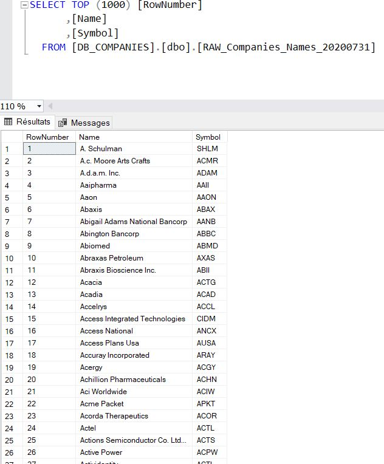
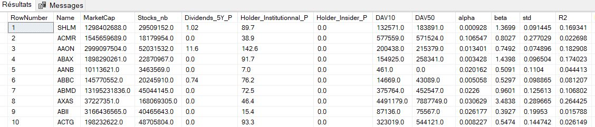

# Corporates Profitability Impact


<font size = 6>Welcome to this project!</font>

Today we will study the **impact of the current crysis on given companies**. The profit variation will be the endog variable and will be explained with foundamentals observations.\
Share price variation won't be added because predicting model has to work on unlisted companies. In other words, the work will only use public quaterly reports, which is mandatory for US listed company and must generalize well on every US companies with a minimal size/capital.

To do that, financials data were get by web-scraping in the previous part.\
It's now time to upload our precious data in a database. For that, ETL process will be followed for the three datasets we have. There isn't much coding, so many screenshots will describe what we are doing.

SSIS in SSDT-BI with MSVS Shell and Microsoft SQL Server will be used.
+ SSIS (SQL Server Integration Service) will complete the ETL process
+ SSDT-BI inclued SSIS (for ETL process), SSAS (for analysis) and SSRS (for reporting). Only SSIS will be used, because python is more powerful than SSAS and TABLEAU will replace SSRS.
+ MSVS include SSDT-BI
+ Microsoft SQL Server is the tool to create our DataBase

I'm really happy to share this work with you...let's see what we can do! I wish you a good reading!

# 1 - DataBase creating & Preparing Data

First thing first, the DataBase for the project is created in Microsoft SQL Server and called "DB_Companies"


My structured folder template for a datascience project is imported. Professionnal outcome as quick as possible often require this kind of approach.


Scraped Data are put in 'Original Data' folder and copied/pasted in 'Prepared data' folder. A quick excel process is applied to theses laters. Companies_Reports.csv is given as example below.\
**1) Data extension is changed in .txt**


**2) Data are opened with excel each columns in text format. Date, currencies, more than 256 charaters string are retreated.**

 

Every columns in reports are numerical, so get ride of coma separating hundreds from thousands is necessary. This steps is mostly done with the text import assistant window when excel open the data .txt file. All columns are put in "Standard" format except Name column which is put in "Text". Advanced must be clicked on and thousands separator is filled with ",".


After importing data text file in excel, all columns (except Name) are selected and format cells are put in number.


Data are now ok to be uploaded in Database:


We have just done one of the most important part! Get the right shape before uploading data avoid lots of time consuming errors which could make us go back to the start, that's why being a little bit fussy is required.

**3) .csv data saving**

Coma separated was chosen (meaning UTF-8 encoding, code 65001). This choice can make default code page error in SSIS because latin-1 (code 1252) is automatically chosen if we don't pay attention. So we have to keep in mind the encoding we choose.


**4) Data are ready to be import in DataBase after some transforms in SSIS.**

# 2 - ETL Process

After this short retreating, our data are copied/pasted in "Uploaded Data" folder and can now be import in Microsoft SQL Server thanks to SQL Server Integration Service.\

Three data flow tasks are created, one per dataset to import.


## 2.1 - Companies Names

Companies_Names.csv is relatively easy to import. Only one conditionnal split is necessary to make sure that all element in Symbol column is filled. A missing Symbol make the entire row go to an error file as a BadRecord, otherwise it goes to OLE DB "DB_COMPANIES" in "RAW_Companies_Names20200731" table.


The process is succesful and there is no BadRecord. 



## 2.2 - Companies Infos

Companies_Infos.csv is still easy to import. Only one conditionnal split is necessary. Let's import the data in this notebook to be clear on the condition to apply.


```python
import pandas as pd

df_CI = pd.read_csv('Companies_infos20200731.csv',sep=';')
df_CI.head()
```


<div>
<style scoped>
    .dataframe tbody tr th:only-of-type {
        vertical-align: middle;
    }

    .dataframe tbody tr th {
        vertical-align: top;
    }

    .dataframe thead th {
        text-align: right;
    }
</style>
<table border="1" class="dataframe">
  <thead>
    <tr style="text-align: right;">
      <th></th>
      <th>Name</th>
      <th>MarketCap</th>
      <th>Stocks_nb</th>
      <th>Dividends_5Y_P</th>
      <th>Holder_Institutionnal_P</th>
      <th>Holder_Insider_P</th>
      <th>DAV10</th>
      <th>DAV50</th>
      <th>alpha</th>
      <th>beta</th>
      <th>std</th>
      <th>R2</th>
      <th>PER</th>
      <th>Company_Value</th>
      <th>Employees</th>
      <th>Industry</th>
      <th>Sector</th>
      <th>CIK</th>
      <th>Adress</th>
    </tr>
  </thead>
  <tbody>
    <tr>
      <th>0</th>
      <td>SHLM</td>
      <td>1.298403e+09</td>
      <td>29509152.0</td>
      <td>1.02</td>
      <td>89.7</td>
      <td>0.0</td>
      <td>132571.0</td>
      <td>183891.0</td>
      <td>0.000928</td>
      <td>1.3699</td>
      <td>0.091445</td>
      <td>0.169341</td>
      <td>48.4</td>
      <td>2.164849e+09</td>
      <td>5300.0</td>
      <td>Chemicals</td>
      <td>Basic Materials</td>
      <td>87565</td>
      <td>3637 Ridgewood Road&lt;br/&gt;Fairlawn, OH 44333</td>
    </tr>
    <tr>
      <th>1</th>
      <td>ACMR</td>
      <td>1.545660e+09</td>
      <td>18179954.0</td>
      <td>0.00</td>
      <td>38.9</td>
      <td>0.0</td>
      <td>577559.0</td>
      <td>571524.0</td>
      <td>0.106547</td>
      <td>0.8027</td>
      <td>0.277029</td>
      <td>0.022698</td>
      <td>92.4</td>
      <td>1.550265e+09</td>
      <td>361.0</td>
      <td>Semiconductors</td>
      <td>Technology</td>
      <td>1680062</td>
      <td>42307 Osgood Road&lt;br/&gt;Suite I&lt;br/&gt;Fremont, CA ...</td>
    </tr>
    <tr>
      <th>2</th>
      <td>AAON</td>
      <td>2.999098e+09</td>
      <td>52031532.0</td>
      <td>11.60</td>
      <td>142.6</td>
      <td>0.0</td>
      <td>200438.0</td>
      <td>215379.0</td>
      <td>0.013401</td>
      <td>0.7492</td>
      <td>0.074896</td>
      <td>0.182908</td>
      <td>47.9</td>
      <td>3.007647e+09</td>
      <td>2290.0</td>
      <td>Construction</td>
      <td>Industrials</td>
      <td>824142</td>
      <td>2425 South Yukon Avenue&lt;br/&gt;Tulsa, OK 74107</td>
    </tr>
    <tr>
      <th>3</th>
      <td>ABAX</td>
      <td>1.898290e+09</td>
      <td>22870967.0</td>
      <td>0.00</td>
      <td>91.7</td>
      <td>0.0</td>
      <td>154925.0</td>
      <td>258341.0</td>
      <td>0.003428</td>
      <td>1.4398</td>
      <td>0.096504</td>
      <td>0.174023</td>
      <td>70.9</td>
      <td>1.731684e+09</td>
      <td>656.0</td>
      <td>Medical Diagnostics &amp; Research</td>
      <td>Healthcare</td>
      <td>881890</td>
      <td>3240 Whipple Road&lt;br/&gt;Union City, CA 94587</td>
    </tr>
    <tr>
      <th>4</th>
      <td>AANB</td>
      <td>1.011362e+07</td>
      <td>3463569.0</td>
      <td>0.00</td>
      <td>7.0</td>
      <td>0.0</td>
      <td>461.0</td>
      <td>0.0</td>
      <td>0.020162</td>
      <td>0.5091</td>
      <td>0.110400</td>
      <td>0.044413</td>
      <td>0.0</td>
      <td>0.000000e+00</td>
      <td>102.0</td>
      <td>NaN</td>
      <td>NaN</td>
      <td>356809</td>
      <td>1130 Connecticut Ave. N.W.&lt;br/&gt;Washington, DC ...</td>
    </tr>
  </tbody>
</table>
</div>


Much features in Companies_Infos.csv only concern stock exchange. In fact theses elements were scraped for potentially other projects but are totally useless for us now. Most important columns are "Company_Value", "Employees","Industry" and "Sector".

That's why the condictionnal split only make sure that "Employees" and "Industry" are filled. A missing value make the entire row go to an error file as a BadRecord, otherwise it goes to OLE DB "DB_COMPANIES" in "RAW_Companies_Info20200731" table.


Only 106 were removed, others companies informations were uploaded in DB_Companies.



## 2.3 - Companies Reports

As stated, default code page error has occur because of encoding. In fact the .csv file is encoded with coma separeted for UTF-8, but OLE DB Destination takes .csv file with semicolon separeted for latin-1. **Putting AlwaysUseDefaultCodePage on True and DefaultCodePage to 65001 (corresponding to UTF-8) can solve the problem.**


The data flow task includes two conditional split. The first one remove all rows with one missing value at least in Net_Income columns, the last one remove all rows with Total_Revenue equal to 0.00.\
Data with the correct shape goes to "RAW_Companies_Reports20200803" table.
Uploaded can be run with this kind of structure.


Upload has been completed and 150 lines were removed. Only 1167 reports out of 2996 companies listed in the NASDAQ stock exchange were correctly get. Our final dataset might include more than a thousand rows, that's not much but it could be enough to find significant insights.\


## 2.4 - Working Tables

All columns in our tables are strings, type converting will be done in this step. Outcomes will be store in working tables:
+ WRK_Companies_Name20200731
+ WRK_Companies_Info20200731
+ WRK_Companies_Reports20200731

A stored procedure is used to do quickly the following steps:\
**1) Create the given work table or remove its content if it already exist.**\
**2) Convert types of the RAW table and store all data it in the work table**


WRK_Companies_Name20200731 and WRK_Companies_Info20200731 were created easily but a conversion type error occur for WRK_Companies_Reports20200731. In fact there is '-' written in certain cells, SQL obviousely cannot convert this kind of string to float.


The work table for companies report stored procedure must be modified in the "insert to" part with this code for each columns:


Correcting this error is relativeley quick, but it would be fixed in web-scraping step if it was found out before and that would have avoid time loss. That's why it's really important to get a structured and efficient approach, errors always occur during data wrangling, but if mains big mistakes are already handled a significant amount of time can be saved!\
\
Our final dataset will be built by associating working tables and features selection.

# 3 - Derivated Table

Derivated table is made with inner join between each working table using SYMBOL as key. This operation increased line number, meaning duplicates present.\
It appears fews symbols are duplicated in companies names raw table, the .csv file has probably the same problem and it was used to scrap companies infos and reports, duplicating the phenomenon.


It could be handled with SSIS, but we can do it in SQL Server too (with a "group by" when joining work tables). A stored procedure including this steps is applied, it was too long to be shown here, so only join and group by can be seen below:


The final dataset is now ready.\
Shape : (1098,69)


Finally, there are 7 differents tables:
+ **3 RAW tables (one for each initial csv)**
+ **3 WORK tables (one for each RAW table)**
+ **1 DERIVATED table**

To get this results, 4 stored procedure were applied:
+ **3 to turn RAW table into WORK table**
+ **1 to tunr WORK tables into DERIVATED table**
+ **1 template**

Everything done is written down for **professionnal tracability**.


# 4 - Exportation to CSV

The final dataset is exported in .csv for visualisaton in TABLEAU.


**Congratulation to have come so far!**\
ETL is finished and data visualisation in TABLEAU is the next step.

I hope you enjoyed reading this work.

This Kernel will always be a work in progress.\
If you want to discuss any other projects or just have a chat about data science topics, I'll be more than happy to connect with you on:
+ [LinkedIn](https://www.linkedin.com/in/jerome-clappe-3997b8149/)
+ [GitHub](https://github.com/JClappe)

See you and have a wonderful day!


