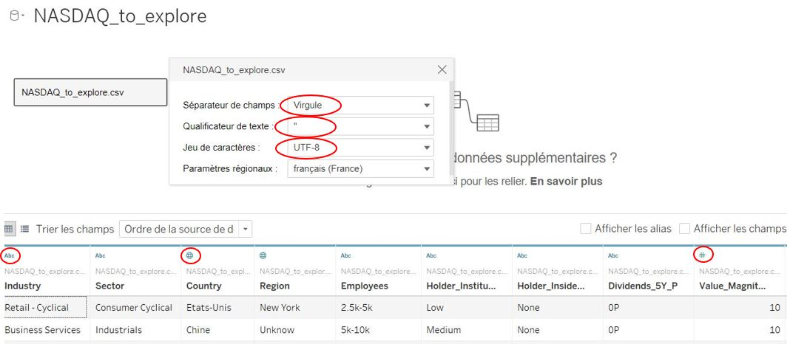
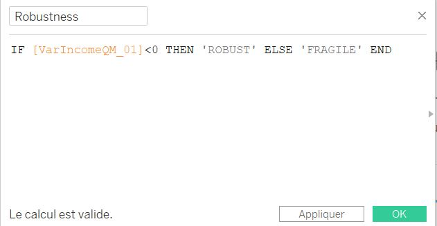
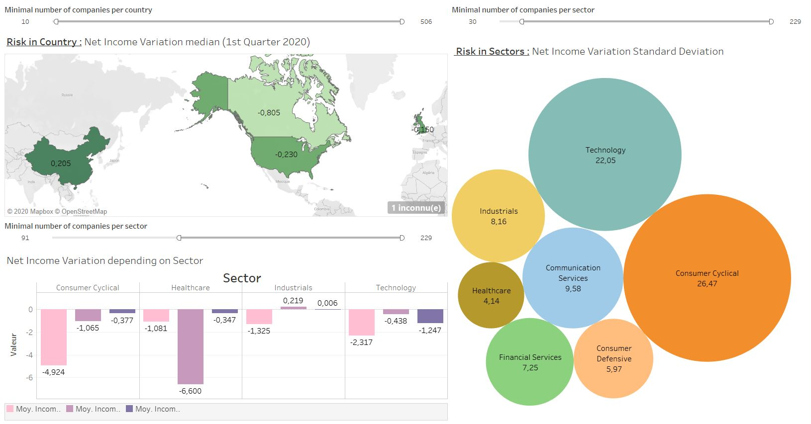
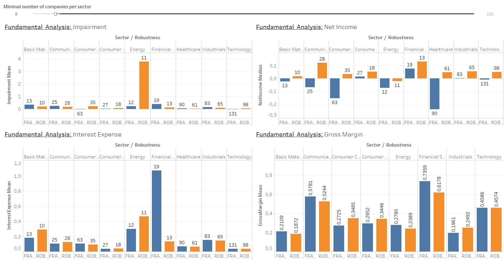
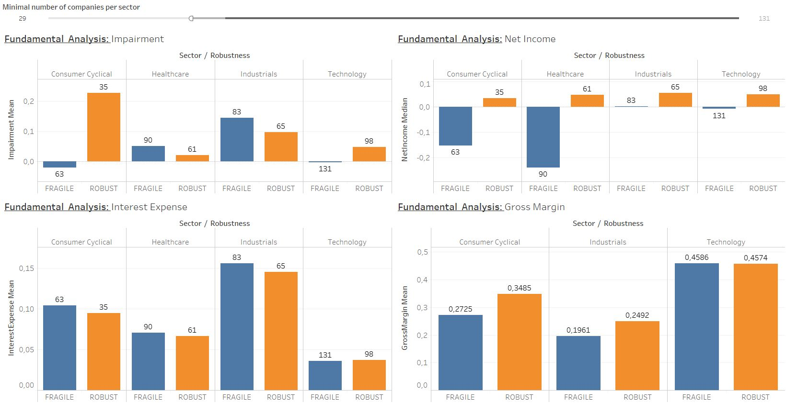
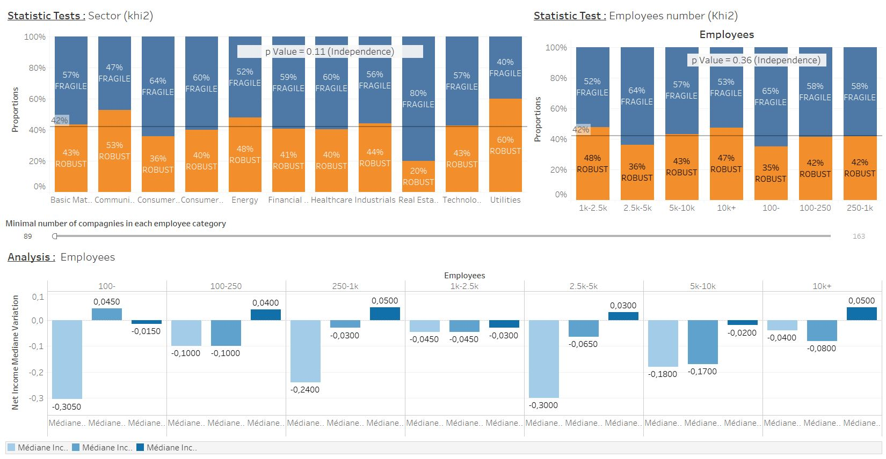

# Corporate Profitability Impact


<font size = 6>Welcome to this project!</font>

Today we will study the **impact of the current crysis on given companies**. The profit variation will be the endog variable and will be explained with foundamentals observations.\
Share price variation won't be added because predicting model has to work on unlisted companies. In other words, the work will only use public quaterly reports, which is mandatory for US listed company.

To do that, four point are followed:
+ [Part 1: Web-Scraping](https://github.com/JClappe/Corporates_profitability_2020/tree/master/Part1_Web_Scrapping) to get financials data 
+ [Part 2: ETL Process](https://github.com/JClappe/Corporates_profitability_2020/tree/master/Part2_ETL_Process) to stored data in a new database
+ Part 3: Data Visualisation with TABLEAU to find good insights
+ Part 4: Machine Learning for predicting models

It's now time to look for some insights by interpreting corporate reports and other global informations. Tableau public is used, so you can find the hole work:
* [DashBoard1](https://public.tableau.com/views/JClappe_NASDAQ_DB1/BD1General_Impact?:language=fr&:display_count=y&publish=yes&:origin=viz_share_link)
* [DashBoard2](https://public.tableau.com/views/JClappe_NASDAQ_DB2/BD2Fundamental_Analysis?:language=fr&:display_count=y&publish=yes&:origin=viz_share_link)
* [DashBoard3](https://public.tableau.com/views/JClappe_NASDAQ_DB3/BD3Statistic_Tests?:language=fr&:display_count=y&publish=yes&:origin=viz_share_link)


I'm really happy to share this work with you...let's see what we can do! I wish you a good reading!


# 1 -  Feature Engineering

## 1.1 - Shape routine

**The given dataset needs feature retreatments** to ease future interpretation of the scraped informations. **TABLEAU includes calculated field** which allow us data manipulation, unfortunately **that's not powerful enough** for what we want to do. **SQL Server** is not a quick way to do it neighter and **I personally doubt it could handel it**. **Python with pandas library is the perfect tool**, so let's import the dataset and do all necessary action right now.


```python
import pandas as pd
import seaborn as sns
import numpy as np
import matplotlib.pyplot as plt
import unicodedata
pd.set_option('display.max_columns',150)
```


```python
df = pd.read_csv('NASDAQ.csv',sep=';')
df_brut = df.copy()
print('Shape : ({} , {})'.format(df_brut.shape[0],df_brut.shape[1]))
print('NaN : {}'.format(df_brut.isna().sum().sum()))
print(df_brut.dtypes[:10])
df_brut.head()
```

    Shape : (1098 , 69)
    NaN : 0
    RowNumber                   int64
    Name                       object
    SYMBOL                     object
    MarketCap                   int64
    Stocks_nb                   int64
    Dividends_5Y_P             object
    Holder_Institutionnal_P    object
    Holder_Insider_P           object
    DAV10                       int64
    DAV50                       int64
    dtype: object
    


<div>
<style scoped>
    .dataframe tbody tr th:only-of-type {
        vertical-align: middle;
    }

    .dataframe tbody tr th {
        vertical-align: top;
    }

    .dataframe thead th {
        text-align: right;
    }
</style>
<table border="1" class="dataframe">
  <thead>
    <tr style="text-align: right;">
      <th></th>
      <th>RowNumber</th>
      <th>Name</th>
      <th>SYMBOL</th>
      <th>MarketCap</th>
      <th>Stocks_nb</th>
      <th>Dividends_5Y_P</th>
      <th>Holder_Institutionnal_P</th>
      <th>Holder_Insider_P</th>
      <th>DAV10</th>
      <th>DAV50</th>
      <th>alpha</th>
      <th>beta</th>
      <th>std</th>
      <th>R2</th>
      <th>PER</th>
      <th>Company_Value</th>
      <th>Employees</th>
      <th>Industry</th>
      <th>Sector</th>
      <th>CIK</th>
      <th>Adress</th>
      <th>Total_revenueQM0</th>
      <th>Total_revenueQM1</th>
      <th>Total_revenueQM2</th>
      <th>Total_revenueQM3</th>
      <th>Cost_of_revenueQM0</th>
      <th>Cost_of_revenueQM1</th>
      <th>Cost_of_revenueQM2</th>
      <th>Cost_of_revenueQM3</th>
      <th>Gross_profitQM0</th>
      <th>Gross_profitQM1</th>
      <th>Gross_profitQM2</th>
      <th>Gross_profitQM3</th>
      <th>Selling_general_and_adminQM0</th>
      <th>Selling_general_and_adminQM1</th>
      <th>Selling_general_and_adminQM2</th>
      <th>Selling_general_and_adminQM3</th>
      <th>Research_developmentQM0</th>
      <th>Research_developmentQM1</th>
      <th>Research_developmentQM2</th>
      <th>Research_developmentQM3</th>
      <th>Total_operating_expensesQM0</th>
      <th>Total_operating_expensesQM1</th>
      <th>Total_operating_expensesQM2</th>
      <th>Total_operating_expensesQM3</th>
      <th>Operating_income_or_lossQM0</th>
      <th>Operating_income_or_lossQM1</th>
      <th>Operating_income_or_lossQM2</th>
      <th>Operating_income_or_lossQM3</th>
      <th>Interest_expenseQM0</th>
      <th>Interest_expenseQM1</th>
      <th>Interest_expenseQM2</th>
      <th>Interest_expenseQM3</th>
      <th>Total_other_incomeQM0</th>
      <th>Total_other_incomeQM1</th>
      <th>Total_other_incomeQM2</th>
      <th>Total_other_incomeQM3</th>
      <th>Income_before_taxQM0</th>
      <th>Income_before_taxQM1</th>
      <th>Income_before_taxQM2</th>
      <th>Income_before_taxQM3</th>
      <th>Income_tax_expenseQM0</th>
      <th>Income_tax_expenseQM1</th>
      <th>Income_tax_expenseQM2</th>
      <th>Income_tax_expenseQM3</th>
      <th>Net_incomeQM0</th>
      <th>Net_incomeQM1</th>
      <th>Net_incomeQM2</th>
      <th>Net_incomeQM3</th>
    </tr>
  </thead>
  <tbody>
    <tr>
      <th>0</th>
      <td>1</td>
      <td>1-800 Flowers.com</td>
      <td>FLWS</td>
      <td>1617353638</td>
      <td>64282736</td>
      <td>0</td>
      <td>67</td>
      <td>0</td>
      <td>811516</td>
      <td>780368</td>
      <td>0,011132</td>
      <td>1,5058</td>
      <td>0,12603800000000001</td>
      <td>0,26092399999999999</td>
      <td>42,200000000000003</td>
      <td>1561661219</td>
      <td>4095</td>
      <td>Retail - Cyclical</td>
      <td>Consumer Cyclical</td>
      <td>1084869</td>
      <td>One Old Country Road&lt;br/&gt;Carle Place, NY 11514</td>
      <td>278776</td>
      <td>605642</td>
      <td>187263</td>
      <td>259398</td>
      <td>171324</td>
      <td>336470</td>
      <td>111117</td>
      <td>154164</td>
      <td>107452</td>
      <td>269172</td>
      <td>76146</td>
      <td>105234</td>
      <td>98637</td>
      <td>150038</td>
      <td>78361</td>
      <td>99029</td>
      <td>11900</td>
      <td>11733</td>
      <td>10803</td>
      <td>11062</td>
      <td>118340</td>
      <td>169601</td>
      <td>96799</td>
      <td>117216</td>
      <td>-10888</td>
      <td>99571</td>
      <td>-20653</td>
      <td>-11982</td>
      <td>147</td>
      <td>985</td>
      <td>595</td>
      <td>379</td>
      <td>-2605</td>
      <td>975</td>
      <td>-84</td>
      <td>351</td>
      <td>-13640</td>
      <td>99561</td>
      <td>-21332</td>
      <td>-12010</td>
      <td>-3983</td>
      <td>25409</td>
      <td>-6061</td>
      <td>-3705</td>
      <td>-9657</td>
      <td>74152</td>
      <td>-15271</td>
      <td>-8305</td>
    </tr>
    <tr>
      <th>1</th>
      <td>2</td>
      <td>1st Constitution Bancorp</td>
      <td>FCCY</td>
      <td>121395446</td>
      <td>10201298</td>
      <td>0</td>
      <td>68,599999999999994</td>
      <td>0</td>
      <td>8485</td>
      <td>16553</td>
      <td>0,000063</td>
      <td>0,56540000000000001</td>
      <td>6,7811999999999997E-2</td>
      <td>0,127081</td>
      <td>8,3000000000000007</td>
      <td>0</td>
      <td>227</td>
      <td>Banks</td>
      <td>Financial Services</td>
      <td>1141807</td>
      <td>2650 Route 130&lt;br/&gt;P.O. Box 634&lt;br/&gt;Cranbury, ...</td>
      <td>16948</td>
      <td>15392</td>
      <td>15154</td>
      <td>13723</td>
      <td>0</td>
      <td>0</td>
      <td>0</td>
      <td>0</td>
      <td>0</td>
      <td>0</td>
      <td>0</td>
      <td>0</td>
      <td>0</td>
      <td>0</td>
      <td>0</td>
      <td>0</td>
      <td>0</td>
      <td>0</td>
      <td>0</td>
      <td>0</td>
      <td>0</td>
      <td>0</td>
      <td>0</td>
      <td>0</td>
      <td>0</td>
      <td>0</td>
      <td>0</td>
      <td>0</td>
      <td>2878</td>
      <td>3452</td>
      <td>3589</td>
      <td>3357</td>
      <td>0</td>
      <td>0</td>
      <td>0</td>
      <td>0</td>
      <td>4986</td>
      <td>4704</td>
      <td>4401</td>
      <td>4938</td>
      <td>1296</td>
      <td>1283</td>
      <td>1157</td>
      <td>1315</td>
      <td>3690</td>
      <td>3421</td>
      <td>3244</td>
      <td>3623</td>
    </tr>
    <tr>
      <th>2</th>
      <td>3</td>
      <td>1st Source</td>
      <td>SRCE</td>
      <td>884809718</td>
      <td>25535634</td>
      <td>11,369999999999999</td>
      <td>108,40000000000001</td>
      <td>0</td>
      <td>56720</td>
      <td>81909</td>
      <td>3,0829999999999998E-3</td>
      <td>1,1267</td>
      <td>6,8046999999999996E-2</td>
      <td>0,50122199999999995</td>
      <td>10,5</td>
      <td>0</td>
      <td>1175</td>
      <td>Banks</td>
      <td>Financial Services</td>
      <td>34782</td>
      <td>100 North Michigan Street&lt;br/&gt;South Bend, IN 4...</td>
      <td>79242</td>
      <td>79466</td>
      <td>80873</td>
      <td>82960</td>
      <td>0</td>
      <td>0</td>
      <td>0</td>
      <td>0</td>
      <td>0</td>
      <td>0</td>
      <td>0</td>
      <td>0</td>
      <td>0</td>
      <td>0</td>
      <td>0</td>
      <td>0</td>
      <td>0</td>
      <td>0</td>
      <td>0</td>
      <td>0</td>
      <td>0</td>
      <td>0</td>
      <td>0</td>
      <td>0</td>
      <td>0</td>
      <td>0</td>
      <td>0</td>
      <td>0</td>
      <td>9849</td>
      <td>12842</td>
      <td>14247</td>
      <td>15481</td>
      <td>0</td>
      <td>0</td>
      <td>0</td>
      <td>0</td>
      <td>24042</td>
      <td>21578</td>
      <td>28576</td>
      <td>32137</td>
      <td>5516</td>
      <td>5160</td>
      <td>6622</td>
      <td>7689</td>
      <td>18502</td>
      <td>16413</td>
      <td>21423</td>
      <td>24438</td>
    </tr>
    <tr>
      <th>3</th>
      <td>4</td>
      <td>51job Ads</td>
      <td>JOBS</td>
      <td>4447690499</td>
      <td>66902685</td>
      <td>0</td>
      <td>85,599999999999994</td>
      <td>0</td>
      <td>142086</td>
      <td>196175</td>
      <td>9,2870000000000001E-3</td>
      <td>1,1822999999999999</td>
      <td>0,108829</td>
      <td>0,21574599999999999</td>
      <td>39</td>
      <td>2950183248</td>
      <td>8650</td>
      <td>Business Services</td>
      <td>Industrials</td>
      <td>1295484</td>
      <td>No. 1387 Zhang Dong Road&lt;br/&gt;Building 3&lt;br/&gt;Sh...</td>
      <td>791111</td>
      <td>1135619</td>
      <td>988953</td>
      <td>963592</td>
      <td>254303</td>
      <td>378148</td>
      <td>306690</td>
      <td>287733</td>
      <td>536808</td>
      <td>757471</td>
      <td>682263</td>
      <td>675859</td>
      <td>366834</td>
      <td>362174</td>
      <td>425517</td>
      <td>405643</td>
      <td>0</td>
      <td>0</td>
      <td>0</td>
      <td>0</td>
      <td>366834</td>
      <td>362174</td>
      <td>425517</td>
      <td>405643</td>
      <td>169974</td>
      <td>395297</td>
      <td>256746</td>
      <td>270216</td>
      <td>0</td>
      <td>0</td>
      <td>0</td>
      <td>0</td>
      <td>24397</td>
      <td>-139037</td>
      <td>44095</td>
      <td>-181657</td>
      <td>238686</td>
      <td>305474</td>
      <td>349231</td>
      <td>133983</td>
      <td>36771</td>
      <td>57630</td>
      <td>50784</td>
      <td>67420</td>
      <td>205246</td>
      <td>249549</td>
      <td>300161</td>
      <td>67424</td>
    </tr>
    <tr>
      <th>4</th>
      <td>5</td>
      <td>8x8</td>
      <td>EGHT</td>
      <td>2222054429</td>
      <td>99287508</td>
      <td>0</td>
      <td>0</td>
      <td>0</td>
      <td>1097513</td>
      <td>1241134</td>
      <td>0,019823</td>
      <td>0,70850000000000002</td>
      <td>0,10141699999999999</td>
      <td>5,8002999999999999E-2</td>
      <td>0</td>
      <td>2213502183</td>
      <td>1497</td>
      <td>Application Software</td>
      <td>Technology</td>
      <td>1023731</td>
      <td>2125 O'Nel Drive&lt;br/&gt;San Jose, CA 95131</td>
      <td>121478</td>
      <td>118567</td>
      <td>109517</td>
      <td>96675</td>
      <td>57621</td>
      <td>56219</td>
      <td>49697</td>
      <td>37691</td>
      <td>63857</td>
      <td>62348</td>
      <td>59820</td>
      <td>58984</td>
      <td>89856</td>
      <td>85646</td>
      <td>78330</td>
      <td>73206</td>
      <td>20155</td>
      <td>19870</td>
      <td>19434</td>
      <td>18331</td>
      <td>110011</td>
      <td>105516</td>
      <td>97764</td>
      <td>91537</td>
      <td>-46154</td>
      <td>-43168</td>
      <td>-37944</td>
      <td>-32553</td>
      <td>0</td>
      <td>0</td>
      <td>0</td>
      <td>0</td>
      <td>-3798</td>
      <td>-3623</td>
      <td>-2732</td>
      <td>-1564</td>
      <td>-49952</td>
      <td>-46791</td>
      <td>-40676</td>
      <td>-34117</td>
      <td>148</td>
      <td>280</td>
      <td>256</td>
      <td>148</td>
      <td>-50100</td>
      <td>-47071</td>
      <td>-40932</td>
      <td>-34265</td>
    </tr>
  </tbody>
</table>
</div>


```python
df_brut.dtypes[-10:]
```


    Income_before_taxQM2     object
    Income_before_taxQM3     object
    Income_tax_expenseQM0    object
    Income_tax_expenseQM1    object
    Income_tax_expenseQM2    object
    Income_tax_expenseQM3    object
    Net_incomeQM0            object
    Net_incomeQM1            object
    Net_incomeQM2            object
    Net_incomeQM3            object
    dtype: object


Columns types are not the same as defined in the SQL Server derivated table, so before going ahead **types must be converted**. Duplicates were handled in the ETL process regarding one condition: two given rows are considered duplicates if they are stricly identical. **In fact it doesn't remove all duplicates, because of a small difference in one given feature.**


```python
df_brut[df_brut.duplicated(subset='SYMBOL',keep=False)].head(10)
```


<div>
<style scoped>
    .dataframe tbody tr th:only-of-type {
        vertical-align: middle;
    }

    .dataframe tbody tr th {
        vertical-align: top;
    }

    .dataframe thead th {
        text-align: right;
    }
</style>
<table border="1" class="dataframe">
  <thead>
    <tr style="text-align: right;">
      <th></th>
      <th>RowNumber</th>
      <th>Name</th>
      <th>SYMBOL</th>
      <th>MarketCap</th>
      <th>Stocks_nb</th>
      <th>Dividends_5Y_P</th>
      <th>Holder_Institutionnal_P</th>
      <th>Holder_Insider_P</th>
      <th>DAV10</th>
      <th>DAV50</th>
      <th>alpha</th>
      <th>beta</th>
      <th>std</th>
      <th>R2</th>
      <th>PER</th>
      <th>Company_Value</th>
      <th>Employees</th>
      <th>Industry</th>
      <th>Sector</th>
      <th>CIK</th>
      <th>Adress</th>
      <th>Total_revenueQM0</th>
      <th>Total_revenueQM1</th>
      <th>Total_revenueQM2</th>
      <th>Total_revenueQM3</th>
      <th>Cost_of_revenueQM0</th>
      <th>Cost_of_revenueQM1</th>
      <th>Cost_of_revenueQM2</th>
      <th>Cost_of_revenueQM3</th>
      <th>Gross_profitQM0</th>
      <th>Gross_profitQM1</th>
      <th>Gross_profitQM2</th>
      <th>Gross_profitQM3</th>
      <th>Selling_general_and_adminQM0</th>
      <th>Selling_general_and_adminQM1</th>
      <th>Selling_general_and_adminQM2</th>
      <th>Selling_general_and_adminQM3</th>
      <th>Research_developmentQM0</th>
      <th>Research_developmentQM1</th>
      <th>Research_developmentQM2</th>
      <th>Research_developmentQM3</th>
      <th>Total_operating_expensesQM0</th>
      <th>Total_operating_expensesQM1</th>
      <th>Total_operating_expensesQM2</th>
      <th>Total_operating_expensesQM3</th>
      <th>Operating_income_or_lossQM0</th>
      <th>Operating_income_or_lossQM1</th>
      <th>Operating_income_or_lossQM2</th>
      <th>Operating_income_or_lossQM3</th>
      <th>Interest_expenseQM0</th>
      <th>Interest_expenseQM1</th>
      <th>Interest_expenseQM2</th>
      <th>Interest_expenseQM3</th>
      <th>Total_other_incomeQM0</th>
      <th>Total_other_incomeQM1</th>
      <th>Total_other_incomeQM2</th>
      <th>Total_other_incomeQM3</th>
      <th>Income_before_taxQM0</th>
      <th>Income_before_taxQM1</th>
      <th>Income_before_taxQM2</th>
      <th>Income_before_taxQM3</th>
      <th>Income_tax_expenseQM0</th>
      <th>Income_tax_expenseQM1</th>
      <th>Income_tax_expenseQM2</th>
      <th>Income_tax_expenseQM3</th>
      <th>Net_incomeQM0</th>
      <th>Net_incomeQM1</th>
      <th>Net_incomeQM2</th>
      <th>Net_incomeQM3</th>
    </tr>
  </thead>
  <tbody>
    <tr>
      <th>930</th>
      <td>931</td>
      <td>T. Rowe Price Grp.</td>
      <td>TROW</td>
      <td>30484723856</td>
      <td>227548883</td>
      <td>0</td>
      <td>125,40000000000001</td>
      <td>7,5999999999999996</td>
      <td>1043141</td>
      <td>1214007</td>
      <td>4,4759999999999999E-3</td>
      <td>1,1619999999999999</td>
      <td>6,5953999999999999E-2</td>
      <td>0,56744000000000006</td>
      <td>16,699999999999999</td>
      <td>29117678743</td>
      <td>7365</td>
      <td>Asset Management</td>
      <td>Financial Services</td>
      <td>1113169</td>
      <td>100 East Pratt Street&lt;br/&gt;Baltimore, MD 21202</td>
      <td>1415400</td>
      <td>1462600</td>
      <td>1468700</td>
      <td>1426700</td>
      <td>650600</td>
      <td>548000</td>
      <td>633000</td>
      <td>568800</td>
      <td>764800</td>
      <td>914600</td>
      <td>835700</td>
      <td>857900</td>
      <td>211100</td>
      <td>207400</td>
      <td>255400</td>
      <td>198800</td>
      <td>0</td>
      <td>0</td>
      <td>0</td>
      <td>0</td>
      <td>211100</td>
      <td>207400</td>
      <td>255400</td>
      <td>198800</td>
      <td>553700</td>
      <td>707200</td>
      <td>580300</td>
      <td>659100</td>
      <td>0</td>
      <td>0</td>
      <td>0</td>
      <td>0</td>
      <td>415100</td>
      <td>-500300</td>
      <td>170000</td>
      <td>43000</td>
      <td>968800</td>
      <td>206900</td>
      <td>750300</td>
      <td>702100</td>
      <td>240300</td>
      <td>40300</td>
      <td>156400</td>
      <td>157000</td>
      <td>586200</td>
      <td>333700</td>
      <td>530700</td>
      <td>532000</td>
    </tr>
    <tr>
      <th>931</th>
      <td>932</td>
      <td>T. Rowe Price Grp.</td>
      <td>TROW</td>
      <td>30484723856</td>
      <td>227548883</td>
      <td>0</td>
      <td>125,40000000000001</td>
      <td>9,8000000000000007</td>
      <td>1043141</td>
      <td>1214007</td>
      <td>4,4759999999999999E-3</td>
      <td>1,1619999999999999</td>
      <td>6,5953999999999999E-2</td>
      <td>0,56744000000000006</td>
      <td>16,699999999999999</td>
      <td>29117678743</td>
      <td>7365</td>
      <td>Asset Management</td>
      <td>Financial Services</td>
      <td>1113169</td>
      <td>100 East Pratt Street&lt;br/&gt;Baltimore, MD 21202</td>
      <td>1415400</td>
      <td>1462600</td>
      <td>1468700</td>
      <td>1426700</td>
      <td>650600</td>
      <td>548000</td>
      <td>633000</td>
      <td>568800</td>
      <td>764800</td>
      <td>914600</td>
      <td>835700</td>
      <td>857900</td>
      <td>211100</td>
      <td>207400</td>
      <td>255400</td>
      <td>198800</td>
      <td>0</td>
      <td>0</td>
      <td>0</td>
      <td>0</td>
      <td>211100</td>
      <td>207400</td>
      <td>255400</td>
      <td>198800</td>
      <td>553700</td>
      <td>707200</td>
      <td>580300</td>
      <td>659100</td>
      <td>0</td>
      <td>0</td>
      <td>0</td>
      <td>0</td>
      <td>415100</td>
      <td>-500300</td>
      <td>170000</td>
      <td>43000</td>
      <td>968800</td>
      <td>206900</td>
      <td>750300</td>
      <td>702100</td>
      <td>240300</td>
      <td>40300</td>
      <td>156400</td>
      <td>157000</td>
      <td>586200</td>
      <td>333700</td>
      <td>530700</td>
      <td>532000</td>
    </tr>
    <tr>
      <th>932</th>
      <td>933</td>
      <td>Taitron Components Incorporated</td>
      <td>TAIT</td>
      <td>14030790</td>
      <td>5797847</td>
      <td>0</td>
      <td>13,800000000000001</td>
      <td>7,5999999999999996</td>
      <td>11805</td>
      <td>17517</td>
      <td>1,8190999999999999E-2</td>
      <td>1,3971</td>
      <td>0,152666</td>
      <td>0,15310099999999999</td>
      <td>22,600000000000001</td>
      <td>8872638</td>
      <td>18</td>
      <td>Hardware</td>
      <td>Technology</td>
      <td>942126</td>
      <td>28040 West Harrison Parkway&lt;br/&gt;Valencia, CA 9...</td>
      <td>1472</td>
      <td>1969</td>
      <td>1658</td>
      <td>1772</td>
      <td>801</td>
      <td>1299</td>
      <td>770</td>
      <td>937</td>
      <td>671</td>
      <td>670</td>
      <td>888</td>
      <td>835</td>
      <td>598</td>
      <td>666</td>
      <td>566</td>
      <td>616</td>
      <td>0</td>
      <td>0</td>
      <td>0</td>
      <td>0</td>
      <td>598</td>
      <td>666</td>
      <td>566</td>
      <td>616</td>
      <td>73</td>
      <td>4</td>
      <td>322</td>
      <td>219</td>
      <td>0</td>
      <td>0</td>
      <td>7</td>
      <td>7</td>
      <td>7</td>
      <td>-164</td>
      <td>188</td>
      <td>31</td>
      <td>91</td>
      <td>-153</td>
      <td>517</td>
      <td>257</td>
      <td>1</td>
      <td>-4</td>
      <td>2</td>
      <td>1</td>
      <td>90</td>
      <td>-149</td>
      <td>478</td>
      <td>258</td>
    </tr>
    <tr>
      <th>933</th>
      <td>934</td>
      <td>Taitron Components Incorporated</td>
      <td>TAIT</td>
      <td>14030790</td>
      <td>5797847</td>
      <td>0</td>
      <td>13,800000000000001</td>
      <td>9,8000000000000007</td>
      <td>11805</td>
      <td>17517</td>
      <td>1,8190999999999999E-2</td>
      <td>1,3971</td>
      <td>0,152666</td>
      <td>0,15310099999999999</td>
      <td>22,600000000000001</td>
      <td>8872638</td>
      <td>18</td>
      <td>Hardware</td>
      <td>Technology</td>
      <td>942126</td>
      <td>28040 West Harrison Parkway&lt;br/&gt;Valencia, CA 9...</td>
      <td>1472</td>
      <td>1969</td>
      <td>1658</td>
      <td>1772</td>
      <td>801</td>
      <td>1299</td>
      <td>770</td>
      <td>937</td>
      <td>671</td>
      <td>670</td>
      <td>888</td>
      <td>835</td>
      <td>598</td>
      <td>666</td>
      <td>566</td>
      <td>616</td>
      <td>0</td>
      <td>0</td>
      <td>0</td>
      <td>0</td>
      <td>598</td>
      <td>666</td>
      <td>566</td>
      <td>616</td>
      <td>73</td>
      <td>4</td>
      <td>322</td>
      <td>219</td>
      <td>0</td>
      <td>0</td>
      <td>7</td>
      <td>7</td>
      <td>7</td>
      <td>-164</td>
      <td>188</td>
      <td>31</td>
      <td>91</td>
      <td>-153</td>
      <td>517</td>
      <td>257</td>
      <td>1</td>
      <td>-4</td>
      <td>2</td>
      <td>1</td>
      <td>90</td>
      <td>-149</td>
      <td>478</td>
      <td>258</td>
    </tr>
    <tr>
      <th>934</th>
      <td>935</td>
      <td>Take Two</td>
      <td>TTWO</td>
      <td>17777349415</td>
      <td>113942760</td>
      <td>0</td>
      <td>70,599999999999994</td>
      <td>7,5999999999999996</td>
      <td>1123375</td>
      <td>2269394</td>
      <td>2,5971000000000001E-2</td>
      <td>0,57899999999999996</td>
      <td>8,6457000000000006E-2</td>
      <td>8,1980999999999998E-2</td>
      <td>42,799999999999997</td>
      <td>15435628284</td>
      <td>5800</td>
      <td>Interactive Media</td>
      <td>Communication Services</td>
      <td>946581</td>
      <td>110 West 44th Street&lt;br/&gt;New York, NY 10036</td>
      <td>760541</td>
      <td>930129</td>
      <td>857841</td>
      <td>540459</td>
      <td>395640</td>
      <td>437093</td>
      <td>468248</td>
      <td>241469</td>
      <td>364901</td>
      <td>493036</td>
      <td>389593</td>
      <td>298990</td>
      <td>162181</td>
      <td>221599</td>
      <td>226225</td>
      <td>166654</td>
      <td>68718</td>
      <td>82520</td>
      <td>76197</td>
      <td>68963</td>
      <td>243401</td>
      <td>316449</td>
      <td>314446</td>
      <td>246874</td>
      <td>121500</td>
      <td>176587</td>
      <td>75147</td>
      <td>52116</td>
      <td>0</td>
      <td>0</td>
      <td>0</td>
      <td>0</td>
      <td>-11148</td>
      <td>246</td>
      <td>-327</td>
      <td>-386</td>
      <td>124634</td>
      <td>188776</td>
      <td>82874</td>
      <td>62155</td>
      <td>1912</td>
      <td>25134</td>
      <td>11059</td>
      <td>15875</td>
      <td>122722</td>
      <td>163642</td>
      <td>71815</td>
      <td>46280</td>
    </tr>
    <tr>
      <th>935</th>
      <td>936</td>
      <td>Take Two</td>
      <td>TTWO</td>
      <td>17777349415</td>
      <td>113942760</td>
      <td>0</td>
      <td>70,599999999999994</td>
      <td>9,8000000000000007</td>
      <td>1123375</td>
      <td>2269394</td>
      <td>2,5971000000000001E-2</td>
      <td>0,57899999999999996</td>
      <td>8,6457000000000006E-2</td>
      <td>8,1980999999999998E-2</td>
      <td>42,799999999999997</td>
      <td>15435628284</td>
      <td>5800</td>
      <td>Interactive Media</td>
      <td>Communication Services</td>
      <td>946581</td>
      <td>110 West 44th Street&lt;br/&gt;New York, NY 10036</td>
      <td>760541</td>
      <td>930129</td>
      <td>857841</td>
      <td>540459</td>
      <td>395640</td>
      <td>437093</td>
      <td>468248</td>
      <td>241469</td>
      <td>364901</td>
      <td>493036</td>
      <td>389593</td>
      <td>298990</td>
      <td>162181</td>
      <td>221599</td>
      <td>226225</td>
      <td>166654</td>
      <td>68718</td>
      <td>82520</td>
      <td>76197</td>
      <td>68963</td>
      <td>243401</td>
      <td>316449</td>
      <td>314446</td>
      <td>246874</td>
      <td>121500</td>
      <td>176587</td>
      <td>75147</td>
      <td>52116</td>
      <td>0</td>
      <td>0</td>
      <td>0</td>
      <td>0</td>
      <td>-11148</td>
      <td>246</td>
      <td>-327</td>
      <td>-386</td>
      <td>124634</td>
      <td>188776</td>
      <td>82874</td>
      <td>62155</td>
      <td>1912</td>
      <td>25134</td>
      <td>11059</td>
      <td>15875</td>
      <td>122722</td>
      <td>163642</td>
      <td>71815</td>
      <td>46280</td>
    </tr>
    <tr>
      <th>936</th>
      <td>937</td>
      <td>Targeted Genetics</td>
      <td>TGEN</td>
      <td>19877724</td>
      <td>24850261</td>
      <td>0</td>
      <td>20,899999999999999</td>
      <td>7,5999999999999996</td>
      <td>332736</td>
      <td>172928</td>
      <td>2,4608000000000001E-2</td>
      <td>0,68989999999999996</td>
      <td>0,12934300000000001</td>
      <td>5,2609999999999997E-2</td>
      <td>0</td>
      <td>21215296</td>
      <td>93</td>
      <td>Construction</td>
      <td>Industrials</td>
      <td>1537435</td>
      <td>45 First Avenue&lt;br/&gt;Waltham, MA 2451</td>
      <td>7963</td>
      <td>8712</td>
      <td>8670</td>
      <td>7867</td>
      <td>5171</td>
      <td>5449</td>
      <td>5839</td>
      <td>4441</td>
      <td>2792</td>
      <td>3263</td>
      <td>2831</td>
      <td>3426</td>
      <td>3545</td>
      <td>3325</td>
      <td>3004</td>
      <td>3388</td>
      <td>364,33999999999997</td>
      <td>376,64999999999998</td>
      <td>365,81999999999999</td>
      <td>372,55000000000001</td>
      <td>3910</td>
      <td>3702</td>
      <td>3369</td>
      <td>3760</td>
      <td>-1117</td>
      <td>-438,93000000000001</td>
      <td>-538,17999999999995</td>
      <td>-334,57999999999998</td>
      <td>59,990000000000002</td>
      <td>38,299999999999997</td>
      <td>18,52</td>
      <td>17,010000000000002</td>
      <td>-19,68</td>
      <td>0,26000000000000001</td>
      <td>0</td>
      <td>19,68</td>
      <td>-1185</td>
      <td>-476,83999999999997</td>
      <td>-556,50999999999999</td>
      <td>-331,83999999999997</td>
      <td>5,2199999999999998</td>
      <td>-0,46999999999999997</td>
      <td>7,8799999999999999</td>
      <td>15,960000000000001</td>
      <td>-1202</td>
      <td>-485,56</td>
      <td>-586,25</td>
      <td>-357,13</td>
    </tr>
    <tr>
      <th>937</th>
      <td>938</td>
      <td>Targeted Genetics</td>
      <td>TGEN</td>
      <td>19877724</td>
      <td>24850261</td>
      <td>0</td>
      <td>20,899999999999999</td>
      <td>9,8000000000000007</td>
      <td>332736</td>
      <td>172928</td>
      <td>2,4608000000000001E-2</td>
      <td>0,68989999999999996</td>
      <td>0,12934300000000001</td>
      <td>5,2609999999999997E-2</td>
      <td>0</td>
      <td>21215296</td>
      <td>93</td>
      <td>Construction</td>
      <td>Industrials</td>
      <td>1537435</td>
      <td>45 First Avenue&lt;br/&gt;Waltham, MA 2451</td>
      <td>7963</td>
      <td>8712</td>
      <td>8670</td>
      <td>7867</td>
      <td>5171</td>
      <td>5449</td>
      <td>5839</td>
      <td>4441</td>
      <td>2792</td>
      <td>3263</td>
      <td>2831</td>
      <td>3426</td>
      <td>3545</td>
      <td>3325</td>
      <td>3004</td>
      <td>3388</td>
      <td>364,33999999999997</td>
      <td>376,64999999999998</td>
      <td>365,81999999999999</td>
      <td>372,55000000000001</td>
      <td>3910</td>
      <td>3702</td>
      <td>3369</td>
      <td>3760</td>
      <td>-1117</td>
      <td>-438,93000000000001</td>
      <td>-538,17999999999995</td>
      <td>-334,57999999999998</td>
      <td>59,990000000000002</td>
      <td>38,299999999999997</td>
      <td>18,52</td>
      <td>17,010000000000002</td>
      <td>-19,68</td>
      <td>0,26000000000000001</td>
      <td>0</td>
      <td>19,68</td>
      <td>-1185</td>
      <td>-476,83999999999997</td>
      <td>-556,50999999999999</td>
      <td>-331,83999999999997</td>
      <td>5,2199999999999998</td>
      <td>-0,46999999999999997</td>
      <td>7,8799999999999999</td>
      <td>15,960000000000001</td>
      <td>-1202</td>
      <td>-485,56</td>
      <td>-586,25</td>
      <td>-357,13</td>
    </tr>
    <tr>
      <th>938</th>
      <td>939</td>
      <td>Taylor Devices</td>
      <td>TAYD</td>
      <td>35595070</td>
      <td>3479513</td>
      <td>0</td>
      <td>25,899999999999999</td>
      <td>7,5999999999999996</td>
      <td>2968</td>
      <td>2155</td>
      <td>8,8190000000000004E-3</td>
      <td>1,1342000000000001</td>
      <td>9,0507000000000004E-2</td>
      <td>0,28708800000000001</td>
      <td>11,699999999999999</td>
      <td>19939344</td>
      <td>119</td>
      <td>Industrial Products</td>
      <td>Industrials</td>
      <td>96536</td>
      <td>90 Taylor Drive&lt;br/&gt;P.O. Box 748&lt;br/&gt;North Ton...</td>
      <td>7234</td>
      <td>7702</td>
      <td>5709</td>
      <td>9013</td>
      <td>4861</td>
      <td>5061</td>
      <td>4026</td>
      <td>6400</td>
      <td>2373</td>
      <td>2642</td>
      <td>1683</td>
      <td>2613</td>
      <td>1438</td>
      <td>1526</td>
      <td>1291</td>
      <td>1494</td>
      <td>0</td>
      <td>0</td>
      <td>0</td>
      <td>0</td>
      <td>1438</td>
      <td>1526</td>
      <td>1291</td>
      <td>1494</td>
      <td>934,96000000000004</td>
      <td>1115</td>
      <td>392,35000000000002</td>
      <td>1119</td>
      <td>0</td>
      <td>0</td>
      <td>0</td>
      <td>0</td>
      <td>36,799999999999997</td>
      <td>26,609999999999999</td>
      <td>37,229999999999997</td>
      <td>-49,020000000000003</td>
      <td>971,75</td>
      <td>1142</td>
      <td>429,57999999999998</td>
      <td>1139</td>
      <td>189</td>
      <td>225</td>
      <td>75</td>
      <td>157</td>
      <td>782,75</td>
      <td>917,00999999999999</td>
      <td>354,57999999999998</td>
      <td>982,38999999999999</td>
    </tr>
    <tr>
      <th>939</th>
      <td>940</td>
      <td>Taylor Devices</td>
      <td>TAYD</td>
      <td>35595070</td>
      <td>3479513</td>
      <td>0</td>
      <td>25,899999999999999</td>
      <td>12,699999999999999</td>
      <td>2968</td>
      <td>2155</td>
      <td>8,8190000000000004E-3</td>
      <td>1,1342000000000001</td>
      <td>9,0507000000000004E-2</td>
      <td>0,28708800000000001</td>
      <td>11,699999999999999</td>
      <td>19939344</td>
      <td>119</td>
      <td>Industrial Products</td>
      <td>Industrials</td>
      <td>96536</td>
      <td>90 Taylor Drive&lt;br/&gt;P.O. Box 748&lt;br/&gt;North Ton...</td>
      <td>7234</td>
      <td>7702</td>
      <td>5709</td>
      <td>9013</td>
      <td>4861</td>
      <td>5061</td>
      <td>4026</td>
      <td>6400</td>
      <td>2373</td>
      <td>2642</td>
      <td>1683</td>
      <td>2613</td>
      <td>1438</td>
      <td>1526</td>
      <td>1291</td>
      <td>1494</td>
      <td>0</td>
      <td>0</td>
      <td>0</td>
      <td>0</td>
      <td>1438</td>
      <td>1526</td>
      <td>1291</td>
      <td>1494</td>
      <td>934,96000000000004</td>
      <td>1115</td>
      <td>392,35000000000002</td>
      <td>1119</td>
      <td>0</td>
      <td>0</td>
      <td>0</td>
      <td>0</td>
      <td>36,799999999999997</td>
      <td>26,609999999999999</td>
      <td>37,229999999999997</td>
      <td>-49,020000000000003</td>
      <td>971,75</td>
      <td>1142</td>
      <td>429,57999999999998</td>
      <td>1139</td>
      <td>189</td>
      <td>225</td>
      <td>75</td>
      <td>157</td>
      <td>782,75</td>
      <td>917,00999999999999</td>
      <td>354,57999999999998</td>
      <td>982,38999999999999</td>
    </tr>
  </tbody>
</table>
</div>


It wasn't fix before to let the user decide what to do with this, for our case we will remove **all duplicates regarding to SYMBOL column**.\
Then we will delete data relative to stock market and convert dtypes of the features left.


```python
df_brut.drop_duplicates(subset='SYMBOL',inplace=True)
l_stock_market = ['MarketCap','DAV10','DAV50','alpha','beta',
                  'std','R2','PER','CIK','RowNumber','Name','SYMBOL']
df_brut.drop(l_stock_market,axis='columns',inplace=True)
df_brut.head()
```


<div>
<style scoped>
    .dataframe tbody tr th:only-of-type {
        vertical-align: middle;
    }

    .dataframe tbody tr th {
        vertical-align: top;
    }

    .dataframe thead th {
        text-align: right;
    }
</style>
<table border="1" class="dataframe">
  <thead>
    <tr style="text-align: right;">
      <th></th>
      <th>Stocks_nb</th>
      <th>Dividends_5Y_P</th>
      <th>Holder_Institutionnal_P</th>
      <th>Holder_Insider_P</th>
      <th>Company_Value</th>
      <th>Employees</th>
      <th>Industry</th>
      <th>Sector</th>
      <th>Adress</th>
      <th>Total_revenueQM0</th>
      <th>Total_revenueQM1</th>
      <th>Total_revenueQM2</th>
      <th>Total_revenueQM3</th>
      <th>Cost_of_revenueQM0</th>
      <th>Cost_of_revenueQM1</th>
      <th>Cost_of_revenueQM2</th>
      <th>Cost_of_revenueQM3</th>
      <th>Gross_profitQM0</th>
      <th>Gross_profitQM1</th>
      <th>Gross_profitQM2</th>
      <th>Gross_profitQM3</th>
      <th>Selling_general_and_adminQM0</th>
      <th>Selling_general_and_adminQM1</th>
      <th>Selling_general_and_adminQM2</th>
      <th>Selling_general_and_adminQM3</th>
      <th>Research_developmentQM0</th>
      <th>Research_developmentQM1</th>
      <th>Research_developmentQM2</th>
      <th>Research_developmentQM3</th>
      <th>Total_operating_expensesQM0</th>
      <th>Total_operating_expensesQM1</th>
      <th>Total_operating_expensesQM2</th>
      <th>Total_operating_expensesQM3</th>
      <th>Operating_income_or_lossQM0</th>
      <th>Operating_income_or_lossQM1</th>
      <th>Operating_income_or_lossQM2</th>
      <th>Operating_income_or_lossQM3</th>
      <th>Interest_expenseQM0</th>
      <th>Interest_expenseQM1</th>
      <th>Interest_expenseQM2</th>
      <th>Interest_expenseQM3</th>
      <th>Total_other_incomeQM0</th>
      <th>Total_other_incomeQM1</th>
      <th>Total_other_incomeQM2</th>
      <th>Total_other_incomeQM3</th>
      <th>Income_before_taxQM0</th>
      <th>Income_before_taxQM1</th>
      <th>Income_before_taxQM2</th>
      <th>Income_before_taxQM3</th>
      <th>Income_tax_expenseQM0</th>
      <th>Income_tax_expenseQM1</th>
      <th>Income_tax_expenseQM2</th>
      <th>Income_tax_expenseQM3</th>
      <th>Net_incomeQM0</th>
      <th>Net_incomeQM1</th>
      <th>Net_incomeQM2</th>
      <th>Net_incomeQM3</th>
    </tr>
  </thead>
  <tbody>
    <tr>
      <th>0</th>
      <td>64282736</td>
      <td>0</td>
      <td>67</td>
      <td>0</td>
      <td>1561661219</td>
      <td>4095</td>
      <td>Retail - Cyclical</td>
      <td>Consumer Cyclical</td>
      <td>One Old Country Road&lt;br/&gt;Carle Place, NY 11514</td>
      <td>278776</td>
      <td>605642</td>
      <td>187263</td>
      <td>259398</td>
      <td>171324</td>
      <td>336470</td>
      <td>111117</td>
      <td>154164</td>
      <td>107452</td>
      <td>269172</td>
      <td>76146</td>
      <td>105234</td>
      <td>98637</td>
      <td>150038</td>
      <td>78361</td>
      <td>99029</td>
      <td>11900</td>
      <td>11733</td>
      <td>10803</td>
      <td>11062</td>
      <td>118340</td>
      <td>169601</td>
      <td>96799</td>
      <td>117216</td>
      <td>-10888</td>
      <td>99571</td>
      <td>-20653</td>
      <td>-11982</td>
      <td>147</td>
      <td>985</td>
      <td>595</td>
      <td>379</td>
      <td>-2605</td>
      <td>975</td>
      <td>-84</td>
      <td>351</td>
      <td>-13640</td>
      <td>99561</td>
      <td>-21332</td>
      <td>-12010</td>
      <td>-3983</td>
      <td>25409</td>
      <td>-6061</td>
      <td>-3705</td>
      <td>-9657</td>
      <td>74152</td>
      <td>-15271</td>
      <td>-8305</td>
    </tr>
    <tr>
      <th>1</th>
      <td>10201298</td>
      <td>0</td>
      <td>68,599999999999994</td>
      <td>0</td>
      <td>0</td>
      <td>227</td>
      <td>Banks</td>
      <td>Financial Services</td>
      <td>2650 Route 130&lt;br/&gt;P.O. Box 634&lt;br/&gt;Cranbury, ...</td>
      <td>16948</td>
      <td>15392</td>
      <td>15154</td>
      <td>13723</td>
      <td>0</td>
      <td>0</td>
      <td>0</td>
      <td>0</td>
      <td>0</td>
      <td>0</td>
      <td>0</td>
      <td>0</td>
      <td>0</td>
      <td>0</td>
      <td>0</td>
      <td>0</td>
      <td>0</td>
      <td>0</td>
      <td>0</td>
      <td>0</td>
      <td>0</td>
      <td>0</td>
      <td>0</td>
      <td>0</td>
      <td>0</td>
      <td>0</td>
      <td>0</td>
      <td>0</td>
      <td>2878</td>
      <td>3452</td>
      <td>3589</td>
      <td>3357</td>
      <td>0</td>
      <td>0</td>
      <td>0</td>
      <td>0</td>
      <td>4986</td>
      <td>4704</td>
      <td>4401</td>
      <td>4938</td>
      <td>1296</td>
      <td>1283</td>
      <td>1157</td>
      <td>1315</td>
      <td>3690</td>
      <td>3421</td>
      <td>3244</td>
      <td>3623</td>
    </tr>
    <tr>
      <th>2</th>
      <td>25535634</td>
      <td>11,369999999999999</td>
      <td>108,40000000000001</td>
      <td>0</td>
      <td>0</td>
      <td>1175</td>
      <td>Banks</td>
      <td>Financial Services</td>
      <td>100 North Michigan Street&lt;br/&gt;South Bend, IN 4...</td>
      <td>79242</td>
      <td>79466</td>
      <td>80873</td>
      <td>82960</td>
      <td>0</td>
      <td>0</td>
      <td>0</td>
      <td>0</td>
      <td>0</td>
      <td>0</td>
      <td>0</td>
      <td>0</td>
      <td>0</td>
      <td>0</td>
      <td>0</td>
      <td>0</td>
      <td>0</td>
      <td>0</td>
      <td>0</td>
      <td>0</td>
      <td>0</td>
      <td>0</td>
      <td>0</td>
      <td>0</td>
      <td>0</td>
      <td>0</td>
      <td>0</td>
      <td>0</td>
      <td>9849</td>
      <td>12842</td>
      <td>14247</td>
      <td>15481</td>
      <td>0</td>
      <td>0</td>
      <td>0</td>
      <td>0</td>
      <td>24042</td>
      <td>21578</td>
      <td>28576</td>
      <td>32137</td>
      <td>5516</td>
      <td>5160</td>
      <td>6622</td>
      <td>7689</td>
      <td>18502</td>
      <td>16413</td>
      <td>21423</td>
      <td>24438</td>
    </tr>
    <tr>
      <th>3</th>
      <td>66902685</td>
      <td>0</td>
      <td>85,599999999999994</td>
      <td>0</td>
      <td>2950183248</td>
      <td>8650</td>
      <td>Business Services</td>
      <td>Industrials</td>
      <td>No. 1387 Zhang Dong Road&lt;br/&gt;Building 3&lt;br/&gt;Sh...</td>
      <td>791111</td>
      <td>1135619</td>
      <td>988953</td>
      <td>963592</td>
      <td>254303</td>
      <td>378148</td>
      <td>306690</td>
      <td>287733</td>
      <td>536808</td>
      <td>757471</td>
      <td>682263</td>
      <td>675859</td>
      <td>366834</td>
      <td>362174</td>
      <td>425517</td>
      <td>405643</td>
      <td>0</td>
      <td>0</td>
      <td>0</td>
      <td>0</td>
      <td>366834</td>
      <td>362174</td>
      <td>425517</td>
      <td>405643</td>
      <td>169974</td>
      <td>395297</td>
      <td>256746</td>
      <td>270216</td>
      <td>0</td>
      <td>0</td>
      <td>0</td>
      <td>0</td>
      <td>24397</td>
      <td>-139037</td>
      <td>44095</td>
      <td>-181657</td>
      <td>238686</td>
      <td>305474</td>
      <td>349231</td>
      <td>133983</td>
      <td>36771</td>
      <td>57630</td>
      <td>50784</td>
      <td>67420</td>
      <td>205246</td>
      <td>249549</td>
      <td>300161</td>
      <td>67424</td>
    </tr>
    <tr>
      <th>4</th>
      <td>99287508</td>
      <td>0</td>
      <td>0</td>
      <td>0</td>
      <td>2213502183</td>
      <td>1497</td>
      <td>Application Software</td>
      <td>Technology</td>
      <td>2125 O'Nel Drive&lt;br/&gt;San Jose, CA 95131</td>
      <td>121478</td>
      <td>118567</td>
      <td>109517</td>
      <td>96675</td>
      <td>57621</td>
      <td>56219</td>
      <td>49697</td>
      <td>37691</td>
      <td>63857</td>
      <td>62348</td>
      <td>59820</td>
      <td>58984</td>
      <td>89856</td>
      <td>85646</td>
      <td>78330</td>
      <td>73206</td>
      <td>20155</td>
      <td>19870</td>
      <td>19434</td>
      <td>18331</td>
      <td>110011</td>
      <td>105516</td>
      <td>97764</td>
      <td>91537</td>
      <td>-46154</td>
      <td>-43168</td>
      <td>-37944</td>
      <td>-32553</td>
      <td>0</td>
      <td>0</td>
      <td>0</td>
      <td>0</td>
      <td>-3798</td>
      <td>-3623</td>
      <td>-2732</td>
      <td>-1564</td>
      <td>-49952</td>
      <td>-46791</td>
      <td>-40676</td>
      <td>-34117</td>
      <td>148</td>
      <td>280</td>
      <td>256</td>
      <td>148</td>
      <td>-50100</td>
      <td>-47071</td>
      <td>-40932</td>
      <td>-34265</td>
    </tr>
  </tbody>
</table>
</div>


Types converting is realized in two steps:\
**1) Converting 'Dividends_5Y_P' in float**\
**2) Converting all object columns except 'Industry', 'Sector' and 'Adress' in int (for that a mask is necessary)**


```python
df_brut['Dividends_5Y_P'] = df_brut['Dividends_5Y_P'].astype('str').str.replace(',','.').astype('float')

#Mask to select all object column except Industy, Sector and Adress to pass it in int 
l_str = df_brut.select_dtypes('object').columns
C_Industry = l_str !='Industry' 
C_Sector = l_str !='Sector'
C_Adress = l_str !='Adress'
mask = C_Industry & C_Sector & C_Adress

for col in df_brut.select_dtypes('object').columns[mask]:
    df_brut[col] = df_brut[col].astype('str').str.replace(',','.').astype('float').astype('int')
```


```python
df_brut.head()
```


<div>
<style scoped>
    .dataframe tbody tr th:only-of-type {
        vertical-align: middle;
    }

    .dataframe tbody tr th {
        vertical-align: top;
    }

    .dataframe thead th {
        text-align: right;
    }
</style>
<table border="1" class="dataframe">
  <thead>
    <tr style="text-align: right;">
      <th></th>
      <th>Stocks_nb</th>
      <th>Dividends_5Y_P</th>
      <th>Holder_Institutionnal_P</th>
      <th>Holder_Insider_P</th>
      <th>Company_Value</th>
      <th>Employees</th>
      <th>Industry</th>
      <th>Sector</th>
      <th>Adress</th>
      <th>Total_revenueQM0</th>
      <th>Total_revenueQM1</th>
      <th>Total_revenueQM2</th>
      <th>Total_revenueQM3</th>
      <th>Cost_of_revenueQM0</th>
      <th>Cost_of_revenueQM1</th>
      <th>Cost_of_revenueQM2</th>
      <th>Cost_of_revenueQM3</th>
      <th>Gross_profitQM0</th>
      <th>Gross_profitQM1</th>
      <th>Gross_profitQM2</th>
      <th>Gross_profitQM3</th>
      <th>Selling_general_and_adminQM0</th>
      <th>Selling_general_and_adminQM1</th>
      <th>Selling_general_and_adminQM2</th>
      <th>Selling_general_and_adminQM3</th>
      <th>Research_developmentQM0</th>
      <th>Research_developmentQM1</th>
      <th>Research_developmentQM2</th>
      <th>Research_developmentQM3</th>
      <th>Total_operating_expensesQM0</th>
      <th>Total_operating_expensesQM1</th>
      <th>Total_operating_expensesQM2</th>
      <th>Total_operating_expensesQM3</th>
      <th>Operating_income_or_lossQM0</th>
      <th>Operating_income_or_lossQM1</th>
      <th>Operating_income_or_lossQM2</th>
      <th>Operating_income_or_lossQM3</th>
      <th>Interest_expenseQM0</th>
      <th>Interest_expenseQM1</th>
      <th>Interest_expenseQM2</th>
      <th>Interest_expenseQM3</th>
      <th>Total_other_incomeQM0</th>
      <th>Total_other_incomeQM1</th>
      <th>Total_other_incomeQM2</th>
      <th>Total_other_incomeQM3</th>
      <th>Income_before_taxQM0</th>
      <th>Income_before_taxQM1</th>
      <th>Income_before_taxQM2</th>
      <th>Income_before_taxQM3</th>
      <th>Income_tax_expenseQM0</th>
      <th>Income_tax_expenseQM1</th>
      <th>Income_tax_expenseQM2</th>
      <th>Income_tax_expenseQM3</th>
      <th>Net_incomeQM0</th>
      <th>Net_incomeQM1</th>
      <th>Net_incomeQM2</th>
      <th>Net_incomeQM3</th>
    </tr>
  </thead>
  <tbody>
    <tr>
      <th>0</th>
      <td>64282736</td>
      <td>0.00</td>
      <td>67</td>
      <td>0</td>
      <td>1561661219</td>
      <td>4095</td>
      <td>Retail - Cyclical</td>
      <td>Consumer Cyclical</td>
      <td>One Old Country Road&lt;br/&gt;Carle Place, NY 11514</td>
      <td>278776</td>
      <td>605642</td>
      <td>187263</td>
      <td>259398</td>
      <td>171324</td>
      <td>336470</td>
      <td>111117</td>
      <td>154164</td>
      <td>107452</td>
      <td>269172</td>
      <td>76146</td>
      <td>105234</td>
      <td>98637</td>
      <td>150038</td>
      <td>78361</td>
      <td>99029</td>
      <td>11900</td>
      <td>11733</td>
      <td>10803</td>
      <td>11062</td>
      <td>118340</td>
      <td>169601</td>
      <td>96799</td>
      <td>117216</td>
      <td>-10888</td>
      <td>99571</td>
      <td>-20653</td>
      <td>-11982</td>
      <td>147</td>
      <td>985</td>
      <td>595</td>
      <td>379</td>
      <td>-2605</td>
      <td>975</td>
      <td>-84</td>
      <td>351</td>
      <td>-13640</td>
      <td>99561</td>
      <td>-21332</td>
      <td>-12010</td>
      <td>-3983</td>
      <td>25409</td>
      <td>-6061</td>
      <td>-3705</td>
      <td>-9657</td>
      <td>74152</td>
      <td>-15271</td>
      <td>-8305</td>
    </tr>
    <tr>
      <th>1</th>
      <td>10201298</td>
      <td>0.00</td>
      <td>68</td>
      <td>0</td>
      <td>0</td>
      <td>227</td>
      <td>Banks</td>
      <td>Financial Services</td>
      <td>2650 Route 130&lt;br/&gt;P.O. Box 634&lt;br/&gt;Cranbury, ...</td>
      <td>16948</td>
      <td>15392</td>
      <td>15154</td>
      <td>13723</td>
      <td>0</td>
      <td>0</td>
      <td>0</td>
      <td>0</td>
      <td>0</td>
      <td>0</td>
      <td>0</td>
      <td>0</td>
      <td>0</td>
      <td>0</td>
      <td>0</td>
      <td>0</td>
      <td>0</td>
      <td>0</td>
      <td>0</td>
      <td>0</td>
      <td>0</td>
      <td>0</td>
      <td>0</td>
      <td>0</td>
      <td>0</td>
      <td>0</td>
      <td>0</td>
      <td>0</td>
      <td>2878</td>
      <td>3452</td>
      <td>3589</td>
      <td>3357</td>
      <td>0</td>
      <td>0</td>
      <td>0</td>
      <td>0</td>
      <td>4986</td>
      <td>4704</td>
      <td>4401</td>
      <td>4938</td>
      <td>1296</td>
      <td>1283</td>
      <td>1157</td>
      <td>1315</td>
      <td>3690</td>
      <td>3421</td>
      <td>3244</td>
      <td>3623</td>
    </tr>
    <tr>
      <th>2</th>
      <td>25535634</td>
      <td>11.37</td>
      <td>108</td>
      <td>0</td>
      <td>0</td>
      <td>1175</td>
      <td>Banks</td>
      <td>Financial Services</td>
      <td>100 North Michigan Street&lt;br/&gt;South Bend, IN 4...</td>
      <td>79242</td>
      <td>79466</td>
      <td>80873</td>
      <td>82960</td>
      <td>0</td>
      <td>0</td>
      <td>0</td>
      <td>0</td>
      <td>0</td>
      <td>0</td>
      <td>0</td>
      <td>0</td>
      <td>0</td>
      <td>0</td>
      <td>0</td>
      <td>0</td>
      <td>0</td>
      <td>0</td>
      <td>0</td>
      <td>0</td>
      <td>0</td>
      <td>0</td>
      <td>0</td>
      <td>0</td>
      <td>0</td>
      <td>0</td>
      <td>0</td>
      <td>0</td>
      <td>9849</td>
      <td>12842</td>
      <td>14247</td>
      <td>15481</td>
      <td>0</td>
      <td>0</td>
      <td>0</td>
      <td>0</td>
      <td>24042</td>
      <td>21578</td>
      <td>28576</td>
      <td>32137</td>
      <td>5516</td>
      <td>5160</td>
      <td>6622</td>
      <td>7689</td>
      <td>18502</td>
      <td>16413</td>
      <td>21423</td>
      <td>24438</td>
    </tr>
    <tr>
      <th>3</th>
      <td>66902685</td>
      <td>0.00</td>
      <td>85</td>
      <td>0</td>
      <td>2950183248</td>
      <td>8650</td>
      <td>Business Services</td>
      <td>Industrials</td>
      <td>No. 1387 Zhang Dong Road&lt;br/&gt;Building 3&lt;br/&gt;Sh...</td>
      <td>791111</td>
      <td>1135619</td>
      <td>988953</td>
      <td>963592</td>
      <td>254303</td>
      <td>378148</td>
      <td>306690</td>
      <td>287733</td>
      <td>536808</td>
      <td>757471</td>
      <td>682263</td>
      <td>675859</td>
      <td>366834</td>
      <td>362174</td>
      <td>425517</td>
      <td>405643</td>
      <td>0</td>
      <td>0</td>
      <td>0</td>
      <td>0</td>
      <td>366834</td>
      <td>362174</td>
      <td>425517</td>
      <td>405643</td>
      <td>169974</td>
      <td>395297</td>
      <td>256746</td>
      <td>270216</td>
      <td>0</td>
      <td>0</td>
      <td>0</td>
      <td>0</td>
      <td>24397</td>
      <td>-139037</td>
      <td>44095</td>
      <td>-181657</td>
      <td>238686</td>
      <td>305474</td>
      <td>349231</td>
      <td>133983</td>
      <td>36771</td>
      <td>57630</td>
      <td>50784</td>
      <td>67420</td>
      <td>205246</td>
      <td>249549</td>
      <td>300161</td>
      <td>67424</td>
    </tr>
    <tr>
      <th>4</th>
      <td>99287508</td>
      <td>0.00</td>
      <td>0</td>
      <td>0</td>
      <td>2213502183</td>
      <td>1497</td>
      <td>Application Software</td>
      <td>Technology</td>
      <td>2125 O'Nel Drive&lt;br/&gt;San Jose, CA 95131</td>
      <td>121478</td>
      <td>118567</td>
      <td>109517</td>
      <td>96675</td>
      <td>57621</td>
      <td>56219</td>
      <td>49697</td>
      <td>37691</td>
      <td>63857</td>
      <td>62348</td>
      <td>59820</td>
      <td>58984</td>
      <td>89856</td>
      <td>85646</td>
      <td>78330</td>
      <td>73206</td>
      <td>20155</td>
      <td>19870</td>
      <td>19434</td>
      <td>18331</td>
      <td>110011</td>
      <td>105516</td>
      <td>97764</td>
      <td>91537</td>
      <td>-46154</td>
      <td>-43168</td>
      <td>-37944</td>
      <td>-32553</td>
      <td>0</td>
      <td>0</td>
      <td>0</td>
      <td>0</td>
      <td>-3798</td>
      <td>-3623</td>
      <td>-2732</td>
      <td>-1564</td>
      <td>-49952</td>
      <td>-46791</td>
      <td>-40676</td>
      <td>-34117</td>
      <td>148</td>
      <td>280</td>
      <td>256</td>
      <td>148</td>
      <td>-50100</td>
      <td>-47071</td>
      <td>-40932</td>
      <td>-34265</td>
    </tr>
  </tbody>
</table>
</div>


```python
df_brut.describe()
```


<div>
<style scoped>
    .dataframe tbody tr th:only-of-type {
        vertical-align: middle;
    }

    .dataframe tbody tr th {
        vertical-align: top;
    }

    .dataframe thead th {
        text-align: right;
    }
</style>
<table border="1" class="dataframe">
  <thead>
    <tr style="text-align: right;">
      <th></th>
      <th>Stocks_nb</th>
      <th>Dividends_5Y_P</th>
      <th>Holder_Institutionnal_P</th>
      <th>Holder_Insider_P</th>
      <th>Company_Value</th>
      <th>Employees</th>
      <th>Total_revenueQM0</th>
      <th>Total_revenueQM1</th>
      <th>Total_revenueQM2</th>
      <th>Total_revenueQM3</th>
      <th>Cost_of_revenueQM0</th>
      <th>Cost_of_revenueQM1</th>
      <th>Cost_of_revenueQM2</th>
      <th>Cost_of_revenueQM3</th>
      <th>Gross_profitQM0</th>
      <th>Gross_profitQM1</th>
      <th>Gross_profitQM2</th>
      <th>Gross_profitQM3</th>
      <th>Selling_general_and_adminQM0</th>
      <th>Selling_general_and_adminQM1</th>
      <th>Selling_general_and_adminQM2</th>
      <th>Selling_general_and_adminQM3</th>
      <th>Research_developmentQM0</th>
      <th>Research_developmentQM1</th>
      <th>Research_developmentQM2</th>
      <th>Research_developmentQM3</th>
      <th>Total_operating_expensesQM0</th>
      <th>Total_operating_expensesQM1</th>
      <th>Total_operating_expensesQM2</th>
      <th>Total_operating_expensesQM3</th>
      <th>Operating_income_or_lossQM0</th>
      <th>Operating_income_or_lossQM1</th>
      <th>Operating_income_or_lossQM2</th>
      <th>Operating_income_or_lossQM3</th>
      <th>Interest_expenseQM0</th>
      <th>Interest_expenseQM1</th>
      <th>Interest_expenseQM2</th>
      <th>Interest_expenseQM3</th>
      <th>Total_other_incomeQM0</th>
      <th>Total_other_incomeQM1</th>
      <th>Total_other_incomeQM2</th>
      <th>Total_other_incomeQM3</th>
      <th>Income_before_taxQM0</th>
      <th>Income_before_taxQM1</th>
      <th>Income_before_taxQM2</th>
      <th>Income_before_taxQM3</th>
      <th>Income_tax_expenseQM0</th>
      <th>Income_tax_expenseQM1</th>
      <th>Income_tax_expenseQM2</th>
      <th>Income_tax_expenseQM3</th>
      <th>Net_incomeQM0</th>
      <th>Net_incomeQM1</th>
      <th>Net_incomeQM2</th>
      <th>Net_incomeQM3</th>
    </tr>
  </thead>
  <tbody>
    <tr>
      <th>count</th>
      <td>1.051000e+03</td>
      <td>1051.000000</td>
      <td>1051.000000</td>
      <td>1051.000000</td>
      <td>1.051000e+03</td>
      <td>1051.000000</td>
      <td>1.051000e+03</td>
      <td>1.051000e+03</td>
      <td>1.051000e+03</td>
      <td>1.051000e+03</td>
      <td>1.051000e+03</td>
      <td>1.051000e+03</td>
      <td>1.051000e+03</td>
      <td>1.051000e+03</td>
      <td>1.051000e+03</td>
      <td>1.051000e+03</td>
      <td>1.051000e+03</td>
      <td>1.051000e+03</td>
      <td>1.051000e+03</td>
      <td>1.051000e+03</td>
      <td>1.051000e+03</td>
      <td>1.051000e+03</td>
      <td>1.051000e+03</td>
      <td>1.051000e+03</td>
      <td>1.051000e+03</td>
      <td>1.051000e+03</td>
      <td>1.051000e+03</td>
      <td>1.051000e+03</td>
      <td>1.051000e+03</td>
      <td>1.051000e+03</td>
      <td>1.051000e+03</td>
      <td>1.051000e+03</td>
      <td>1.051000e+03</td>
      <td>1.051000e+03</td>
      <td>1.051000e+03</td>
      <td>1.051000e+03</td>
      <td>1.051000e+03</td>
      <td>1.051000e+03</td>
      <td>1.051000e+03</td>
      <td>1.051000e+03</td>
      <td>1.051000e+03</td>
      <td>1.051000e+03</td>
      <td>1.051000e+03</td>
      <td>1.051000e+03</td>
      <td>1.051000e+03</td>
      <td>1.051000e+03</td>
      <td>1.051000e+03</td>
      <td>1.051000e+03</td>
      <td>1.051000e+03</td>
      <td>1.051000e+03</td>
      <td>1.051000e+03</td>
      <td>1.051000e+03</td>
      <td>1.051000e+03</td>
      <td>1.051000e+03</td>
    </tr>
    <tr>
      <th>mean</th>
      <td>1.083967e+08</td>
      <td>4.012816</td>
      <td>85.268316</td>
      <td>4.887726</td>
      <td>1.155778e+10</td>
      <td>8087.561370</td>
      <td>2.506114e+06</td>
      <td>2.613090e+06</td>
      <td>2.671619e+06</td>
      <td>2.475011e+06</td>
      <td>1.915008e+06</td>
      <td>2.001652e+06</td>
      <td>2.035456e+06</td>
      <td>1.873988e+06</td>
      <td>5.139474e+05</td>
      <td>5.402918e+05</td>
      <td>5.663994e+05</td>
      <td>5.328126e+05</td>
      <td>2.694923e+05</td>
      <td>2.889166e+05</td>
      <td>2.709158e+05</td>
      <td>2.610179e+05</td>
      <td>7.538666e+04</td>
      <td>6.825040e+04</td>
      <td>7.053457e+04</td>
      <td>7.054849e+04</td>
      <td>3.661755e+05</td>
      <td>3.786655e+05</td>
      <td>3.629704e+05</td>
      <td>3.639285e+05</td>
      <td>1.530411e+05</td>
      <td>1.674574e+05</td>
      <td>2.089874e+05</td>
      <td>1.746573e+05</td>
      <td>5.372054e+04</td>
      <td>5.973633e+04</td>
      <td>6.039969e+04</td>
      <td>6.130523e+04</td>
      <td>-6.668068e+03</td>
      <td>-1.181718e+04</td>
      <td>6.845591e+03</td>
      <td>-7.759943e+01</td>
      <td>1.678286e+05</td>
      <td>2.401269e+05</td>
      <td>2.982852e+05</td>
      <td>2.885036e+05</td>
      <td>3.371054e+04</td>
      <td>6.231089e+04</td>
      <td>5.239895e+04</td>
      <td>5.594438e+04</td>
      <td>1.373353e+05</td>
      <td>1.735107e+05</td>
      <td>2.743521e+05</td>
      <td>2.239792e+05</td>
    </tr>
    <tr>
      <th>std</th>
      <td>4.113069e+08</td>
      <td>8.558512</td>
      <td>49.119197</td>
      <td>6.891316</td>
      <td>8.948899e+10</td>
      <td>37908.830456</td>
      <td>5.239467e+07</td>
      <td>5.518681e+07</td>
      <td>5.512488e+07</td>
      <td>5.060556e+07</td>
      <td>4.612923e+07</td>
      <td>4.853214e+07</td>
      <td>4.822517e+07</td>
      <td>4.403318e+07</td>
      <td>6.420960e+06</td>
      <td>6.800347e+06</td>
      <td>7.080003e+06</td>
      <td>6.716352e+06</td>
      <td>4.580429e+06</td>
      <td>4.873378e+06</td>
      <td>4.390254e+06</td>
      <td>4.397202e+06</td>
      <td>6.095567e+05</td>
      <td>5.489076e+05</td>
      <td>5.820008e+05</td>
      <td>5.611585e+05</td>
      <td>4.691242e+06</td>
      <td>4.968968e+06</td>
      <td>4.508890e+06</td>
      <td>4.542543e+06</td>
      <td>1.789953e+06</td>
      <td>1.881282e+06</td>
      <td>2.641599e+06</td>
      <td>2.269631e+06</td>
      <td>8.679614e+05</td>
      <td>9.396381e+05</td>
      <td>9.579374e+05</td>
      <td>9.675565e+05</td>
      <td>1.408822e+05</td>
      <td>1.284143e+05</td>
      <td>4.694932e+05</td>
      <td>6.299016e+04</td>
      <td>2.153463e+06</td>
      <td>4.758615e+06</td>
      <td>4.693055e+06</td>
      <td>5.403134e+06</td>
      <td>3.722185e+05</td>
      <td>1.394580e+06</td>
      <td>9.620168e+05</td>
      <td>1.178084e+06</td>
      <td>1.890601e+06</td>
      <td>3.179782e+06</td>
      <td>3.600971e+06</td>
      <td>3.943691e+06</td>
    </tr>
    <tr>
      <th>min</th>
      <td>0.000000e+00</td>
      <td>0.000000</td>
      <td>0.000000</td>
      <td>0.000000</td>
      <td>0.000000e+00</td>
      <td>0.000000</td>
      <td>-5.498510e+05</td>
      <td>-2.398000e+06</td>
      <td>-3.254000e+03</td>
      <td>-2.252600e+04</td>
      <td>0.000000e+00</td>
      <td>-3.776100e+04</td>
      <td>0.000000e+00</td>
      <td>0.000000e+00</td>
      <td>-5.820000e+05</td>
      <td>-1.099000e+05</td>
      <td>-5.122900e+04</td>
      <td>-2.555260e+05</td>
      <td>0.000000e+00</td>
      <td>-2.200000e+04</td>
      <td>0.000000e+00</td>
      <td>-1.504000e+03</td>
      <td>0.000000e+00</td>
      <td>-1.643000e+03</td>
      <td>0.000000e+00</td>
      <td>-1.230000e+02</td>
      <td>-3.694100e+04</td>
      <td>-1.600000e+05</td>
      <td>-2.349000e+04</td>
      <td>0.000000e+00</td>
      <td>-2.983000e+06</td>
      <td>-3.330000e+05</td>
      <td>-1.308570e+05</td>
      <td>-4.182000e+06</td>
      <td>0.000000e+00</td>
      <td>-2.452800e+04</td>
      <td>-4.000000e+01</td>
      <td>0.000000e+00</td>
      <td>-2.032000e+06</td>
      <td>-2.029429e+06</td>
      <td>-1.038300e+07</td>
      <td>-1.157000e+06</td>
      <td>-2.973000e+06</td>
      <td>-2.421000e+06</td>
      <td>-7.129000e+06</td>
      <td>-4.881000e+06</td>
      <td>-2.840000e+05</td>
      <td>-1.464776e+06</td>
      <td>-7.880000e+05</td>
      <td>-4.343000e+06</td>
      <td>-3.339000e+06</td>
      <td>-2.442000e+06</td>
      <td>-6.373000e+06</td>
      <td>-6.229000e+06</td>
    </tr>
    <tr>
      <th>25%</th>
      <td>1.414957e+07</td>
      <td>0.000000</td>
      <td>50.000000</td>
      <td>0.000000</td>
      <td>2.217836e+07</td>
      <td>280.500000</td>
      <td>2.126200e+04</td>
      <td>2.207550e+04</td>
      <td>2.293850e+04</td>
      <td>2.275400e+04</td>
      <td>0.000000e+00</td>
      <td>0.000000e+00</td>
      <td>8.000000e+00</td>
      <td>0.000000e+00</td>
      <td>0.000000e+00</td>
      <td>0.000000e+00</td>
      <td>0.000000e+00</td>
      <td>0.000000e+00</td>
      <td>7.810000e+02</td>
      <td>7.980000e+02</td>
      <td>8.970000e+02</td>
      <td>9.775000e+02</td>
      <td>0.000000e+00</td>
      <td>0.000000e+00</td>
      <td>0.000000e+00</td>
      <td>0.000000e+00</td>
      <td>1.808000e+03</td>
      <td>1.764500e+03</td>
      <td>1.841000e+03</td>
      <td>1.824500e+03</td>
      <td>-8.885000e+02</td>
      <td>0.000000e+00</td>
      <td>0.000000e+00</td>
      <td>0.000000e+00</td>
      <td>4.000000e+01</td>
      <td>9.000000e+00</td>
      <td>2.200000e+01</td>
      <td>2.350000e+01</td>
      <td>-8.635000e+02</td>
      <td>-5.650000e+02</td>
      <td>-2.300000e+02</td>
      <td>-1.615000e+02</td>
      <td>-4.762000e+03</td>
      <td>-1.398000e+03</td>
      <td>-4.610000e+02</td>
      <td>-4.325000e+02</td>
      <td>-5.000000e-01</td>
      <td>0.000000e+00</td>
      <td>2.000000e+00</td>
      <td>1.350000e+01</td>
      <td>-3.912000e+03</td>
      <td>-1.400500e+03</td>
      <td>-6.065000e+02</td>
      <td>-3.550000e+02</td>
    </tr>
    <tr>
      <th>50%</th>
      <td>3.308705e+07</td>
      <td>0.000000</td>
      <td>82.000000</td>
      <td>1.000000</td>
      <td>4.542069e+08</td>
      <td>1147.000000</td>
      <td>9.620400e+04</td>
      <td>1.062830e+05</td>
      <td>1.040190e+05</td>
      <td>1.000940e+05</td>
      <td>2.661900e+04</td>
      <td>2.716300e+04</td>
      <td>2.892800e+04</td>
      <td>2.779700e+04</td>
      <td>1.701000e+04</td>
      <td>2.074900e+04</td>
      <td>2.166100e+04</td>
      <td>2.021700e+04</td>
      <td>1.365200e+04</td>
      <td>1.346400e+04</td>
      <td>1.332900e+04</td>
      <td>1.366800e+04</td>
      <td>0.000000e+00</td>
      <td>0.000000e+00</td>
      <td>0.000000e+00</td>
      <td>0.000000e+00</td>
      <td>2.011500e+04</td>
      <td>2.064300e+04</td>
      <td>2.076000e+04</td>
      <td>1.976500e+04</td>
      <td>0.000000e+00</td>
      <td>7.440000e+02</td>
      <td>1.480000e+03</td>
      <td>1.120000e+03</td>
      <td>1.716000e+03</td>
      <td>1.798000e+03</td>
      <td>1.869000e+03</td>
      <td>1.955000e+03</td>
      <td>0.000000e+00</td>
      <td>0.000000e+00</td>
      <td>0.000000e+00</td>
      <td>0.000000e+00</td>
      <td>2.749000e+03</td>
      <td>4.148000e+03</td>
      <td>6.502000e+03</td>
      <td>7.030000e+03</td>
      <td>5.350000e+02</td>
      <td>6.960000e+02</td>
      <td>1.095000e+03</td>
      <td>1.280000e+03</td>
      <td>2.207000e+03</td>
      <td>3.316000e+03</td>
      <td>4.987000e+03</td>
      <td>5.515000e+03</td>
    </tr>
    <tr>
      <th>75%</th>
      <td>7.604542e+07</td>
      <td>4.800000</td>
      <td>124.500000</td>
      <td>9.000000</td>
      <td>2.815828e+09</td>
      <td>4544.500000</td>
      <td>3.283535e+05</td>
      <td>3.796420e+05</td>
      <td>3.700020e+05</td>
      <td>3.625640e+05</td>
      <td>1.667010e+05</td>
      <td>1.923315e+05</td>
      <td>1.851595e+05</td>
      <td>1.848290e+05</td>
      <td>9.431750e+04</td>
      <td>1.095515e+05</td>
      <td>1.101020e+05</td>
      <td>1.040025e+05</td>
      <td>5.388150e+04</td>
      <td>5.783000e+04</td>
      <td>5.547500e+04</td>
      <td>5.668450e+04</td>
      <td>5.386000e+03</td>
      <td>5.588000e+03</td>
      <td>5.186000e+03</td>
      <td>5.097500e+03</td>
      <td>8.157550e+04</td>
      <td>8.697350e+04</td>
      <td>8.356200e+04</td>
      <td>8.432950e+04</td>
      <td>1.786600e+04</td>
      <td>2.446250e+04</td>
      <td>2.493450e+04</td>
      <td>2.422650e+04</td>
      <td>8.551500e+03</td>
      <td>8.811500e+03</td>
      <td>8.827500e+03</td>
      <td>9.814500e+03</td>
      <td>1.750000e+01</td>
      <td>9.700000e+01</td>
      <td>1.155000e+02</td>
      <td>1.870000e+02</td>
      <td>2.424050e+04</td>
      <td>2.693550e+04</td>
      <td>3.443200e+04</td>
      <td>3.374150e+04</td>
      <td>5.156000e+03</td>
      <td>5.294000e+03</td>
      <td>6.412000e+03</td>
      <td>7.374500e+03</td>
      <td>1.971900e+04</td>
      <td>2.206800e+04</td>
      <td>2.801550e+04</td>
      <td>2.798250e+04</td>
    </tr>
    <tr>
      <th>max</th>
      <td>7.571000e+09</td>
      <td>65.630000</td>
      <td>194.000000</td>
      <td>21.000000</td>
      <td>1.625141e+12</td>
      <td>798000.000000</td>
      <td>1.691044e+09</td>
      <td>1.782753e+09</td>
      <td>1.778116e+09</td>
      <td>1.633120e+09</td>
      <td>1.492044e+09</td>
      <td>1.570519e+09</td>
      <td>1.559158e+09</td>
      <td>1.423889e+09</td>
      <td>1.990000e+08</td>
      <td>2.122340e+08</td>
      <td>2.189580e+08</td>
      <td>2.092310e+08</td>
      <td>1.469890e+08</td>
      <td>1.561200e+08</td>
      <td>1.405330e+08</td>
      <td>1.412430e+08</td>
      <td>1.038800e+07</td>
      <td>9.325000e+06</td>
      <td>1.063300e+07</td>
      <td>9.497000e+06</td>
      <td>1.469890e+08</td>
      <td>1.561200e+08</td>
      <td>1.405330e+08</td>
      <td>1.412430e+08</td>
      <td>5.201100e+07</td>
      <td>5.611400e+07</td>
      <td>7.842500e+07</td>
      <td>6.798800e+07</td>
      <td>2.025300e+07</td>
      <td>2.250300e+07</td>
      <td>2.312200e+07</td>
      <td>2.376000e+07</td>
      <td>1.474000e+06</td>
      <td>1.602000e+06</td>
      <td>1.051018e+07</td>
      <td>9.900540e+05</td>
      <td>6.300800e+07</td>
      <td>1.523860e+08</td>
      <td>1.465230e+08</td>
      <td>1.724030e+08</td>
      <td>1.003900e+07</td>
      <td>4.490200e+07</td>
      <td>3.054800e+07</td>
      <td>3.751900e+07</td>
      <td>5.643700e+07</td>
      <td>1.009230e+08</td>
      <td>1.091170e+08</td>
      <td>1.250360e+08</td>
    </tr>
  </tbody>
</table>
</div>


Way better! Now columns dtype is converted, features engineering can begin. It will be realized in two parts:
- General Informations (corporate data interpreting)
- Financial Informations (reports data interpreting)


## 1.2 - General Informations

Features to retake:
* Holder_Institutionnal_P
* Holder_Insider_P
* Dividends_5Y_P
* Company_Value
* Employees
* Industry
* Sector
* Adress

**Holders:**\
Holder columns are given in percentage, groups will be created to help exploratory data analysis.


```python
df_work = df_brut.copy()

Quantile = [0,0.2,0.4,0.6,0.8,1]
labels = ['VeryLow','Low','Medium','High','VeryHigh']
bins_quantile = []
for q in Quantile:
    bins_quantile.append(df_work['Holder_Institutionnal_P'].quantile(q))
df_work['Holder_Institutionnal_P'] = pd.cut(df_work['Holder_Institutionnal_P'],
                                            bins = bins_quantile,
                                            include_lowest=True,
                                            labels=labels)

def Holder_Insider(value):
    if value == 0:
        return 'None'
    elif value < df_work['Holder_Insider_P'].quantile(0.75): #corresponding to 9% 
        return 'Few'
    else:
        return 'Significant'
        
df_work['Holder_Insider_P'] = df_work['Holder_Insider_P'].apply(Holder_Insider)
```

**Dividends:**\
Dividend informations can be well interpreted if compared with the annual net income. In fact a very interresting thing is to know the percentage of the Net Income used to dividends pay out, regarding informations we have this could be calculated with the formula below:\
\
<font size = 5> $Div_{Year} = \frac{\overline{Div_{5Year}}*SN}{5*\sum_{q=1}^{4}NI*1000}$ </font>

With:
+ **Div : Dividend**
+ **SN : Stock Number**
+ **NI : Net Income (in k$)**


```python
df_work['AnnualNet']=df_brut['Net_incomeQM0']+df_brut['Net_incomeQM1']+df_brut['Net_incomeQM2']+df_brut['Net_incomeQM3']
df_work['Dividends_5Y_P'] = df_brut['Dividends_5Y_P']*df_brut['Stocks_nb']/(5*df_work['AnnualNet']*10e3)


def Dividends (value):
    if value == 0:
        return '0P'
    elif value<0.05:
        return '0+:5P'
    elif value <10:
        return '5:10P'
    else:
        return '10P+'
    
df_work['Dividends_5Y_P'] = df_work['Dividends_5Y_P'].apply(Dividends)
```

**Corporate value:**\
Knowing exact corporate values isn't necessary. So, only the order of magnitude in taken, for intance a 10000 and 1000000 companie values is respectively given by 5 and 7.


```python
def Value (value):
    return str(len(str(value)))

df_work['Value_Magnitude10$']=df_work['Company_Value'].apply(Value)
```

**Employees Number**:\
The exact employees number don't interest us neighter. Groups are made as below:


```python
def Employees(value):
    if value<100:
        return '100-'
    elif value <250:
        return '100-250'
    elif value <1000:
        return '250-1k'
    elif value <2500:
        return '1k-2.5k'
    elif value <5000:
        return '2.5k-5k'
    elif value <10000:
        return '5k-10k'
    else:
        return '10k+'
    
df_work['Employees'] = df_work['Employees'].apply(Employees)
```

**Industry:**\
Industy feature contains too much categories. A plenty of them have less than 5 companies. So, in order to make more robust insights, larger groups must be made, explaining the retake below:


```python
def Industry(value):
    if value == 'Oil & Gas - Services':
        return 'Oil & Gas'
    elif value == 'Oil & Gas - E&P':
        return 'Oil & Gas'
    elif value == 'Other Energy Sources':
        return 'Oil & Gas'
    elif value == 'Computer Hardware':
        return 'Hardware'
    elif value == 'Healthcare Plans':
        return 'Medical Devices & Instruments'
    elif value == 'Medical Devices':
        return 'Medical Devices & Instruments'
    elif value == 'Application Software':
        return 'Software'
    elif value == 'Medical Distribution':
        return 'Medical Devices & Instruments'
    elif value == 'Steel':
        return 'Metals & Mining'
    elif value == 'Homebuilding & Construction':
        return 'Real Estate'
    elif value == 'Industrial Distribution':
        return 'Industrial Products'
    elif value == 'Beverages - Alcoholic':
        return 'Utilities - Regulated'
    elif value == 'Beverages - Non-Alcoholic':
        return 'Utilities - Regulated'
    elif value == 'Packaging & Containers':
        return 'Manufacturing - Apparel & Accessories'
    elif value == 'Furnishings, Fixtures & Appliances':
        return 'Utilities - Regulated'
    elif value == 'Farm & Heavy Construction Machinery':
        return 'Construction'
    elif value == 'Conglomerates':
        return 'Banks'
    elif value == 'REITs':
        return 'Real Estate'
    elif value == 'Education':
        return 'Media - Diversified'
    elif value == 'Waste Management':
        return 'Industrial Products'
    elif value == 'Aerospace & Defense':
        return 'Retail - Defensive'
    elif value == 'Forest Products':
        return 'Industrial Products'
    elif value == 'Chemicals':
        return 'Drug Manufacturers'
    else:
        return value
    
df_work['Industry'] = df_work['Industry'].apply(Industry)
```

**Sector:**\
Sector won't be modified.


```python
df_work['Sector'].value_counts()
```


    Financial Services        255
    Technology                229
    Healthcare                152
    Industrials               149
    Consumer Cyclical          99
    Communication Services     53
    Consumer Defensive         45
    Basic Materials            23
    Energy                     23
    Real Estate                13
    Utilities                  10
    Name: Sector, dtype: int64


**Adress:**

This feature needs some efforts to be well used. Html tag is still inclued, the only part between it and coma will be kept. It corresponds to the company headquarter city.


```python
def Adress (value):
    return value.split('<br/>')[-1].split(',')[0]

df_work['Adress'] = df_work['Adress'].apply(Adress)
```

The current problem is that **we have no way to associate the city to the corresponding Country in the dataset**. To do that the friend of all human being will be used:


**Selenium package will be used** instead of Google map API. This small web-scraping step is much easier than the part 1, but that's a pleasant reminder. **Countries and regions corresponding** to adresses will be found, like always **data won't be perfectly proper** so retakes are likely to occur.


```python
from time import time, sleep
from random import randint
from IPython.display import clear_output
from selenium import webdriver
from selenium.webdriver.support import expected_conditions as ec
from selenium.webdriver.common.by import By
from selenium.webdriver.support.ui import WebDriverWait

def Scrap_Country(city_list):
    path = 'https://www.google.fr/maps/place/'
    time_to_wait = 5
    browser = webdriver.Firefox()  #Initialising Firefox to Scrap
    L_City = []
    L_Country = []
    L_Region = []
    
    start_time = time()
    cpt = 0
    
    for city in city_list:
        cpt+=1
        sleep(randint(1,3))
        try:
            browser.get(path+city)
            data= WebDriverWait(browser, time_to_wait).until(ec.visibility_of_element_located((By.XPATH, "//div[contains(@class,'section-hero-header-title-description')]")))

            # Transform country name and region in UTF-8 encoding
            tmp_country = data.text.split('\n')[2]
            tmp_country = unicodedata.normalize('NFD', tmp_country).encode('ascii', 'ignore').decode('ascii','ignore')
            if tmp_country =='':
                tmp_country = 'Unknow'

            tmp_region = data.text.split('\n')[1]
            tmp_region = unicodedata.normalize('NFD', tmp_region).encode('ascii', 'ignore').decode('ascii','ignore')
            if tmp_region =='':
                tmp_region = 'Unknow'

            #Adding country name and region
            L_City.append(city)
            L_Country.append(tmp_country)
            L_Region.append(tmp_region)        
        
        except:
            print('{} not taken in charge'.format(city))
            L_City.append(city)
            L_Country.append('Unknow')
            L_Region.append('Unknow')
        
        eleapse_time = time() - start_time
        print('Request {} >>> Frequency: {} s/request'.format(cpt,round(eleapse_time/cpt,5)))
        clear_output(wait = True)
            
    df_Results = pd.DataFrame({'City':L_City,
                               'Country':L_Country,
                               'Region' : L_Region
                              })
    browser.close()
    return df_Results
```

**1 to 3 seconds are randomely taken between each request** for temporization. **About 45 min is needed** because about 600 requests will be made, each lasting 5 seconds.\
Same method in part 1 is applied in case of bad connexion with the server, **the total list is splited in 6 batchs of 100 elements.**


```python
threshold = 100
l_city_tmp = []
l_missing_tmp = []
for i in np.arange(df_work.shape[0]//threshold+1):
    NASDAQ_City =  list(df_work['Adress'].unique())[i*threshold:(i+1)*threshold]
    df_NASDAQ_City = Scrap_Country(NASDAQ_City)
    l_city_tmp.append(df_NASDAQ_City)

df_City = pd.concat(l_city_tmp,axis='index')
df_City.reset_index(drop=True,inplace=True)

Missing = ((df_City['Region']=='Unknow') | (df_City['Country']=='Unknow')).sum()
Obtained = df_City.shape[0] - Missing
print('City Scraped : {}\n>>> Info obtained : {}\n>>> Info Missing  : {}'.format(df_City.shape[0],
                                                                                    Obtained,
                                                                                    Missing))
```

    City Scraped : 595
    >>> Info obtained : 430
    >>> Info Missing  : 165
    


```python
df_City = pd.read_csv('City.csv')
```

As expected, scraped data aren't perfect, sometimes we got wheater information instead of country. Google map hasn't always the same shape.\
Functions are applied below to clean data.


```python
df_City['Country'].value_counts()
```


    Etats-Unis                                343
    Unknow                                    151
    Canada                                     11
    Ensoleille dans l'ensemble  30 C            7
    Royaume-Uni                                 6
    Ensoleille dans l'ensemble  29 C            5
    Israel                                      4
    Ensoleille  34 C                            3
    Ensoleille  32 C                            3
    Grece                                       3
    Ensoleille  28 C                            2
    Ensoleille  35 C                            2
    Partiellement couvert  29 C                 2
    Zhejiang                                    2
    Espagne                                     2
    Chine                                       2
    Partiellement couvert  31 C                 2
    Ensoleille dans l'ensemble  28 C            2
    Taiwan                                      2
    Porto Rico                                  1
    Partiellement couvert  30 C                 1
    Mexique                                     1
    Partiellement couvert  23 C                 1
    Partiellement couvert  27 C                 1
    4,5                                         1
    Ensoleille  27 C                            1
    Allemagne                                   1
    Ensoleille  25 C                            1
    Inde                                        1
    80035 Naples                                1
    Ensoleille  39 C                            1
    Suede                                       1
    Partiellement couvert  26 C                 1
    District federal                            1
    Coree du Sud                                1
    Ensoleille  37 C                            1
    Nuageux dans l'ensemble  26 C               1
    Japon                                       1
    Hubei                                       1
    Pays-Bas                                    1
    (1412)                                      1
    17:51                                       1
    Italie                                      1
    Ensoleille dans l'ensemble  37 C            1
    Ensoleille  36 C                            1
    Ensoleille  24 C                            1
    Temps clair avec quelques nuages  28 C      1
    Missouri                                    1
    96100 Syracuse                              1
    Nuageux dans l'ensemble  20 C               1
    Shandong                                    1
    East District                               1
    Australie                                   1
    Ensoleille  29 C                            1
    Ensoleille dans l'ensemble  32 C            1
    Partiellement couvert  28 C                 1
    Argentine                                   1
    Pologne                                     1
    Temps clair avec quelques nuages  10 C      1
    Etat de New York                            1
    Name: Country, dtype: int64


```python
def Country(value):
    cpt = 0
    previous = 't'
    for char in value:
        if char.isnumeric():
            if previous.isnumeric():
                cpt +=1
            else:
                cpt = 1
        previous = char

    if cpt == 0:
        return value
    elif cpt<5:
        return 'Unknow'
    else:
        value = value.split(' ')
        for t in value:
            if t.isalpha():
                return t
                break
                
                
def Country_Switch(value):
    if value == 'Zhejiang':
        return 'Chine'
    elif value == 'Shandong':
        return 'Chine'
    elif value == 'Hubei':
        return 'Chine'
    elif value == 'Taiwan':
        return 'Chine'   
    elif value == 'District federal':
        return 'Bresil'
    elif value == 'East District':
        return 'Chine'
    elif value == 'Syracuse':
        return 'Italie'
    elif value == 'Naples':
        return 'Italie'
    elif value == 'Etat de New York':
        return 'Etats-Unis'
    elif value == 'Missouri':
        return 'Etats-Unis'
    else:
        return value
    

df_City['Country'] = df_City['Country'].apply(Country)
df_City['Country'] = df_City['Country'].apply(Country_Switch)
df_City['Country'].value_counts()
```


    Etats-Unis      345
    Unknow          200
    Canada           11
    Chine             9
    Royaume-Uni       6
    Israel            4
    Italie            3
    Grece             3
    Espagne           2
    Bresil            1
    Australie         1
    Coree du Sud      1
    Argentine         1
    Suede             1
    Pologne           1
    Allemagne         1
    Porto Rico        1
    Mexique           1
    Japon             1
    Pays-Bas          1
    Inde              1
    Name: Country, dtype: int64


```python
def Region(value):
    cpt = 0
    previous = 't'
    for char in value:
        if char.isnumeric():
            if previous.isnumeric():
                cpt +=1
            else:
                cpt = 1
        previous = char

    if cpt == 0:
        return value
    elif cpt<5:
        return 'Unknow'
    else:
        value = value.split(' ')
        l_str = ''
        for t in value:
            if t.isalpha():
                l_str = l_str + t

            return l_str
        
def Region_Switch(value):
    if value == 'Etat de New York':
        return 'New York'
    elif value == 'Etat':
        return 'Unknow'
    elif value == '':
        return 'Unknow'
    elif value == 'Zeeland':
        return 'New Zeeland'   
    elif value == 'Ville Autonome de Buenos Aires':
        return 'Buenos Aires'
    elif value == 'Queens, Etat de New York':
        return 'Queens'
    elif value == 'New York, Etat de New York':
        return 'New York'
    elif value == 'township de Woodbridge':
        return 'New York'
    elif value == 'Cockeysville, Maryland':
        return 'Maryland'
    elif value == 'Montreal, QC':
        return 'Montreal'
    else:
        return value
    

df_City['Region'] = df_City['Region'].apply(Region)
df_City['Region'] = df_City['Region'].apply(Region_Switch)
df_City['Region'].value_counts()
```


    Unknow         184
    Californie      53
    Texas           18
    Royaume-Uni     18
    New York        17
                  ... 
    Alaska           1
    Nebraska         1
    Bristol          1
    Arizona          1
    Caroline         1
    Name: Region, Length: 96, dtype: int64


```python
dict_region = df_City.copy()
dict_region.index = dict_region['City']
dict_region.drop(['City','Country'],axis='columns',inplace=True)
dict_region = dict_region.to_dict()['Region']

dict_Country = df_City.copy()
dict_Country.index = dict_Country['City']
dict_Country.drop(['City','Region'],axis='columns',inplace=True)
dict_Country = dict_Country.to_dict()['Country']
```

NaN value are created by applying map on Adress, but that's only because theses rows contains ' '. So NaN will be filled by 'Unknow' in Region and County features.


```python
df_work[df_work['Adress'].map(dict_Country).isna()]
```


<div>
<style scoped>
    .dataframe tbody tr th:only-of-type {
        vertical-align: middle;
    }

    .dataframe tbody tr th {
        vertical-align: top;
    }

    .dataframe thead th {
        text-align: right;
    }
</style>
<table border="1" class="dataframe">
  <thead>
    <tr style="text-align: right;">
      <th></th>
      <th>Stocks_nb</th>
      <th>Dividends_5Y_P</th>
      <th>Holder_Institutionnal_P</th>
      <th>Holder_Insider_P</th>
      <th>Company_Value</th>
      <th>Employees</th>
      <th>Industry</th>
      <th>Sector</th>
      <th>Adress</th>
      <th>Total_revenueQM0</th>
      <th>Total_revenueQM1</th>
      <th>Total_revenueQM2</th>
      <th>Total_revenueQM3</th>
      <th>Cost_of_revenueQM0</th>
      <th>Cost_of_revenueQM1</th>
      <th>Cost_of_revenueQM2</th>
      <th>Cost_of_revenueQM3</th>
      <th>Gross_profitQM0</th>
      <th>Gross_profitQM1</th>
      <th>Gross_profitQM2</th>
      <th>Gross_profitQM3</th>
      <th>Selling_general_and_adminQM0</th>
      <th>Selling_general_and_adminQM1</th>
      <th>Selling_general_and_adminQM2</th>
      <th>Selling_general_and_adminQM3</th>
      <th>Research_developmentQM0</th>
      <th>Research_developmentQM1</th>
      <th>Research_developmentQM2</th>
      <th>Research_developmentQM3</th>
      <th>Total_operating_expensesQM0</th>
      <th>Total_operating_expensesQM1</th>
      <th>Total_operating_expensesQM2</th>
      <th>Total_operating_expensesQM3</th>
      <th>Operating_income_or_lossQM0</th>
      <th>Operating_income_or_lossQM1</th>
      <th>Operating_income_or_lossQM2</th>
      <th>Operating_income_or_lossQM3</th>
      <th>Interest_expenseQM0</th>
      <th>Interest_expenseQM1</th>
      <th>Interest_expenseQM2</th>
      <th>Interest_expenseQM3</th>
      <th>Total_other_incomeQM0</th>
      <th>Total_other_incomeQM1</th>
      <th>Total_other_incomeQM2</th>
      <th>Total_other_incomeQM3</th>
      <th>Income_before_taxQM0</th>
      <th>Income_before_taxQM1</th>
      <th>Income_before_taxQM2</th>
      <th>Income_before_taxQM3</th>
      <th>Income_tax_expenseQM0</th>
      <th>Income_tax_expenseQM1</th>
      <th>Income_tax_expenseQM2</th>
      <th>Income_tax_expenseQM3</th>
      <th>Net_incomeQM0</th>
      <th>Net_incomeQM1</th>
      <th>Net_incomeQM2</th>
      <th>Net_incomeQM3</th>
      <th>AnnualNet</th>
      <th>Value_Magnitude10$</th>
    </tr>
  </thead>
  <tbody>
    <tr>
      <th>245</th>
      <td>441523711</td>
      <td>0P</td>
      <td>High</td>
      <td>None</td>
      <td>143841297394</td>
      <td>100-</td>
      <td>Retail - Defensive</td>
      <td>Consumer Defensive</td>
      <td></td>
      <td>37266000</td>
      <td>39072000</td>
      <td>37040000</td>
      <td>47498000</td>
      <td>32249000</td>
      <td>34056000</td>
      <td>32233000</td>
      <td>41310000</td>
      <td>5017000</td>
      <td>5016000</td>
      <td>4807000</td>
      <td>6188000</td>
      <td>3830000</td>
      <td>3743000</td>
      <td>3732000</td>
      <td>4684000</td>
      <td>0</td>
      <td>0</td>
      <td>0</td>
      <td>0</td>
      <td>3838000</td>
      <td>3750000</td>
      <td>3746000</td>
      <td>4725000</td>
      <td>1179000</td>
      <td>1266000</td>
      <td>1061000</td>
      <td>1463000</td>
      <td>37000</td>
      <td>34000</td>
      <td>38000</td>
      <td>45000</td>
      <td>11000</td>
      <td>15000</td>
      <td>3000</td>
      <td>29000</td>
      <td>1163000</td>
      <td>1277000</td>
      <td>1058000</td>
      <td>1492000</td>
      <td>311000</td>
      <td>330000</td>
      <td>202000</td>
      <td>382000</td>
      <td>838000</td>
      <td>931000</td>
      <td>844000</td>
      <td>1097000</td>
      <td>3710000</td>
      <td>12</td>
    </tr>
    <tr>
      <th>501</th>
      <td>260771340</td>
      <td>0P</td>
      <td>VeryHigh</td>
      <td>Few</td>
      <td>72719884177</td>
      <td>100-</td>
      <td>Software</td>
      <td>Technology</td>
      <td></td>
      <td>3002000</td>
      <td>1696000</td>
      <td>1165000</td>
      <td>994000</td>
      <td>426000</td>
      <td>340000</td>
      <td>290000</td>
      <td>281000</td>
      <td>2576000</td>
      <td>1356000</td>
      <td>875000</td>
      <td>713000</td>
      <td>829000</td>
      <td>752000</td>
      <td>529000</td>
      <td>531000</td>
      <td>332000</td>
      <td>333000</td>
      <td>334000</td>
      <td>333000</td>
      <td>1163000</td>
      <td>1086000</td>
      <td>865000</td>
      <td>866000</td>
      <td>1413000</td>
      <td>270000</td>
      <td>10000</td>
      <td>-153000</td>
      <td>2000</td>
      <td>3000</td>
      <td>2000</td>
      <td>3000</td>
      <td>-13000</td>
      <td>4000</td>
      <td>2000</td>
      <td>0</td>
      <td>1408000</td>
      <td>282000</td>
      <td>22000</td>
      <td>-137000</td>
      <td>324000</td>
      <td>42000</td>
      <td>-35000</td>
      <td>-93000</td>
      <td>1084000</td>
      <td>240000</td>
      <td>57000</td>
      <td>-44000</td>
      <td>1337000</td>
      <td>11</td>
    </tr>
    <tr>
      <th>602</th>
      <td>266684468</td>
      <td>0P</td>
      <td>VeryHigh</td>
      <td>None</td>
      <td>17293087521</td>
      <td>100-</td>
      <td>Semiconductors</td>
      <td>Technology</td>
      <td></td>
      <td>545369</td>
      <td>561916</td>
      <td>551070</td>
      <td>533040</td>
      <td>0</td>
      <td>0</td>
      <td>0</td>
      <td>0</td>
      <td>362368</td>
      <td>366437</td>
      <td>360524</td>
      <td>343323</td>
      <td>0</td>
      <td>0</td>
      <td>0</td>
      <td>0</td>
      <td>0</td>
      <td>0</td>
      <td>0</td>
      <td>0</td>
      <td>183703</td>
      <td>182567</td>
      <td>188740</td>
      <td>185885</td>
      <td>0</td>
      <td>0</td>
      <td>0</td>
      <td>0</td>
      <td>0</td>
      <td>0</td>
      <td>0</td>
      <td>0</td>
      <td>-678</td>
      <td>-523</td>
      <td>-2728</td>
      <td>-1434</td>
      <td>169499</td>
      <td>181725</td>
      <td>169039</td>
      <td>157833</td>
      <td>-37799</td>
      <td>20535</td>
      <td>22989</td>
      <td>17677</td>
      <td>207298</td>
      <td>161190</td>
      <td>146050</td>
      <td>140156</td>
      <td>654694</td>
      <td>11</td>
    </tr>
  </tbody>
</table>
</div>


```python
df_work['Country'] = df_work['Adress'].map(dict_Country)
df_work['Country'].fillna('Unknow',inplace= True)

df_work['Region'] = df_work['Adress'].map(dict_region)
df_work['Region'].fillna('Unknow',inplace= True)
```


```python
df_work.head(10)
```


<div>
<style scoped>
    .dataframe tbody tr th:only-of-type {
        vertical-align: middle;
    }

    .dataframe tbody tr th {
        vertical-align: top;
    }

    .dataframe thead th {
        text-align: right;
    }
</style>
<table border="1" class="dataframe">
  <thead>
    <tr style="text-align: right;">
      <th></th>
      <th>Stocks_nb</th>
      <th>Dividends_5Y_P</th>
      <th>Holder_Institutionnal_P</th>
      <th>Holder_Insider_P</th>
      <th>Company_Value</th>
      <th>Employees</th>
      <th>Industry</th>
      <th>Sector</th>
      <th>Adress</th>
      <th>Total_revenueQM0</th>
      <th>Total_revenueQM1</th>
      <th>Total_revenueQM2</th>
      <th>Total_revenueQM3</th>
      <th>Cost_of_revenueQM0</th>
      <th>Cost_of_revenueQM1</th>
      <th>Cost_of_revenueQM2</th>
      <th>Cost_of_revenueQM3</th>
      <th>Gross_profitQM0</th>
      <th>Gross_profitQM1</th>
      <th>Gross_profitQM2</th>
      <th>Gross_profitQM3</th>
      <th>Selling_general_and_adminQM0</th>
      <th>Selling_general_and_adminQM1</th>
      <th>Selling_general_and_adminQM2</th>
      <th>Selling_general_and_adminQM3</th>
      <th>Research_developmentQM0</th>
      <th>Research_developmentQM1</th>
      <th>Research_developmentQM2</th>
      <th>Research_developmentQM3</th>
      <th>Total_operating_expensesQM0</th>
      <th>Total_operating_expensesQM1</th>
      <th>Total_operating_expensesQM2</th>
      <th>Total_operating_expensesQM3</th>
      <th>Operating_income_or_lossQM0</th>
      <th>Operating_income_or_lossQM1</th>
      <th>Operating_income_or_lossQM2</th>
      <th>Operating_income_or_lossQM3</th>
      <th>Interest_expenseQM0</th>
      <th>Interest_expenseQM1</th>
      <th>Interest_expenseQM2</th>
      <th>Interest_expenseQM3</th>
      <th>Total_other_incomeQM0</th>
      <th>Total_other_incomeQM1</th>
      <th>Total_other_incomeQM2</th>
      <th>Total_other_incomeQM3</th>
      <th>Income_before_taxQM0</th>
      <th>Income_before_taxQM1</th>
      <th>Income_before_taxQM2</th>
      <th>Income_before_taxQM3</th>
      <th>Income_tax_expenseQM0</th>
      <th>Income_tax_expenseQM1</th>
      <th>Income_tax_expenseQM2</th>
      <th>Income_tax_expenseQM3</th>
      <th>Net_incomeQM0</th>
      <th>Net_incomeQM1</th>
      <th>Net_incomeQM2</th>
      <th>Net_incomeQM3</th>
      <th>AnnualNet</th>
      <th>Value_Magnitude10$</th>
      <th>Country</th>
      <th>Region</th>
    </tr>
  </thead>
  <tbody>
    <tr>
      <th>0</th>
      <td>64282736</td>
      <td>0P</td>
      <td>Low</td>
      <td>None</td>
      <td>1561661219</td>
      <td>2.5k-5k</td>
      <td>Retail - Cyclical</td>
      <td>Consumer Cyclical</td>
      <td>Carle Place</td>
      <td>278776</td>
      <td>605642</td>
      <td>187263</td>
      <td>259398</td>
      <td>171324</td>
      <td>336470</td>
      <td>111117</td>
      <td>154164</td>
      <td>107452</td>
      <td>269172</td>
      <td>76146</td>
      <td>105234</td>
      <td>98637</td>
      <td>150038</td>
      <td>78361</td>
      <td>99029</td>
      <td>11900</td>
      <td>11733</td>
      <td>10803</td>
      <td>11062</td>
      <td>118340</td>
      <td>169601</td>
      <td>96799</td>
      <td>117216</td>
      <td>-10888</td>
      <td>99571</td>
      <td>-20653</td>
      <td>-11982</td>
      <td>147</td>
      <td>985</td>
      <td>595</td>
      <td>379</td>
      <td>-2605</td>
      <td>975</td>
      <td>-84</td>
      <td>351</td>
      <td>-13640</td>
      <td>99561</td>
      <td>-21332</td>
      <td>-12010</td>
      <td>-3983</td>
      <td>25409</td>
      <td>-6061</td>
      <td>-3705</td>
      <td>-9657</td>
      <td>74152</td>
      <td>-15271</td>
      <td>-8305</td>
      <td>40919</td>
      <td>10</td>
      <td>Etats-Unis</td>
      <td>New York</td>
    </tr>
    <tr>
      <th>1</th>
      <td>10201298</td>
      <td>0P</td>
      <td>Low</td>
      <td>None</td>
      <td>0</td>
      <td>100-250</td>
      <td>Banks</td>
      <td>Financial Services</td>
      <td>Cranbury</td>
      <td>16948</td>
      <td>15392</td>
      <td>15154</td>
      <td>13723</td>
      <td>0</td>
      <td>0</td>
      <td>0</td>
      <td>0</td>
      <td>0</td>
      <td>0</td>
      <td>0</td>
      <td>0</td>
      <td>0</td>
      <td>0</td>
      <td>0</td>
      <td>0</td>
      <td>0</td>
      <td>0</td>
      <td>0</td>
      <td>0</td>
      <td>0</td>
      <td>0</td>
      <td>0</td>
      <td>0</td>
      <td>0</td>
      <td>0</td>
      <td>0</td>
      <td>0</td>
      <td>2878</td>
      <td>3452</td>
      <td>3589</td>
      <td>3357</td>
      <td>0</td>
      <td>0</td>
      <td>0</td>
      <td>0</td>
      <td>4986</td>
      <td>4704</td>
      <td>4401</td>
      <td>4938</td>
      <td>1296</td>
      <td>1283</td>
      <td>1157</td>
      <td>1315</td>
      <td>3690</td>
      <td>3421</td>
      <td>3244</td>
      <td>3623</td>
      <td>13978</td>
      <td>1</td>
      <td>Etats-Unis</td>
      <td>New Jersey</td>
    </tr>
    <tr>
      <th>2</th>
      <td>25535634</td>
      <td>5:10P</td>
      <td>High</td>
      <td>None</td>
      <td>0</td>
      <td>1k-2.5k</td>
      <td>Banks</td>
      <td>Financial Services</td>
      <td>South Bend</td>
      <td>79242</td>
      <td>79466</td>
      <td>80873</td>
      <td>82960</td>
      <td>0</td>
      <td>0</td>
      <td>0</td>
      <td>0</td>
      <td>0</td>
      <td>0</td>
      <td>0</td>
      <td>0</td>
      <td>0</td>
      <td>0</td>
      <td>0</td>
      <td>0</td>
      <td>0</td>
      <td>0</td>
      <td>0</td>
      <td>0</td>
      <td>0</td>
      <td>0</td>
      <td>0</td>
      <td>0</td>
      <td>0</td>
      <td>0</td>
      <td>0</td>
      <td>0</td>
      <td>9849</td>
      <td>12842</td>
      <td>14247</td>
      <td>15481</td>
      <td>0</td>
      <td>0</td>
      <td>0</td>
      <td>0</td>
      <td>24042</td>
      <td>21578</td>
      <td>28576</td>
      <td>32137</td>
      <td>5516</td>
      <td>5160</td>
      <td>6622</td>
      <td>7689</td>
      <td>18502</td>
      <td>16413</td>
      <td>21423</td>
      <td>24438</td>
      <td>80776</td>
      <td>1</td>
      <td>Etats-Unis</td>
      <td>Indiana</td>
    </tr>
    <tr>
      <th>3</th>
      <td>66902685</td>
      <td>0P</td>
      <td>Medium</td>
      <td>None</td>
      <td>2950183248</td>
      <td>5k-10k</td>
      <td>Business Services</td>
      <td>Industrials</td>
      <td>Shanghai</td>
      <td>791111</td>
      <td>1135619</td>
      <td>988953</td>
      <td>963592</td>
      <td>254303</td>
      <td>378148</td>
      <td>306690</td>
      <td>287733</td>
      <td>536808</td>
      <td>757471</td>
      <td>682263</td>
      <td>675859</td>
      <td>366834</td>
      <td>362174</td>
      <td>425517</td>
      <td>405643</td>
      <td>0</td>
      <td>0</td>
      <td>0</td>
      <td>0</td>
      <td>366834</td>
      <td>362174</td>
      <td>425517</td>
      <td>405643</td>
      <td>169974</td>
      <td>395297</td>
      <td>256746</td>
      <td>270216</td>
      <td>0</td>
      <td>0</td>
      <td>0</td>
      <td>0</td>
      <td>24397</td>
      <td>-139037</td>
      <td>44095</td>
      <td>-181657</td>
      <td>238686</td>
      <td>305474</td>
      <td>349231</td>
      <td>133983</td>
      <td>36771</td>
      <td>57630</td>
      <td>50784</td>
      <td>67420</td>
      <td>205246</td>
      <td>249549</td>
      <td>300161</td>
      <td>67424</td>
      <td>822380</td>
      <td>10</td>
      <td>Chine</td>
      <td>Unknow</td>
    </tr>
    <tr>
      <th>4</th>
      <td>99287508</td>
      <td>0P</td>
      <td>VeryLow</td>
      <td>None</td>
      <td>2213502183</td>
      <td>1k-2.5k</td>
      <td>Software</td>
      <td>Technology</td>
      <td>San Jose</td>
      <td>121478</td>
      <td>118567</td>
      <td>109517</td>
      <td>96675</td>
      <td>57621</td>
      <td>56219</td>
      <td>49697</td>
      <td>37691</td>
      <td>63857</td>
      <td>62348</td>
      <td>59820</td>
      <td>58984</td>
      <td>89856</td>
      <td>85646</td>
      <td>78330</td>
      <td>73206</td>
      <td>20155</td>
      <td>19870</td>
      <td>19434</td>
      <td>18331</td>
      <td>110011</td>
      <td>105516</td>
      <td>97764</td>
      <td>91537</td>
      <td>-46154</td>
      <td>-43168</td>
      <td>-37944</td>
      <td>-32553</td>
      <td>0</td>
      <td>0</td>
      <td>0</td>
      <td>0</td>
      <td>-3798</td>
      <td>-3623</td>
      <td>-2732</td>
      <td>-1564</td>
      <td>-49952</td>
      <td>-46791</td>
      <td>-40676</td>
      <td>-34117</td>
      <td>148</td>
      <td>280</td>
      <td>256</td>
      <td>148</td>
      <td>-50100</td>
      <td>-47071</td>
      <td>-40932</td>
      <td>-34265</td>
      <td>-172368</td>
      <td>10</td>
      <td>Etats-Unis</td>
      <td>Californie</td>
    </tr>
    <tr>
      <th>5</th>
      <td>18179954</td>
      <td>0P</td>
      <td>VeryLow</td>
      <td>None</td>
      <td>1550265163</td>
      <td>250-1k</td>
      <td>Semiconductors</td>
      <td>Technology</td>
      <td>Fremont</td>
      <td>24348</td>
      <td>24608</td>
      <td>33427</td>
      <td>29010</td>
      <td>14120</td>
      <td>12165</td>
      <td>17173</td>
      <td>15879</td>
      <td>10228</td>
      <td>12443</td>
      <td>16254</td>
      <td>13131</td>
      <td>5333</td>
      <td>5292</td>
      <td>5732</td>
      <td>5129</td>
      <td>3677</td>
      <td>3302</td>
      <td>3492</td>
      <td>3341</td>
      <td>9010</td>
      <td>8594</td>
      <td>9224</td>
      <td>8470</td>
      <td>1218</td>
      <td>3849</td>
      <td>7030</td>
      <td>4661</td>
      <td>111</td>
      <td>207</td>
      <td>205</td>
      <td>194</td>
      <td>825</td>
      <td>-831</td>
      <td>1841</td>
      <td>696</td>
      <td>2267</td>
      <td>3016</td>
      <td>8761</td>
      <td>5187</td>
      <td>304</td>
      <td>-1185</td>
      <td>-328</td>
      <td>876</td>
      <td>1705</td>
      <td>3944</td>
      <td>8782</td>
      <td>4311</td>
      <td>18742</td>
      <td>10</td>
      <td>Etats-Unis</td>
      <td>Californie</td>
    </tr>
    <tr>
      <th>6</th>
      <td>52031532</td>
      <td>5:10P</td>
      <td>VeryHigh</td>
      <td>None</td>
      <td>3007647306</td>
      <td>1k-2.5k</td>
      <td>Construction</td>
      <td>Industrials</td>
      <td>Tulsa</td>
      <td>137483</td>
      <td>122574</td>
      <td>113500</td>
      <td>119437</td>
      <td>94536</td>
      <td>86502</td>
      <td>86115</td>
      <td>89262</td>
      <td>42947</td>
      <td>36072</td>
      <td>27385</td>
      <td>30175</td>
      <td>14278</td>
      <td>14051</td>
      <td>12476</td>
      <td>12338</td>
      <td>0</td>
      <td>0</td>
      <td>0</td>
      <td>0</td>
      <td>14740</td>
      <td>14483</td>
      <td>12876</td>
      <td>12719</td>
      <td>28207</td>
      <td>21589</td>
      <td>14509</td>
      <td>17456</td>
      <td>0</td>
      <td>0</td>
      <td>0</td>
      <td>0</td>
      <td>-439</td>
      <td>-189</td>
      <td>-131</td>
      <td>-751</td>
      <td>27829</td>
      <td>21417</td>
      <td>14387</td>
      <td>16736</td>
      <td>5976</td>
      <td>5396</td>
      <td>560</td>
      <td>3775</td>
      <td>21853</td>
      <td>16021</td>
      <td>13827</td>
      <td>12961</td>
      <td>64662</td>
      <td>10</td>
      <td>Etats-Unis</td>
      <td>Oklahoma</td>
    </tr>
    <tr>
      <th>7</th>
      <td>45044145</td>
      <td>0P</td>
      <td>Low</td>
      <td>None</td>
      <td>12825537792</td>
      <td>1k-2.5k</td>
      <td>Medical Devices &amp; Instruments</td>
      <td>Healthcare</td>
      <td>Danvers</td>
      <td>206658</td>
      <td>221584</td>
      <td>204974</td>
      <td>207666</td>
      <td>39368</td>
      <td>39996</td>
      <td>34867</td>
      <td>37073</td>
      <td>167290</td>
      <td>181588</td>
      <td>170107</td>
      <td>170593</td>
      <td>83892</td>
      <td>85674</td>
      <td>85956</td>
      <td>86078</td>
      <td>25346</td>
      <td>25655</td>
      <td>23969</td>
      <td>23790</td>
      <td>109238</td>
      <td>111329</td>
      <td>109925</td>
      <td>109868</td>
      <td>58052</td>
      <td>70259</td>
      <td>60182</td>
      <td>60725</td>
      <td>0</td>
      <td>0</td>
      <td>0</td>
      <td>0</td>
      <td>-18739</td>
      <td>26757</td>
      <td>-42824</td>
      <td>42413</td>
      <td>39313</td>
      <td>97016</td>
      <td>17358</td>
      <td>103138</td>
      <td>7515</td>
      <td>27799</td>
      <td>4287</td>
      <td>14215</td>
      <td>31798</td>
      <td>69217</td>
      <td>13071</td>
      <td>88923</td>
      <td>203009</td>
      <td>11</td>
      <td>Etats-Unis</td>
      <td>Massachusetts</td>
    </tr>
    <tr>
      <th>8</th>
      <td>168069305</td>
      <td>0P</td>
      <td>Low</td>
      <td>None</td>
      <td>238542044</td>
      <td>100-</td>
      <td>Oil &amp; Gas</td>
      <td>Energy</td>
      <td>San Antonio</td>
      <td>15726</td>
      <td>28276</td>
      <td>31536</td>
      <td>34820</td>
      <td>16401</td>
      <td>23260</td>
      <td>20747</td>
      <td>23180</td>
      <td>-675</td>
      <td>5016</td>
      <td>10789</td>
      <td>11640</td>
      <td>2447</td>
      <td>3135</td>
      <td>2736</td>
      <td>2705</td>
      <td>0</td>
      <td>0</td>
      <td>0</td>
      <td>0</td>
      <td>2447</td>
      <td>3135</td>
      <td>2736</td>
      <td>2705</td>
      <td>-3122</td>
      <td>1881</td>
      <td>8053</td>
      <td>8935</td>
      <td>4386</td>
      <td>3629</td>
      <td>2951</td>
      <td>2765</td>
      <td>49071</td>
      <td>-66410</td>
      <td>12081</td>
      <td>5636</td>
      <td>41443</td>
      <td>-68268</td>
      <td>17041</td>
      <td>11678</td>
      <td>0</td>
      <td>0</td>
      <td>0</td>
      <td>0</td>
      <td>41443</td>
      <td>-68268</td>
      <td>17041</td>
      <td>11678</td>
      <td>1894</td>
      <td>9</td>
      <td>Etats-Unis</td>
      <td>Texas</td>
    </tr>
    <tr>
      <th>9</th>
      <td>48705804</td>
      <td>0P</td>
      <td>Medium</td>
      <td>None</td>
      <td>47801332</td>
      <td>100-</td>
      <td>Business Services</td>
      <td>Industrials</td>
      <td>Irvine</td>
      <td>3815</td>
      <td>688</td>
      <td>1711</td>
      <td>5460</td>
      <td>2506</td>
      <td>3794</td>
      <td>2186</td>
      <td>5671</td>
      <td>1309</td>
      <td>-3106</td>
      <td>-475</td>
      <td>-211</td>
      <td>4878</td>
      <td>4201</td>
      <td>4670</td>
      <td>3810</td>
      <td>0</td>
      <td>0</td>
      <td>0</td>
      <td>0</td>
      <td>4878</td>
      <td>4201</td>
      <td>4670</td>
      <td>3810</td>
      <td>-3569</td>
      <td>-7307</td>
      <td>-5145</td>
      <td>-4021</td>
      <td>0</td>
      <td>0</td>
      <td>0</td>
      <td>0</td>
      <td>-9595</td>
      <td>3712</td>
      <td>-3181</td>
      <td>-2857</td>
      <td>-12629</td>
      <td>-1513</td>
      <td>-7608</td>
      <td>-5748</td>
      <td>-1338</td>
      <td>-2147</td>
      <td>0</td>
      <td>9</td>
      <td>-12185</td>
      <td>327</td>
      <td>-7608</td>
      <td>-5757</td>
      <td>-25223</td>
      <td>8</td>
      <td>Etats-Unis</td>
      <td>Californie</td>
    </tr>
  </tbody>
</table>
</div>


## 1.3 - Financial information

Here is the funniest part, where financial data will be interpreted so we could compare reports. First of all, 12 last months revenue is calculated by suming last 4 quarter revenue. **Ordrer of magnitude is kept.**


```python
df_work['10eXk_AnnualRevenue'] = df_work['Total_revenueQM0']+df_work['Total_revenueQM1']+df_work['Total_revenueQM2']+df_work['Total_revenueQM3']
df_work['10eXk_AnnualRevenue'] = df_work['10eXk_AnnualRevenue'].apply(lambda x: len(str(x)))
```

The following calculation will help to compare corporate fundamentals.
+ <font size = 4.5>$GrossProfit = TotalRevenue - CostOfRevenue$ </font>
    - needed to calculate further ratio
    - will be removed from the final dataset
    
    
+ <font size = 4.5>$GrossMargin = \frac{GrossProfit}{TotalRevenue}$</font>
    - Strongly depending on sector
    - If higher than 40%, that's the first step for a sustainable competitive advantage
    
    
+ <font size = 4.5>$SaleAdmin_{PercentOfGrossProfit} = \frac{SaleAdmin}{GrossProfit}$</font>
    - Depense due to marketing and administrative tasks
    - If lower than 30%, that's a great thing.
    
    
+ <font size = 4.5>$Impairment = \frac{TotalOperatingExpenses-(RD+SaleAdmin)}{GrossProfit}$</font>
    - Meaning the cost averaging of an investment over the time
    - Relatively low (10%) if possible
    
    
+ <font size = 4.5>$InterestExpense_{PercentOfTotalOpExpenses} = \frac{NetIncome}{TotalOpExpense}$</font>
    - All company debts interests to pay
    - Lower than 15% if any LBO was recently made on the company.
    - Strongly depending on sector, but that's a good economic risk index
    
    
+ <font size = 4.5>$NetIncome_{PercentOfTotalRevenue} = \frac{NetIncome}{TotalRevenue}$</font>
    - Company profitability 
    - Upper than 10% or 15% is very nice.


```python
for i in np.arange(4):

    df_work['GrossProfit_QM'+str(i)] = df_work['Total_revenueQM'+str(i)]-df_work['Cost_of_revenueQM'+str(i)]

    # Gross Margin
    df_work['GrossMargin_QM'+str(i)]=df_work['GrossProfit_QM'+str(i)]/df_work['Total_revenueQM'+str(i)]

    # Sale and Admin depenses percent of Gross Profit
    df_work['Sale&AdminOfGrossProfit_QM'+str(i)] = df_work['Selling_general_and_adminQM'+str(i)]/df_work['GrossProfit_QM'+str(i)]

    # Research and Devloppement depensees percent of Gross Profit
    df_work['R&D_QM'+str(i)] = df_work['Research_developmentQM'+str(i)]/df_work['GrossProfit_QM'+str(i)]
    
    # Impairment
    df_work['Impairment_QM'+str(i)] = (df_work['Total_operating_expensesQM'+str(i)]-(df_work['Research_developmentQM'+str(i)]+df_work['Selling_general_and_adminQM'+str(i)]))/df_work['GrossProfit_QM'+str(i)]
    
    # Interest expense
    df_work['InterestExpense_QM'+str(i)] = df_work['Interest_expenseQM'+str(i)]/df_work['Total_operating_expensesQM'+str(i)]
    
    # Net Income
    df_work['NetIncome_QM'+str(i)] = df_work['Net_incomeQM'+str(i)]/df_work['Total_revenueQM'+str(i)]
```


```python
df_work.head(10)
```


<div>
<style scoped>
    .dataframe tbody tr th:only-of-type {
        vertical-align: middle;
    }

    .dataframe tbody tr th {
        vertical-align: top;
    }

    .dataframe thead th {
        text-align: right;
    }
</style>
<table border="1" class="dataframe">
  <thead>
    <tr style="text-align: right;">
      <th></th>
      <th>Stocks_nb</th>
      <th>Dividends_5Y_P</th>
      <th>Holder_Institutionnal_P</th>
      <th>Holder_Insider_P</th>
      <th>Company_Value</th>
      <th>Employees</th>
      <th>Industry</th>
      <th>Sector</th>
      <th>Adress</th>
      <th>Total_revenueQM0</th>
      <th>Total_revenueQM1</th>
      <th>Total_revenueQM2</th>
      <th>Total_revenueQM3</th>
      <th>Cost_of_revenueQM0</th>
      <th>Cost_of_revenueQM1</th>
      <th>Cost_of_revenueQM2</th>
      <th>Cost_of_revenueQM3</th>
      <th>Gross_profitQM0</th>
      <th>Gross_profitQM1</th>
      <th>Gross_profitQM2</th>
      <th>Gross_profitQM3</th>
      <th>Selling_general_and_adminQM0</th>
      <th>Selling_general_and_adminQM1</th>
      <th>Selling_general_and_adminQM2</th>
      <th>Selling_general_and_adminQM3</th>
      <th>Research_developmentQM0</th>
      <th>Research_developmentQM1</th>
      <th>Research_developmentQM2</th>
      <th>Research_developmentQM3</th>
      <th>Total_operating_expensesQM0</th>
      <th>Total_operating_expensesQM1</th>
      <th>Total_operating_expensesQM2</th>
      <th>Total_operating_expensesQM3</th>
      <th>Operating_income_or_lossQM0</th>
      <th>Operating_income_or_lossQM1</th>
      <th>Operating_income_or_lossQM2</th>
      <th>Operating_income_or_lossQM3</th>
      <th>Interest_expenseQM0</th>
      <th>Interest_expenseQM1</th>
      <th>Interest_expenseQM2</th>
      <th>Interest_expenseQM3</th>
      <th>Total_other_incomeQM0</th>
      <th>Total_other_incomeQM1</th>
      <th>Total_other_incomeQM2</th>
      <th>Total_other_incomeQM3</th>
      <th>Income_before_taxQM0</th>
      <th>Income_before_taxQM1</th>
      <th>Income_before_taxQM2</th>
      <th>Income_before_taxQM3</th>
      <th>Income_tax_expenseQM0</th>
      <th>Income_tax_expenseQM1</th>
      <th>Income_tax_expenseQM2</th>
      <th>Income_tax_expenseQM3</th>
      <th>Net_incomeQM0</th>
      <th>Net_incomeQM1</th>
      <th>Net_incomeQM2</th>
      <th>Net_incomeQM3</th>
      <th>AnnualNet</th>
      <th>Value_Magnitude10$</th>
      <th>Country</th>
      <th>Region</th>
      <th>10eXk_AnnualRevenue</th>
      <th>GrossProfit_QM0</th>
      <th>GrossMargin_QM0</th>
      <th>Sale&amp;AdminOfGrossProfit_QM0</th>
      <th>R&amp;D_QM0</th>
      <th>Impairment_QM0</th>
      <th>InterestExpense_QM0</th>
      <th>NetIncome_QM0</th>
      <th>GrossProfit_QM1</th>
      <th>GrossMargin_QM1</th>
      <th>Sale&amp;AdminOfGrossProfit_QM1</th>
      <th>R&amp;D_QM1</th>
      <th>Impairment_QM1</th>
      <th>InterestExpense_QM1</th>
      <th>NetIncome_QM1</th>
      <th>GrossProfit_QM2</th>
      <th>GrossMargin_QM2</th>
      <th>Sale&amp;AdminOfGrossProfit_QM2</th>
      <th>R&amp;D_QM2</th>
      <th>Impairment_QM2</th>
      <th>InterestExpense_QM2</th>
      <th>NetIncome_QM2</th>
      <th>GrossProfit_QM3</th>
      <th>GrossMargin_QM3</th>
      <th>Sale&amp;AdminOfGrossProfit_QM3</th>
      <th>R&amp;D_QM3</th>
      <th>Impairment_QM3</th>
      <th>InterestExpense_QM3</th>
      <th>NetIncome_QM3</th>
    </tr>
  </thead>
  <tbody>
    <tr>
      <th>0</th>
      <td>64282736</td>
      <td>0P</td>
      <td>Low</td>
      <td>None</td>
      <td>1561661219</td>
      <td>2.5k-5k</td>
      <td>Retail - Cyclical</td>
      <td>Consumer Cyclical</td>
      <td>Carle Place</td>
      <td>278776</td>
      <td>605642</td>
      <td>187263</td>
      <td>259398</td>
      <td>171324</td>
      <td>336470</td>
      <td>111117</td>
      <td>154164</td>
      <td>107452</td>
      <td>269172</td>
      <td>76146</td>
      <td>105234</td>
      <td>98637</td>
      <td>150038</td>
      <td>78361</td>
      <td>99029</td>
      <td>11900</td>
      <td>11733</td>
      <td>10803</td>
      <td>11062</td>
      <td>118340</td>
      <td>169601</td>
      <td>96799</td>
      <td>117216</td>
      <td>-10888</td>
      <td>99571</td>
      <td>-20653</td>
      <td>-11982</td>
      <td>147</td>
      <td>985</td>
      <td>595</td>
      <td>379</td>
      <td>-2605</td>
      <td>975</td>
      <td>-84</td>
      <td>351</td>
      <td>-13640</td>
      <td>99561</td>
      <td>-21332</td>
      <td>-12010</td>
      <td>-3983</td>
      <td>25409</td>
      <td>-6061</td>
      <td>-3705</td>
      <td>-9657</td>
      <td>74152</td>
      <td>-15271</td>
      <td>-8305</td>
      <td>40919</td>
      <td>10</td>
      <td>Etats-Unis</td>
      <td>New York</td>
      <td>7</td>
      <td>107452</td>
      <td>0.385442</td>
      <td>0.917963</td>
      <td>0.110747</td>
      <td>0.072618</td>
      <td>0.001242</td>
      <td>-0.034641</td>
      <td>269172</td>
      <td>0.444441</td>
      <td>0.557406</td>
      <td>0.043589</td>
      <td>0.029089</td>
      <td>0.005808</td>
      <td>0.122435</td>
      <td>76146</td>
      <td>0.406626</td>
      <td>1.029089</td>
      <td>0.141872</td>
      <td>0.100268</td>
      <td>0.006147</td>
      <td>-0.081548</td>
      <td>105234</td>
      <td>0.405685</td>
      <td>0.941036</td>
      <td>0.105118</td>
      <td>0.067706</td>
      <td>0.003233</td>
      <td>-0.032016</td>
    </tr>
    <tr>
      <th>1</th>
      <td>10201298</td>
      <td>0P</td>
      <td>Low</td>
      <td>None</td>
      <td>0</td>
      <td>100-250</td>
      <td>Banks</td>
      <td>Financial Services</td>
      <td>Cranbury</td>
      <td>16948</td>
      <td>15392</td>
      <td>15154</td>
      <td>13723</td>
      <td>0</td>
      <td>0</td>
      <td>0</td>
      <td>0</td>
      <td>0</td>
      <td>0</td>
      <td>0</td>
      <td>0</td>
      <td>0</td>
      <td>0</td>
      <td>0</td>
      <td>0</td>
      <td>0</td>
      <td>0</td>
      <td>0</td>
      <td>0</td>
      <td>0</td>
      <td>0</td>
      <td>0</td>
      <td>0</td>
      <td>0</td>
      <td>0</td>
      <td>0</td>
      <td>0</td>
      <td>2878</td>
      <td>3452</td>
      <td>3589</td>
      <td>3357</td>
      <td>0</td>
      <td>0</td>
      <td>0</td>
      <td>0</td>
      <td>4986</td>
      <td>4704</td>
      <td>4401</td>
      <td>4938</td>
      <td>1296</td>
      <td>1283</td>
      <td>1157</td>
      <td>1315</td>
      <td>3690</td>
      <td>3421</td>
      <td>3244</td>
      <td>3623</td>
      <td>13978</td>
      <td>1</td>
      <td>Etats-Unis</td>
      <td>New Jersey</td>
      <td>5</td>
      <td>16948</td>
      <td>1.000000</td>
      <td>0.000000</td>
      <td>0.000000</td>
      <td>0.000000</td>
      <td>inf</td>
      <td>0.217725</td>
      <td>15392</td>
      <td>1.000000</td>
      <td>0.000000</td>
      <td>0.000000</td>
      <td>0.000000</td>
      <td>inf</td>
      <td>0.222258</td>
      <td>15154</td>
      <td>1.000000</td>
      <td>0.000000</td>
      <td>0.000000</td>
      <td>0.000000</td>
      <td>inf</td>
      <td>0.214069</td>
      <td>13723</td>
      <td>1.000000</td>
      <td>0.000000</td>
      <td>0.000000</td>
      <td>0.000000</td>
      <td>inf</td>
      <td>0.264009</td>
    </tr>
    <tr>
      <th>2</th>
      <td>25535634</td>
      <td>5:10P</td>
      <td>High</td>
      <td>None</td>
      <td>0</td>
      <td>1k-2.5k</td>
      <td>Banks</td>
      <td>Financial Services</td>
      <td>South Bend</td>
      <td>79242</td>
      <td>79466</td>
      <td>80873</td>
      <td>82960</td>
      <td>0</td>
      <td>0</td>
      <td>0</td>
      <td>0</td>
      <td>0</td>
      <td>0</td>
      <td>0</td>
      <td>0</td>
      <td>0</td>
      <td>0</td>
      <td>0</td>
      <td>0</td>
      <td>0</td>
      <td>0</td>
      <td>0</td>
      <td>0</td>
      <td>0</td>
      <td>0</td>
      <td>0</td>
      <td>0</td>
      <td>0</td>
      <td>0</td>
      <td>0</td>
      <td>0</td>
      <td>9849</td>
      <td>12842</td>
      <td>14247</td>
      <td>15481</td>
      <td>0</td>
      <td>0</td>
      <td>0</td>
      <td>0</td>
      <td>24042</td>
      <td>21578</td>
      <td>28576</td>
      <td>32137</td>
      <td>5516</td>
      <td>5160</td>
      <td>6622</td>
      <td>7689</td>
      <td>18502</td>
      <td>16413</td>
      <td>21423</td>
      <td>24438</td>
      <td>80776</td>
      <td>1</td>
      <td>Etats-Unis</td>
      <td>Indiana</td>
      <td>6</td>
      <td>79242</td>
      <td>1.000000</td>
      <td>0.000000</td>
      <td>0.000000</td>
      <td>0.000000</td>
      <td>inf</td>
      <td>0.233487</td>
      <td>79466</td>
      <td>1.000000</td>
      <td>0.000000</td>
      <td>0.000000</td>
      <td>0.000000</td>
      <td>inf</td>
      <td>0.206541</td>
      <td>80873</td>
      <td>1.000000</td>
      <td>0.000000</td>
      <td>0.000000</td>
      <td>0.000000</td>
      <td>inf</td>
      <td>0.264897</td>
      <td>82960</td>
      <td>1.000000</td>
      <td>0.000000</td>
      <td>0.000000</td>
      <td>0.000000</td>
      <td>inf</td>
      <td>0.294576</td>
    </tr>
    <tr>
      <th>3</th>
      <td>66902685</td>
      <td>0P</td>
      <td>Medium</td>
      <td>None</td>
      <td>2950183248</td>
      <td>5k-10k</td>
      <td>Business Services</td>
      <td>Industrials</td>
      <td>Shanghai</td>
      <td>791111</td>
      <td>1135619</td>
      <td>988953</td>
      <td>963592</td>
      <td>254303</td>
      <td>378148</td>
      <td>306690</td>
      <td>287733</td>
      <td>536808</td>
      <td>757471</td>
      <td>682263</td>
      <td>675859</td>
      <td>366834</td>
      <td>362174</td>
      <td>425517</td>
      <td>405643</td>
      <td>0</td>
      <td>0</td>
      <td>0</td>
      <td>0</td>
      <td>366834</td>
      <td>362174</td>
      <td>425517</td>
      <td>405643</td>
      <td>169974</td>
      <td>395297</td>
      <td>256746</td>
      <td>270216</td>
      <td>0</td>
      <td>0</td>
      <td>0</td>
      <td>0</td>
      <td>24397</td>
      <td>-139037</td>
      <td>44095</td>
      <td>-181657</td>
      <td>238686</td>
      <td>305474</td>
      <td>349231</td>
      <td>133983</td>
      <td>36771</td>
      <td>57630</td>
      <td>50784</td>
      <td>67420</td>
      <td>205246</td>
      <td>249549</td>
      <td>300161</td>
      <td>67424</td>
      <td>822380</td>
      <td>10</td>
      <td>Chine</td>
      <td>Unknow</td>
      <td>7</td>
      <td>536808</td>
      <td>0.678550</td>
      <td>0.683362</td>
      <td>0.000000</td>
      <td>0.000000</td>
      <td>0.000000</td>
      <td>0.259440</td>
      <td>757471</td>
      <td>0.667012</td>
      <td>0.478136</td>
      <td>0.000000</td>
      <td>0.000000</td>
      <td>0.000000</td>
      <td>0.219747</td>
      <td>682263</td>
      <td>0.689884</td>
      <td>0.623685</td>
      <td>0.000000</td>
      <td>0.000000</td>
      <td>0.000000</td>
      <td>0.303514</td>
      <td>675859</td>
      <td>0.701395</td>
      <td>0.600189</td>
      <td>0.000000</td>
      <td>0.000000</td>
      <td>0.000000</td>
      <td>0.069972</td>
    </tr>
    <tr>
      <th>4</th>
      <td>99287508</td>
      <td>0P</td>
      <td>VeryLow</td>
      <td>None</td>
      <td>2213502183</td>
      <td>1k-2.5k</td>
      <td>Software</td>
      <td>Technology</td>
      <td>San Jose</td>
      <td>121478</td>
      <td>118567</td>
      <td>109517</td>
      <td>96675</td>
      <td>57621</td>
      <td>56219</td>
      <td>49697</td>
      <td>37691</td>
      <td>63857</td>
      <td>62348</td>
      <td>59820</td>
      <td>58984</td>
      <td>89856</td>
      <td>85646</td>
      <td>78330</td>
      <td>73206</td>
      <td>20155</td>
      <td>19870</td>
      <td>19434</td>
      <td>18331</td>
      <td>110011</td>
      <td>105516</td>
      <td>97764</td>
      <td>91537</td>
      <td>-46154</td>
      <td>-43168</td>
      <td>-37944</td>
      <td>-32553</td>
      <td>0</td>
      <td>0</td>
      <td>0</td>
      <td>0</td>
      <td>-3798</td>
      <td>-3623</td>
      <td>-2732</td>
      <td>-1564</td>
      <td>-49952</td>
      <td>-46791</td>
      <td>-40676</td>
      <td>-34117</td>
      <td>148</td>
      <td>280</td>
      <td>256</td>
      <td>148</td>
      <td>-50100</td>
      <td>-47071</td>
      <td>-40932</td>
      <td>-34265</td>
      <td>-172368</td>
      <td>10</td>
      <td>Etats-Unis</td>
      <td>Californie</td>
      <td>6</td>
      <td>63857</td>
      <td>0.525667</td>
      <td>1.407144</td>
      <td>0.315627</td>
      <td>0.000000</td>
      <td>0.000000</td>
      <td>-0.412420</td>
      <td>62348</td>
      <td>0.525846</td>
      <td>1.373677</td>
      <td>0.318695</td>
      <td>0.000000</td>
      <td>0.000000</td>
      <td>-0.396999</td>
      <td>59820</td>
      <td>0.546217</td>
      <td>1.309428</td>
      <td>0.324875</td>
      <td>0.000000</td>
      <td>0.000000</td>
      <td>-0.373750</td>
      <td>58984</td>
      <td>0.610127</td>
      <td>1.241116</td>
      <td>0.310779</td>
      <td>0.000000</td>
      <td>0.000000</td>
      <td>-0.354435</td>
    </tr>
    <tr>
      <th>5</th>
      <td>18179954</td>
      <td>0P</td>
      <td>VeryLow</td>
      <td>None</td>
      <td>1550265163</td>
      <td>250-1k</td>
      <td>Semiconductors</td>
      <td>Technology</td>
      <td>Fremont</td>
      <td>24348</td>
      <td>24608</td>
      <td>33427</td>
      <td>29010</td>
      <td>14120</td>
      <td>12165</td>
      <td>17173</td>
      <td>15879</td>
      <td>10228</td>
      <td>12443</td>
      <td>16254</td>
      <td>13131</td>
      <td>5333</td>
      <td>5292</td>
      <td>5732</td>
      <td>5129</td>
      <td>3677</td>
      <td>3302</td>
      <td>3492</td>
      <td>3341</td>
      <td>9010</td>
      <td>8594</td>
      <td>9224</td>
      <td>8470</td>
      <td>1218</td>
      <td>3849</td>
      <td>7030</td>
      <td>4661</td>
      <td>111</td>
      <td>207</td>
      <td>205</td>
      <td>194</td>
      <td>825</td>
      <td>-831</td>
      <td>1841</td>
      <td>696</td>
      <td>2267</td>
      <td>3016</td>
      <td>8761</td>
      <td>5187</td>
      <td>304</td>
      <td>-1185</td>
      <td>-328</td>
      <td>876</td>
      <td>1705</td>
      <td>3944</td>
      <td>8782</td>
      <td>4311</td>
      <td>18742</td>
      <td>10</td>
      <td>Etats-Unis</td>
      <td>Californie</td>
      <td>6</td>
      <td>10228</td>
      <td>0.420076</td>
      <td>0.521412</td>
      <td>0.359503</td>
      <td>0.000000</td>
      <td>0.012320</td>
      <td>0.070026</td>
      <td>12443</td>
      <td>0.505649</td>
      <td>0.425299</td>
      <td>0.265370</td>
      <td>0.000000</td>
      <td>0.024087</td>
      <td>0.160273</td>
      <td>16254</td>
      <td>0.486254</td>
      <td>0.352652</td>
      <td>0.214839</td>
      <td>0.000000</td>
      <td>0.022225</td>
      <td>0.262722</td>
      <td>13131</td>
      <td>0.452637</td>
      <td>0.390602</td>
      <td>0.254436</td>
      <td>0.000000</td>
      <td>0.022904</td>
      <td>0.148604</td>
    </tr>
    <tr>
      <th>6</th>
      <td>52031532</td>
      <td>5:10P</td>
      <td>VeryHigh</td>
      <td>None</td>
      <td>3007647306</td>
      <td>1k-2.5k</td>
      <td>Construction</td>
      <td>Industrials</td>
      <td>Tulsa</td>
      <td>137483</td>
      <td>122574</td>
      <td>113500</td>
      <td>119437</td>
      <td>94536</td>
      <td>86502</td>
      <td>86115</td>
      <td>89262</td>
      <td>42947</td>
      <td>36072</td>
      <td>27385</td>
      <td>30175</td>
      <td>14278</td>
      <td>14051</td>
      <td>12476</td>
      <td>12338</td>
      <td>0</td>
      <td>0</td>
      <td>0</td>
      <td>0</td>
      <td>14740</td>
      <td>14483</td>
      <td>12876</td>
      <td>12719</td>
      <td>28207</td>
      <td>21589</td>
      <td>14509</td>
      <td>17456</td>
      <td>0</td>
      <td>0</td>
      <td>0</td>
      <td>0</td>
      <td>-439</td>
      <td>-189</td>
      <td>-131</td>
      <td>-751</td>
      <td>27829</td>
      <td>21417</td>
      <td>14387</td>
      <td>16736</td>
      <td>5976</td>
      <td>5396</td>
      <td>560</td>
      <td>3775</td>
      <td>21853</td>
      <td>16021</td>
      <td>13827</td>
      <td>12961</td>
      <td>64662</td>
      <td>10</td>
      <td>Etats-Unis</td>
      <td>Oklahoma</td>
      <td>6</td>
      <td>42947</td>
      <td>0.312380</td>
      <td>0.332456</td>
      <td>0.000000</td>
      <td>0.010757</td>
      <td>0.000000</td>
      <td>0.158951</td>
      <td>36072</td>
      <td>0.294288</td>
      <td>0.389527</td>
      <td>0.000000</td>
      <td>0.011976</td>
      <td>0.000000</td>
      <td>0.130705</td>
      <td>27385</td>
      <td>0.241278</td>
      <td>0.455578</td>
      <td>0.000000</td>
      <td>0.014607</td>
      <td>0.000000</td>
      <td>0.121824</td>
      <td>30175</td>
      <td>0.252644</td>
      <td>0.408882</td>
      <td>0.000000</td>
      <td>0.012626</td>
      <td>0.000000</td>
      <td>0.108517</td>
    </tr>
    <tr>
      <th>7</th>
      <td>45044145</td>
      <td>0P</td>
      <td>Low</td>
      <td>None</td>
      <td>12825537792</td>
      <td>1k-2.5k</td>
      <td>Medical Devices &amp; Instruments</td>
      <td>Healthcare</td>
      <td>Danvers</td>
      <td>206658</td>
      <td>221584</td>
      <td>204974</td>
      <td>207666</td>
      <td>39368</td>
      <td>39996</td>
      <td>34867</td>
      <td>37073</td>
      <td>167290</td>
      <td>181588</td>
      <td>170107</td>
      <td>170593</td>
      <td>83892</td>
      <td>85674</td>
      <td>85956</td>
      <td>86078</td>
      <td>25346</td>
      <td>25655</td>
      <td>23969</td>
      <td>23790</td>
      <td>109238</td>
      <td>111329</td>
      <td>109925</td>
      <td>109868</td>
      <td>58052</td>
      <td>70259</td>
      <td>60182</td>
      <td>60725</td>
      <td>0</td>
      <td>0</td>
      <td>0</td>
      <td>0</td>
      <td>-18739</td>
      <td>26757</td>
      <td>-42824</td>
      <td>42413</td>
      <td>39313</td>
      <td>97016</td>
      <td>17358</td>
      <td>103138</td>
      <td>7515</td>
      <td>27799</td>
      <td>4287</td>
      <td>14215</td>
      <td>31798</td>
      <td>69217</td>
      <td>13071</td>
      <td>88923</td>
      <td>203009</td>
      <td>11</td>
      <td>Etats-Unis</td>
      <td>Massachusetts</td>
      <td>6</td>
      <td>167290</td>
      <td>0.809502</td>
      <td>0.501476</td>
      <td>0.151509</td>
      <td>0.000000</td>
      <td>0.000000</td>
      <td>0.153868</td>
      <td>181588</td>
      <td>0.819500</td>
      <td>0.471804</td>
      <td>0.141281</td>
      <td>0.000000</td>
      <td>0.000000</td>
      <td>0.312374</td>
      <td>170107</td>
      <td>0.829895</td>
      <td>0.505305</td>
      <td>0.140905</td>
      <td>0.000000</td>
      <td>0.000000</td>
      <td>0.063769</td>
      <td>170593</td>
      <td>0.821478</td>
      <td>0.504581</td>
      <td>0.139455</td>
      <td>0.000000</td>
      <td>0.000000</td>
      <td>0.428202</td>
    </tr>
    <tr>
      <th>8</th>
      <td>168069305</td>
      <td>0P</td>
      <td>Low</td>
      <td>None</td>
      <td>238542044</td>
      <td>100-</td>
      <td>Oil &amp; Gas</td>
      <td>Energy</td>
      <td>San Antonio</td>
      <td>15726</td>
      <td>28276</td>
      <td>31536</td>
      <td>34820</td>
      <td>16401</td>
      <td>23260</td>
      <td>20747</td>
      <td>23180</td>
      <td>-675</td>
      <td>5016</td>
      <td>10789</td>
      <td>11640</td>
      <td>2447</td>
      <td>3135</td>
      <td>2736</td>
      <td>2705</td>
      <td>0</td>
      <td>0</td>
      <td>0</td>
      <td>0</td>
      <td>2447</td>
      <td>3135</td>
      <td>2736</td>
      <td>2705</td>
      <td>-3122</td>
      <td>1881</td>
      <td>8053</td>
      <td>8935</td>
      <td>4386</td>
      <td>3629</td>
      <td>2951</td>
      <td>2765</td>
      <td>49071</td>
      <td>-66410</td>
      <td>12081</td>
      <td>5636</td>
      <td>41443</td>
      <td>-68268</td>
      <td>17041</td>
      <td>11678</td>
      <td>0</td>
      <td>0</td>
      <td>0</td>
      <td>0</td>
      <td>41443</td>
      <td>-68268</td>
      <td>17041</td>
      <td>11678</td>
      <td>1894</td>
      <td>9</td>
      <td>Etats-Unis</td>
      <td>Texas</td>
      <td>6</td>
      <td>-675</td>
      <td>-0.042923</td>
      <td>-3.625185</td>
      <td>-0.000000</td>
      <td>-0.000000</td>
      <td>1.792399</td>
      <td>2.635317</td>
      <td>5016</td>
      <td>0.177394</td>
      <td>0.625000</td>
      <td>0.000000</td>
      <td>0.000000</td>
      <td>1.157576</td>
      <td>-2.414344</td>
      <td>10789</td>
      <td>0.342117</td>
      <td>0.253592</td>
      <td>0.000000</td>
      <td>0.000000</td>
      <td>1.078582</td>
      <td>0.540367</td>
      <td>11640</td>
      <td>0.334291</td>
      <td>0.232388</td>
      <td>0.000000</td>
      <td>0.000000</td>
      <td>1.022181</td>
      <td>0.335382</td>
    </tr>
    <tr>
      <th>9</th>
      <td>48705804</td>
      <td>0P</td>
      <td>Medium</td>
      <td>None</td>
      <td>47801332</td>
      <td>100-</td>
      <td>Business Services</td>
      <td>Industrials</td>
      <td>Irvine</td>
      <td>3815</td>
      <td>688</td>
      <td>1711</td>
      <td>5460</td>
      <td>2506</td>
      <td>3794</td>
      <td>2186</td>
      <td>5671</td>
      <td>1309</td>
      <td>-3106</td>
      <td>-475</td>
      <td>-211</td>
      <td>4878</td>
      <td>4201</td>
      <td>4670</td>
      <td>3810</td>
      <td>0</td>
      <td>0</td>
      <td>0</td>
      <td>0</td>
      <td>4878</td>
      <td>4201</td>
      <td>4670</td>
      <td>3810</td>
      <td>-3569</td>
      <td>-7307</td>
      <td>-5145</td>
      <td>-4021</td>
      <td>0</td>
      <td>0</td>
      <td>0</td>
      <td>0</td>
      <td>-9595</td>
      <td>3712</td>
      <td>-3181</td>
      <td>-2857</td>
      <td>-12629</td>
      <td>-1513</td>
      <td>-7608</td>
      <td>-5748</td>
      <td>-1338</td>
      <td>-2147</td>
      <td>0</td>
      <td>9</td>
      <td>-12185</td>
      <td>327</td>
      <td>-7608</td>
      <td>-5757</td>
      <td>-25223</td>
      <td>8</td>
      <td>Etats-Unis</td>
      <td>Californie</td>
      <td>5</td>
      <td>1309</td>
      <td>0.343119</td>
      <td>3.726509</td>
      <td>0.000000</td>
      <td>0.000000</td>
      <td>0.000000</td>
      <td>-3.193971</td>
      <td>-3106</td>
      <td>-4.514535</td>
      <td>-1.352543</td>
      <td>-0.000000</td>
      <td>-0.000000</td>
      <td>0.000000</td>
      <td>0.475291</td>
      <td>-475</td>
      <td>-0.277615</td>
      <td>-9.831579</td>
      <td>-0.000000</td>
      <td>-0.000000</td>
      <td>0.000000</td>
      <td>-4.446523</td>
      <td>-211</td>
      <td>-0.038645</td>
      <td>-18.056872</td>
      <td>-0.000000</td>
      <td>-0.000000</td>
      <td>0.000000</td>
      <td>-1.054396</td>
    </tr>
  </tbody>
</table>
</div>


Target is calculated with the net income difference between two following quarter. So there are three net income variation.


```python
df_work['VarIncomeQM_01'] = np.around((df_work['Net_incomeQM0']-df_work['Net_incomeQM1'])/abs(df_work['Net_incomeQM1']),2)
df_work['VarIncomeQM_12'] = np.around((df_work['Net_incomeQM1']-df_work['Net_incomeQM2'])/abs(df_work['Net_incomeQM2']),2)
df_work['VarIncomeQM_23'] = np.around((df_work['Net_incomeQM2']-df_work['Net_incomeQM3'])/abs(df_work['Net_incomeQM3']),2)
```

Infinite value is calculated because some 0 are filled in some reports and might be an error, that's why rows containing infinite values are deleted.


```python
df_work = df_work[~(df_work['InterestExpense_QM2']==np.inf)]
```


```python
df_work.head()
```


<div>
<style scoped>
    .dataframe tbody tr th:only-of-type {
        vertical-align: middle;
    }

    .dataframe tbody tr th {
        vertical-align: top;
    }

    .dataframe thead th {
        text-align: right;
    }
</style>
<table border="1" class="dataframe">
  <thead>
    <tr style="text-align: right;">
      <th></th>
      <th>Stocks_nb</th>
      <th>Dividends_5Y_P</th>
      <th>Holder_Institutionnal_P</th>
      <th>Holder_Insider_P</th>
      <th>Company_Value</th>
      <th>Employees</th>
      <th>Industry</th>
      <th>Sector</th>
      <th>Adress</th>
      <th>Total_revenueQM0</th>
      <th>Total_revenueQM1</th>
      <th>Total_revenueQM2</th>
      <th>Total_revenueQM3</th>
      <th>Cost_of_revenueQM0</th>
      <th>Cost_of_revenueQM1</th>
      <th>Cost_of_revenueQM2</th>
      <th>Cost_of_revenueQM3</th>
      <th>Gross_profitQM0</th>
      <th>Gross_profitQM1</th>
      <th>Gross_profitQM2</th>
      <th>Gross_profitQM3</th>
      <th>Selling_general_and_adminQM0</th>
      <th>Selling_general_and_adminQM1</th>
      <th>Selling_general_and_adminQM2</th>
      <th>Selling_general_and_adminQM3</th>
      <th>Research_developmentQM0</th>
      <th>Research_developmentQM1</th>
      <th>Research_developmentQM2</th>
      <th>Research_developmentQM3</th>
      <th>Total_operating_expensesQM0</th>
      <th>Total_operating_expensesQM1</th>
      <th>Total_operating_expensesQM2</th>
      <th>Total_operating_expensesQM3</th>
      <th>Operating_income_or_lossQM0</th>
      <th>Operating_income_or_lossQM1</th>
      <th>Operating_income_or_lossQM2</th>
      <th>Operating_income_or_lossQM3</th>
      <th>Interest_expenseQM0</th>
      <th>Interest_expenseQM1</th>
      <th>Interest_expenseQM2</th>
      <th>Interest_expenseQM3</th>
      <th>Total_other_incomeQM0</th>
      <th>Total_other_incomeQM1</th>
      <th>Total_other_incomeQM2</th>
      <th>Total_other_incomeQM3</th>
      <th>Income_before_taxQM0</th>
      <th>Income_before_taxQM1</th>
      <th>Income_before_taxQM2</th>
      <th>Income_before_taxQM3</th>
      <th>Income_tax_expenseQM0</th>
      <th>Income_tax_expenseQM1</th>
      <th>Income_tax_expenseQM2</th>
      <th>Income_tax_expenseQM3</th>
      <th>Net_incomeQM0</th>
      <th>Net_incomeQM1</th>
      <th>Net_incomeQM2</th>
      <th>Net_incomeQM3</th>
      <th>AnnualNet</th>
      <th>Value_Magnitude10$</th>
      <th>Country</th>
      <th>Region</th>
      <th>10eXk_AnnualRevenue</th>
      <th>GrossProfit_QM0</th>
      <th>GrossMargin_QM0</th>
      <th>Sale&amp;AdminOfGrossProfit_QM0</th>
      <th>R&amp;D_QM0</th>
      <th>Impairment_QM0</th>
      <th>InterestExpense_QM0</th>
      <th>NetIncome_QM0</th>
      <th>GrossProfit_QM1</th>
      <th>GrossMargin_QM1</th>
      <th>Sale&amp;AdminOfGrossProfit_QM1</th>
      <th>R&amp;D_QM1</th>
      <th>Impairment_QM1</th>
      <th>InterestExpense_QM1</th>
      <th>NetIncome_QM1</th>
      <th>GrossProfit_QM2</th>
      <th>GrossMargin_QM2</th>
      <th>Sale&amp;AdminOfGrossProfit_QM2</th>
      <th>R&amp;D_QM2</th>
      <th>Impairment_QM2</th>
      <th>InterestExpense_QM2</th>
      <th>NetIncome_QM2</th>
      <th>GrossProfit_QM3</th>
      <th>GrossMargin_QM3</th>
      <th>Sale&amp;AdminOfGrossProfit_QM3</th>
      <th>R&amp;D_QM3</th>
      <th>Impairment_QM3</th>
      <th>InterestExpense_QM3</th>
      <th>NetIncome_QM3</th>
      <th>VarIncomeQM_01</th>
      <th>VarIncomeQM_12</th>
      <th>VarIncomeQM_23</th>
    </tr>
  </thead>
  <tbody>
    <tr>
      <th>0</th>
      <td>64282736</td>
      <td>0P</td>
      <td>Low</td>
      <td>None</td>
      <td>1561661219</td>
      <td>2.5k-5k</td>
      <td>Retail - Cyclical</td>
      <td>Consumer Cyclical</td>
      <td>Carle Place</td>
      <td>278776</td>
      <td>605642</td>
      <td>187263</td>
      <td>259398</td>
      <td>171324</td>
      <td>336470</td>
      <td>111117</td>
      <td>154164</td>
      <td>107452</td>
      <td>269172</td>
      <td>76146</td>
      <td>105234</td>
      <td>98637</td>
      <td>150038</td>
      <td>78361</td>
      <td>99029</td>
      <td>11900</td>
      <td>11733</td>
      <td>10803</td>
      <td>11062</td>
      <td>118340</td>
      <td>169601</td>
      <td>96799</td>
      <td>117216</td>
      <td>-10888</td>
      <td>99571</td>
      <td>-20653</td>
      <td>-11982</td>
      <td>147</td>
      <td>985</td>
      <td>595</td>
      <td>379</td>
      <td>-2605</td>
      <td>975</td>
      <td>-84</td>
      <td>351</td>
      <td>-13640</td>
      <td>99561</td>
      <td>-21332</td>
      <td>-12010</td>
      <td>-3983</td>
      <td>25409</td>
      <td>-6061</td>
      <td>-3705</td>
      <td>-9657</td>
      <td>74152</td>
      <td>-15271</td>
      <td>-8305</td>
      <td>40919</td>
      <td>10</td>
      <td>Etats-Unis</td>
      <td>New York</td>
      <td>7</td>
      <td>107452</td>
      <td>0.385442</td>
      <td>0.917963</td>
      <td>0.110747</td>
      <td>0.072618</td>
      <td>0.001242</td>
      <td>-0.034641</td>
      <td>269172</td>
      <td>0.444441</td>
      <td>0.557406</td>
      <td>0.043589</td>
      <td>0.029089</td>
      <td>0.005808</td>
      <td>0.122435</td>
      <td>76146</td>
      <td>0.406626</td>
      <td>1.029089</td>
      <td>0.141872</td>
      <td>0.100268</td>
      <td>0.006147</td>
      <td>-0.081548</td>
      <td>105234</td>
      <td>0.405685</td>
      <td>0.941036</td>
      <td>0.105118</td>
      <td>0.067706</td>
      <td>0.003233</td>
      <td>-0.032016</td>
      <td>-1.13</td>
      <td>5.86</td>
      <td>-0.84</td>
    </tr>
    <tr>
      <th>3</th>
      <td>66902685</td>
      <td>0P</td>
      <td>Medium</td>
      <td>None</td>
      <td>2950183248</td>
      <td>5k-10k</td>
      <td>Business Services</td>
      <td>Industrials</td>
      <td>Shanghai</td>
      <td>791111</td>
      <td>1135619</td>
      <td>988953</td>
      <td>963592</td>
      <td>254303</td>
      <td>378148</td>
      <td>306690</td>
      <td>287733</td>
      <td>536808</td>
      <td>757471</td>
      <td>682263</td>
      <td>675859</td>
      <td>366834</td>
      <td>362174</td>
      <td>425517</td>
      <td>405643</td>
      <td>0</td>
      <td>0</td>
      <td>0</td>
      <td>0</td>
      <td>366834</td>
      <td>362174</td>
      <td>425517</td>
      <td>405643</td>
      <td>169974</td>
      <td>395297</td>
      <td>256746</td>
      <td>270216</td>
      <td>0</td>
      <td>0</td>
      <td>0</td>
      <td>0</td>
      <td>24397</td>
      <td>-139037</td>
      <td>44095</td>
      <td>-181657</td>
      <td>238686</td>
      <td>305474</td>
      <td>349231</td>
      <td>133983</td>
      <td>36771</td>
      <td>57630</td>
      <td>50784</td>
      <td>67420</td>
      <td>205246</td>
      <td>249549</td>
      <td>300161</td>
      <td>67424</td>
      <td>822380</td>
      <td>10</td>
      <td>Chine</td>
      <td>Unknow</td>
      <td>7</td>
      <td>536808</td>
      <td>0.678550</td>
      <td>0.683362</td>
      <td>0.000000</td>
      <td>0.000000</td>
      <td>0.000000</td>
      <td>0.259440</td>
      <td>757471</td>
      <td>0.667012</td>
      <td>0.478136</td>
      <td>0.000000</td>
      <td>0.000000</td>
      <td>0.000000</td>
      <td>0.219747</td>
      <td>682263</td>
      <td>0.689884</td>
      <td>0.623685</td>
      <td>0.000000</td>
      <td>0.000000</td>
      <td>0.000000</td>
      <td>0.303514</td>
      <td>675859</td>
      <td>0.701395</td>
      <td>0.600189</td>
      <td>0.000000</td>
      <td>0.000000</td>
      <td>0.000000</td>
      <td>0.069972</td>
      <td>-0.18</td>
      <td>-0.17</td>
      <td>3.45</td>
    </tr>
    <tr>
      <th>4</th>
      <td>99287508</td>
      <td>0P</td>
      <td>VeryLow</td>
      <td>None</td>
      <td>2213502183</td>
      <td>1k-2.5k</td>
      <td>Software</td>
      <td>Technology</td>
      <td>San Jose</td>
      <td>121478</td>
      <td>118567</td>
      <td>109517</td>
      <td>96675</td>
      <td>57621</td>
      <td>56219</td>
      <td>49697</td>
      <td>37691</td>
      <td>63857</td>
      <td>62348</td>
      <td>59820</td>
      <td>58984</td>
      <td>89856</td>
      <td>85646</td>
      <td>78330</td>
      <td>73206</td>
      <td>20155</td>
      <td>19870</td>
      <td>19434</td>
      <td>18331</td>
      <td>110011</td>
      <td>105516</td>
      <td>97764</td>
      <td>91537</td>
      <td>-46154</td>
      <td>-43168</td>
      <td>-37944</td>
      <td>-32553</td>
      <td>0</td>
      <td>0</td>
      <td>0</td>
      <td>0</td>
      <td>-3798</td>
      <td>-3623</td>
      <td>-2732</td>
      <td>-1564</td>
      <td>-49952</td>
      <td>-46791</td>
      <td>-40676</td>
      <td>-34117</td>
      <td>148</td>
      <td>280</td>
      <td>256</td>
      <td>148</td>
      <td>-50100</td>
      <td>-47071</td>
      <td>-40932</td>
      <td>-34265</td>
      <td>-172368</td>
      <td>10</td>
      <td>Etats-Unis</td>
      <td>Californie</td>
      <td>6</td>
      <td>63857</td>
      <td>0.525667</td>
      <td>1.407144</td>
      <td>0.315627</td>
      <td>0.000000</td>
      <td>0.000000</td>
      <td>-0.412420</td>
      <td>62348</td>
      <td>0.525846</td>
      <td>1.373677</td>
      <td>0.318695</td>
      <td>0.000000</td>
      <td>0.000000</td>
      <td>-0.396999</td>
      <td>59820</td>
      <td>0.546217</td>
      <td>1.309428</td>
      <td>0.324875</td>
      <td>0.000000</td>
      <td>0.000000</td>
      <td>-0.373750</td>
      <td>58984</td>
      <td>0.610127</td>
      <td>1.241116</td>
      <td>0.310779</td>
      <td>0.000000</td>
      <td>0.000000</td>
      <td>-0.354435</td>
      <td>-0.06</td>
      <td>-0.15</td>
      <td>-0.19</td>
    </tr>
    <tr>
      <th>5</th>
      <td>18179954</td>
      <td>0P</td>
      <td>VeryLow</td>
      <td>None</td>
      <td>1550265163</td>
      <td>250-1k</td>
      <td>Semiconductors</td>
      <td>Technology</td>
      <td>Fremont</td>
      <td>24348</td>
      <td>24608</td>
      <td>33427</td>
      <td>29010</td>
      <td>14120</td>
      <td>12165</td>
      <td>17173</td>
      <td>15879</td>
      <td>10228</td>
      <td>12443</td>
      <td>16254</td>
      <td>13131</td>
      <td>5333</td>
      <td>5292</td>
      <td>5732</td>
      <td>5129</td>
      <td>3677</td>
      <td>3302</td>
      <td>3492</td>
      <td>3341</td>
      <td>9010</td>
      <td>8594</td>
      <td>9224</td>
      <td>8470</td>
      <td>1218</td>
      <td>3849</td>
      <td>7030</td>
      <td>4661</td>
      <td>111</td>
      <td>207</td>
      <td>205</td>
      <td>194</td>
      <td>825</td>
      <td>-831</td>
      <td>1841</td>
      <td>696</td>
      <td>2267</td>
      <td>3016</td>
      <td>8761</td>
      <td>5187</td>
      <td>304</td>
      <td>-1185</td>
      <td>-328</td>
      <td>876</td>
      <td>1705</td>
      <td>3944</td>
      <td>8782</td>
      <td>4311</td>
      <td>18742</td>
      <td>10</td>
      <td>Etats-Unis</td>
      <td>Californie</td>
      <td>6</td>
      <td>10228</td>
      <td>0.420076</td>
      <td>0.521412</td>
      <td>0.359503</td>
      <td>0.000000</td>
      <td>0.012320</td>
      <td>0.070026</td>
      <td>12443</td>
      <td>0.505649</td>
      <td>0.425299</td>
      <td>0.265370</td>
      <td>0.000000</td>
      <td>0.024087</td>
      <td>0.160273</td>
      <td>16254</td>
      <td>0.486254</td>
      <td>0.352652</td>
      <td>0.214839</td>
      <td>0.000000</td>
      <td>0.022225</td>
      <td>0.262722</td>
      <td>13131</td>
      <td>0.452637</td>
      <td>0.390602</td>
      <td>0.254436</td>
      <td>0.000000</td>
      <td>0.022904</td>
      <td>0.148604</td>
      <td>-0.57</td>
      <td>-0.55</td>
      <td>1.04</td>
    </tr>
    <tr>
      <th>6</th>
      <td>52031532</td>
      <td>5:10P</td>
      <td>VeryHigh</td>
      <td>None</td>
      <td>3007647306</td>
      <td>1k-2.5k</td>
      <td>Construction</td>
      <td>Industrials</td>
      <td>Tulsa</td>
      <td>137483</td>
      <td>122574</td>
      <td>113500</td>
      <td>119437</td>
      <td>94536</td>
      <td>86502</td>
      <td>86115</td>
      <td>89262</td>
      <td>42947</td>
      <td>36072</td>
      <td>27385</td>
      <td>30175</td>
      <td>14278</td>
      <td>14051</td>
      <td>12476</td>
      <td>12338</td>
      <td>0</td>
      <td>0</td>
      <td>0</td>
      <td>0</td>
      <td>14740</td>
      <td>14483</td>
      <td>12876</td>
      <td>12719</td>
      <td>28207</td>
      <td>21589</td>
      <td>14509</td>
      <td>17456</td>
      <td>0</td>
      <td>0</td>
      <td>0</td>
      <td>0</td>
      <td>-439</td>
      <td>-189</td>
      <td>-131</td>
      <td>-751</td>
      <td>27829</td>
      <td>21417</td>
      <td>14387</td>
      <td>16736</td>
      <td>5976</td>
      <td>5396</td>
      <td>560</td>
      <td>3775</td>
      <td>21853</td>
      <td>16021</td>
      <td>13827</td>
      <td>12961</td>
      <td>64662</td>
      <td>10</td>
      <td>Etats-Unis</td>
      <td>Oklahoma</td>
      <td>6</td>
      <td>42947</td>
      <td>0.312380</td>
      <td>0.332456</td>
      <td>0.000000</td>
      <td>0.010757</td>
      <td>0.000000</td>
      <td>0.158951</td>
      <td>36072</td>
      <td>0.294288</td>
      <td>0.389527</td>
      <td>0.000000</td>
      <td>0.011976</td>
      <td>0.000000</td>
      <td>0.130705</td>
      <td>27385</td>
      <td>0.241278</td>
      <td>0.455578</td>
      <td>0.000000</td>
      <td>0.014607</td>
      <td>0.000000</td>
      <td>0.121824</td>
      <td>30175</td>
      <td>0.252644</td>
      <td>0.408882</td>
      <td>0.000000</td>
      <td>0.012626</td>
      <td>0.000000</td>
      <td>0.108517</td>
      <td>0.36</td>
      <td>0.16</td>
      <td>0.07</td>
    </tr>
  </tbody>
</table>
</div>


## 1.4 - Final Dataset

In order to get the final dataset, all useless features won't be selected.


```python
L_to_keep = ['Industry','Sector','Country','Region','Employees','Holder_Institutionnal_P','Holder_Insider_P',
             'Dividends_5Y_P','Value_Magnitude10$','10eXk_AnnualRevenue','AnnualNet']
df_Fst_Part = df_work[L_to_keep].copy()

l_to_remove = ['GrossProfit_QM0','GrossProfit_QM1','GrossProfit_QM2','GrossProfit_QM3']
df_Snd_Part = df_work.loc[:,'GrossProfit_QM0':].drop(l_to_remove,axis='columns',inplace = False).copy()
df_Final_NASDAQ = pd.concat([df_Fst_Part,df_Snd_Part],axis='columns')


def AnnualNet(value):
    value = str(value)
    sign = ''
    size = '0'
    if value[0] == '-':
        sign = '-'
        size = str(len(value[1:]))
    else:
        size = str(len(value))
    return int(sign+size)

df_Final_NASDAQ['AnnualNet'] = df_Final_NASDAQ['AnnualNet'].apply(AnnualNet)
df_Final_NASDAQ.dropna(inplace=True)
df_Final_NASDAQ.head()
```


<div>
<style scoped>
    .dataframe tbody tr th:only-of-type {
        vertical-align: middle;
    }

    .dataframe tbody tr th {
        vertical-align: top;
    }

    .dataframe thead th {
        text-align: right;
    }
</style>
<table border="1" class="dataframe">
  <thead>
    <tr style="text-align: right;">
      <th></th>
      <th>Industry</th>
      <th>Sector</th>
      <th>Country</th>
      <th>Region</th>
      <th>Employees</th>
      <th>Holder_Institutionnal_P</th>
      <th>Holder_Insider_P</th>
      <th>Dividends_5Y_P</th>
      <th>Value_Magnitude10$</th>
      <th>10eXk_AnnualRevenue</th>
      <th>AnnualNet</th>
      <th>GrossMargin_QM0</th>
      <th>Sale&amp;AdminOfGrossProfit_QM0</th>
      <th>R&amp;D_QM0</th>
      <th>Impairment_QM0</th>
      <th>InterestExpense_QM0</th>
      <th>NetIncome_QM0</th>
      <th>GrossMargin_QM1</th>
      <th>Sale&amp;AdminOfGrossProfit_QM1</th>
      <th>R&amp;D_QM1</th>
      <th>Impairment_QM1</th>
      <th>InterestExpense_QM1</th>
      <th>NetIncome_QM1</th>
      <th>GrossMargin_QM2</th>
      <th>Sale&amp;AdminOfGrossProfit_QM2</th>
      <th>R&amp;D_QM2</th>
      <th>Impairment_QM2</th>
      <th>InterestExpense_QM2</th>
      <th>NetIncome_QM2</th>
      <th>GrossMargin_QM3</th>
      <th>Sale&amp;AdminOfGrossProfit_QM3</th>
      <th>R&amp;D_QM3</th>
      <th>Impairment_QM3</th>
      <th>InterestExpense_QM3</th>
      <th>NetIncome_QM3</th>
      <th>VarIncomeQM_01</th>
      <th>VarIncomeQM_12</th>
      <th>VarIncomeQM_23</th>
    </tr>
  </thead>
  <tbody>
    <tr>
      <th>0</th>
      <td>Retail - Cyclical</td>
      <td>Consumer Cyclical</td>
      <td>Etats-Unis</td>
      <td>New York</td>
      <td>2.5k-5k</td>
      <td>Low</td>
      <td>None</td>
      <td>0P</td>
      <td>10</td>
      <td>7</td>
      <td>5</td>
      <td>0.385442</td>
      <td>0.917963</td>
      <td>0.110747</td>
      <td>0.072618</td>
      <td>0.001242</td>
      <td>-0.034641</td>
      <td>0.444441</td>
      <td>0.557406</td>
      <td>0.043589</td>
      <td>0.029089</td>
      <td>0.005808</td>
      <td>0.122435</td>
      <td>0.406626</td>
      <td>1.029089</td>
      <td>0.141872</td>
      <td>0.100268</td>
      <td>0.006147</td>
      <td>-0.081548</td>
      <td>0.405685</td>
      <td>0.941036</td>
      <td>0.105118</td>
      <td>0.067706</td>
      <td>0.003233</td>
      <td>-0.032016</td>
      <td>-1.13</td>
      <td>5.86</td>
      <td>-0.84</td>
    </tr>
    <tr>
      <th>3</th>
      <td>Business Services</td>
      <td>Industrials</td>
      <td>Chine</td>
      <td>Unknow</td>
      <td>5k-10k</td>
      <td>Medium</td>
      <td>None</td>
      <td>0P</td>
      <td>10</td>
      <td>7</td>
      <td>6</td>
      <td>0.678550</td>
      <td>0.683362</td>
      <td>0.000000</td>
      <td>0.000000</td>
      <td>0.000000</td>
      <td>0.259440</td>
      <td>0.667012</td>
      <td>0.478136</td>
      <td>0.000000</td>
      <td>0.000000</td>
      <td>0.000000</td>
      <td>0.219747</td>
      <td>0.689884</td>
      <td>0.623685</td>
      <td>0.000000</td>
      <td>0.000000</td>
      <td>0.000000</td>
      <td>0.303514</td>
      <td>0.701395</td>
      <td>0.600189</td>
      <td>0.000000</td>
      <td>0.000000</td>
      <td>0.000000</td>
      <td>0.069972</td>
      <td>-0.18</td>
      <td>-0.17</td>
      <td>3.45</td>
    </tr>
    <tr>
      <th>4</th>
      <td>Software</td>
      <td>Technology</td>
      <td>Etats-Unis</td>
      <td>Californie</td>
      <td>1k-2.5k</td>
      <td>VeryLow</td>
      <td>None</td>
      <td>0P</td>
      <td>10</td>
      <td>6</td>
      <td>-6</td>
      <td>0.525667</td>
      <td>1.407144</td>
      <td>0.315627</td>
      <td>0.000000</td>
      <td>0.000000</td>
      <td>-0.412420</td>
      <td>0.525846</td>
      <td>1.373677</td>
      <td>0.318695</td>
      <td>0.000000</td>
      <td>0.000000</td>
      <td>-0.396999</td>
      <td>0.546217</td>
      <td>1.309428</td>
      <td>0.324875</td>
      <td>0.000000</td>
      <td>0.000000</td>
      <td>-0.373750</td>
      <td>0.610127</td>
      <td>1.241116</td>
      <td>0.310779</td>
      <td>0.000000</td>
      <td>0.000000</td>
      <td>-0.354435</td>
      <td>-0.06</td>
      <td>-0.15</td>
      <td>-0.19</td>
    </tr>
    <tr>
      <th>5</th>
      <td>Semiconductors</td>
      <td>Technology</td>
      <td>Etats-Unis</td>
      <td>Californie</td>
      <td>250-1k</td>
      <td>VeryLow</td>
      <td>None</td>
      <td>0P</td>
      <td>10</td>
      <td>6</td>
      <td>5</td>
      <td>0.420076</td>
      <td>0.521412</td>
      <td>0.359503</td>
      <td>0.000000</td>
      <td>0.012320</td>
      <td>0.070026</td>
      <td>0.505649</td>
      <td>0.425299</td>
      <td>0.265370</td>
      <td>0.000000</td>
      <td>0.024087</td>
      <td>0.160273</td>
      <td>0.486254</td>
      <td>0.352652</td>
      <td>0.214839</td>
      <td>0.000000</td>
      <td>0.022225</td>
      <td>0.262722</td>
      <td>0.452637</td>
      <td>0.390602</td>
      <td>0.254436</td>
      <td>0.000000</td>
      <td>0.022904</td>
      <td>0.148604</td>
      <td>-0.57</td>
      <td>-0.55</td>
      <td>1.04</td>
    </tr>
    <tr>
      <th>6</th>
      <td>Construction</td>
      <td>Industrials</td>
      <td>Etats-Unis</td>
      <td>Oklahoma</td>
      <td>1k-2.5k</td>
      <td>VeryHigh</td>
      <td>None</td>
      <td>5:10P</td>
      <td>10</td>
      <td>6</td>
      <td>5</td>
      <td>0.312380</td>
      <td>0.332456</td>
      <td>0.000000</td>
      <td>0.010757</td>
      <td>0.000000</td>
      <td>0.158951</td>
      <td>0.294288</td>
      <td>0.389527</td>
      <td>0.000000</td>
      <td>0.011976</td>
      <td>0.000000</td>
      <td>0.130705</td>
      <td>0.241278</td>
      <td>0.455578</td>
      <td>0.000000</td>
      <td>0.014607</td>
      <td>0.000000</td>
      <td>0.121824</td>
      <td>0.252644</td>
      <td>0.408882</td>
      <td>0.000000</td>
      <td>0.012626</td>
      <td>0.000000</td>
      <td>0.108517</td>
      <td>0.36</td>
      <td>0.16</td>
      <td>0.07</td>
    </tr>
  </tbody>
</table>
</div>


The data set is saved in .csv.


```python
df_Final_NASDAQ.to_csv('NASDAQ_to_explore.csv',index=None)
```


```python
df_Final_NASDAQ.shape
```


    (822, 38)


# 2 - Data Visualisation

TABLEAU is used to catch some very interesting insights, you can find the hole work composed in three DashBoards:
* [DashBoard1](https://public.tableau.com/views/JClappe_NASDAQ_DB1/BD1General_Impact?:language=fr&:display_count=y&publish=yes&:origin=viz_share_link)
* [DashBoard2](https://public.tableau.com/views/JClappe_NASDAQ_DB2/BD2Fundamental_Analysis?:language=fr&:display_count=y&publish=yes&:origin=viz_share_link)
* [DashBoard3](https://public.tableau.com/views/JClappe_NASDAQ_DB3/BD3Statistic_Tests?:language=fr&:display_count=y&publish=yes&:origin=viz_share_link)

First data are imported and set up in TABLEAU.



A calculated field is used to help us interpreting data. Company with a positive variation of net income is considered as robust and other are considered as fragile.



**A dashboard was made and the most importants informations will be introduced below.**



<font size = 4>**1) Risk in Country**</font>\
The map give the median net income variation of NASDAQ corporates in each country for the first quarter. The crysis occurs during this period, so we see that USA seems to be more impacted than China. But, we need to be very careful with this because of two reasons:
* The lack of companies out of USA
* Companies in NASDAQ are likely to be worldwilde
So it's not totally meaningful, but it was interesting enough to show it. Some searches has to be made about this phenomenon.

<font size = 4>**2) Risk in Sector**</font>\
The standard deviation of the net income variation for all corporate was studied. It shows that some sectors are way more unstable than other. Technology and Consumer cyclical get largely the first place. Sectors like Healtcare or Consumer undergone less variations.

<font size = 4>**3) Net Income variation depending on Sector**</font>\
A minimal number of 90 companies per sector was taken to get more significants results. The last quarter badly impact net income in majority of companies. Consumer Cyclical get the worth result but Healtcare seems to be in better shape than the previous quarter.





<font size = 4>**1) Fundamental Analysis: Impairment**</font>\
Impairment is largely due to the sector (energy has very high impairment, because this sector implies lots of investments). In energy, technology and Consumer Cyclical sector Impairement is an important factor of robustness.

<font size = 4>**2) Fundamental Analysis: Interest Expense**</font>\
This feature isn't significant, unless for one sector: Financials. High interest expense in financial institution means an important exposure, so it's logical that this parameter decrease robustness.

<font size = 4>**3) Fundamental Analysis: Net Income**</font>\
Corporates with a positive net income are mostly robust than other. It seems obvious but it may be well to point out that profitable corporates are likely to have better robustness.

<font size = 4>**4) Fundamental Analysis: Gross Margin**</font>\
This last graph is so amazing! What we see is: nothing! Strictly nothing... It means that gross margin has nothing to do with the current crysis impact, we could thought that corporate with a better margin implies differentiation from other concurrents. If there is differentiation, customer can't do without the corporate, so sales occur.

**Sustainable competitive advantage is not a good criterion to robustness...** That could be an amazing new as an investor, because with bad quarterly results, stock price of a good company could decrease and become a good deal.



<font size = 4>**1) Statistic Test: Sector**</font>\
Khi2 test is made to know if the sector is significant on the corporate robustness, **p value is equal to 0.11** so the H0 hypothesis of independence can't be rejected regarding to 5% alpha, in other words **the test say that there is no relation between the sector and the robustness of a company**.
But we must to be very critical in here because of the following points:
+ **Many sectors don't have much corporates!** If we need thouands companies to demonstrated 1% of difference, it means there is no differnece, but if there are only about 15 values in each sector, **the current result with Khi 2 test isn't surprising. On the contrary, it looks promising.**
+ We lack **feedback on a longer period of time**, 2 or 3 quarter could be great to correctly evaluate the robustness, because with only a unique quarter, errors are made. For instance we can think about **the commercial conflit between USA and China**, which has nothing to do with the current crysis but had **badly impacted steel industry in the past two years**. Other phenomena occured and **taking net income variation mean between 2 or 3 quarter can avoid major biais**.


<font size = 4>**2) Statistic Test: Employees number**</font>\
Khi2 test is made to know if the employees number is significant on the corporate robustness, **p value is equal to 0.36** so the H0 hypothesis of independence can't be rejected regarding to 5% alpha, in other words **the test say that there is no relation between the employees number and the robustness of a company**. 

<font size = 4>**3) Analysis: Employees**</font>\
As explained above, employee number isn't significant, but what we see is still interesting. The net income variation between quarter 1 an 2 (corresponding to the middle bar in each employees bin) was mostly negative.

# 3 - Conclusion

\
Data visualisation with TABLEAU gave us interesting insight for robustness corporates:
+ **Localisation might be a factor, but deeper searches needs to be made**
+ **Technology and Consumer Cyclical are the most unstable sectors**
+ **Impariement is significant for energy, consumer cyclical and technology sector robustness**
+ **Interest Expenses is significant for financial sector robustness**
+ **Sustainable competitive advandage is not a factor**

Statistic test has been made but point out the independence between Sector and Robustness. Being critical is important here, in fact test result is promising regarding the small number of elements in most sectors. **More corporates needs to be added to get better outcomes.**\
Another point can be noted, **the crysis is too recent to get proper feedbacks**. 2 or 3 quarters after the begining of the crysis must be studied to limit errors.

**Congratulation to have come so far!**\
Data visualisation in TABLEAU is now finished, the next step is machine learning to implement predicting model.

Here you can find the summary:
+ [Part 1: Web-Scraping](https://github.com/JClappe/Corporates_profitability_2020/tree/master/Part1_Web_Scrapping) 
+ [Part 2: ETL Process](https://github.com/JClappe/Corporates_profitability_2020/tree/master/Part2_ETL_Process)
+ Part 3: Data Visualisation
+ Part 4: Machine Learning

I hope you enjoyed reading this work.

This Kernel will always be a work in progress.\
If you want to discuss any other projects or just have a chat about data science topics, I'll be more than happy to connect with you on:
+ [LinkedIn](https://www.linkedin.com/in/jerome-clappe-3997b8149/)
+ [GitHub](https://github.com/JClappe)

See you and have a wonderful day!


